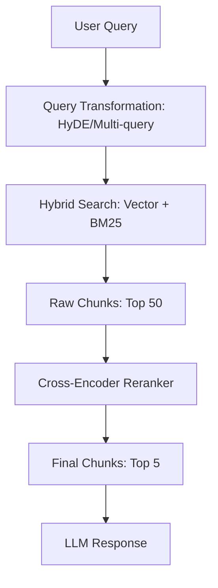

# ⚡ Retrieval Optimization: Haystack mein Needle dhundaana
> **Objective:** RAG accuracy improve karne ke techniques master karna, retrieval ko optimize karke—query expansion se multi-stage retrieval aur contextual compression tak | **Language:** Hinglish | **Standard:** 2026 Expert Framework

---

## 🧭 1. Beginner-Friendly Hinglish Explanation
Retrieval Optimization ka matlab hai "Search ko itna smart banana ki model ko hamesha sahi info mile".

- **The Problem:** Kabhi-kabhi user ka sawal clear nahi hota, ya hamara "Search engine" (Vector DB) galti se galat chunks le aata hai.
- **The Solution:** Optimization. 
  - **Query Expansion:** User ke sawal ko aur behtar tarike se likhna.
  - **Contextual Compression:** Chunks mein se sirf "Kaam ki baat" nikalna.
- **Intuition:** Ye ek "Smart Detective" jaisa hai jo sirf wahi file nikalta hai jisme asli saboot (Evidence) ho, na ki poora cupboard khali kar deta hai.

---

## 🧠 2. Deep Technical Explanation
Optimization teen stages mein hota hai: **Pre-retrieval**, **Retrieval**, aur **Post-retrieval**:

1. **Pre-retrieval (Query Transformation):**
   - **Hypothetical Document Embeddings (HyDE):** Model pehle ek "Fake Answer" likhta hai, phir us fake answer se search karta hai. (Bahut powerful).
   - **Multi-Query:** Ek sawal ko 5 alag tariko se likhna aur 5 bar search karna.
2. **Retrieval (Dense + Sparse):**
   - **Hybrid Search:** Vector search (Meaning) + BM25 (Exact keywords) ko mix karna.
3. **Post-retrieval (Refinement):**
   - **Reranking:** Top 10 results ko ek bade model se re-score karwana.
   - **Contextual Compression:** Chunks mein se irrelevant sentences hatana takki LLM ka context saaf rahe.

---

## 📐 3. Mathematical Intuition
**Reciprocal Rank Fusion (RRF):**
Jab multiple search results ko combine karte hain (e.g., Vector aur Keyword), tab RRF use karte hain final score calculate karne ke liye:
$$\text{Score}(d) = \sum_{r \in R} \frac{1}{k + \text{rank}(r, d)}$$
Jahan $k$ ek constant hai (usually 60). Ye ensure karta hai ki jo document bhi kisi bhi search mein high rank karta hai, usko ek achha final score milega.

---

## 🏗️ 4. Architecture Diagrams

```mermaid
graph TD
    Query[User Query] --> Trans[Query Transformation: HyDE/Multi-query]
    Trans --> Search[Hybrid Search: Vector + BM25]
    Search --> Raw[Raw Chunks: Top 50]
    Raw --> Rerank[Cross-Encoder Reranker]
    Rerank --> Final[Final Chunks: Top 5]
    Final --> LLM[LLM Response]
```

---

## 💻 5. Production-Ready Examples
2026 mein **HyDE** logic implement karna:
```python
def hyde_retrieval(query, retriever, llm):
    # 1. Generate a 'Hypothetical' answer
    hypothetical_answer = llm.invoke(f"Write a short technical answer for: {query}")
    
    # 2. Search using the answer, not the query!
    # This works better because Answer-to-Doc similarity is higher than Query-to-Doc.
    docs = retriever.get_relevant_documents(hypothetical_answer)
    return docs
```

---

## 🌍 6. Real-World Use Cases
- **Enterprise Search:** Company codebases mein search karna, jahan exact keywords (e.g., `init_auth_v2`) code ke meaning jitne hi important hain.
- **Medical RAG:** Medical journals mein search karne se pehle "High BP" ko "Hypertension" expand karna.

---

## ❌ 7. Failure Cases
- **Over-expansion:** Agar aap query ko bahut zyada expand karte hain, to aap "Noise" introduce karte hain aur search completely random results return karta hai.
- **Reranking Latency:** Reranking ke liye bade model ka istemal karne se 2-3 seconds ka latency badh sakta hai. **Fix: Small Cross-Encoder use karein.**

---

## 🛠️ 8. Debugging Guide
| Problem | Reason | Solution |
| :--- | :--- | :--- |
| **Search key technical terms ko ignore karta hai** | Sirf Vector Search use kar rahe hain | **Hybrid Search** (Vector + BM25) par switch karein. |
| **Model generic answers deta hai** | Top results noisy hain | **Reranker** implement karein (e.g., Cohere ya BGE-Reranker). |

---

## ⚖️ 9. Tradeoffs
- **HyDE (High Accuracy / High Latency)** vs **Standard Search (Lower Accuracy / Fast).**

---

## 🛡️ 10. Security Concerns
- **Retrieval Poisoning:** Ek attacker specific "Search-friendly" keywords wale documents inject kar sakta hai taaki unka malicious content hamesha RAG results mein top par rahe.

---

## 📈 11. Scaling Challenges
- **The Reranking Bottleneck:** 1000 chunks ko rerank karna bohat slow hota hai. Standard practice: ANN se 100 retrieve karein $\rightarrow$ Top 20 rerank karein $\rightarrow$ Top 5 LLM ko feed karein.

---

## 💰 12. Cost Considerations
- Query expansion extra LLM tokens use karta hai. Paisa bachane ke liye query transformation ke liye ek small, cheap model (jaise Llama-3 1B) use karein.

---

## ✅ 13. Best Practices
- **Default mein Hybrid Search use karein.** 
- **Ek 'Small' Reranker implement karein.** Ek chhota bhi kisi se kam nahi hai.
- **Metadata Filtering aapka dost hai.** Sab kuch na search karein; pehle `date` ya `category` se filter karein.
漫
---

## 📝 14. Interview Questions
1. "Hypothetical Document Embedding (HyDE) retrieval ko kaise behtar banata hai?"
2. "Reciprocal Rank Fusion (RRF) kya hai aur ye Hybrid Search mein kyu use hota hai?"
3. "Bi-Encoder aur Cross-Encoder mein kya antar hai?"

---

## 🚀 15. Latest 2026 LLM Engineering Patterns
- **Query-as-a-Service:** Ek specialized agent jo user ke query ko "Investigate" karta hai aur results merge karne se pehle 5 different sources (Web, SQL, Vector, Graph) se data fetch karta hai.
- **Dynamic Context Windowing:** Model ke initial thoughts mein confidence ke basis par retrieved chunks ki sankhya ko automatically adjust karna.
漫