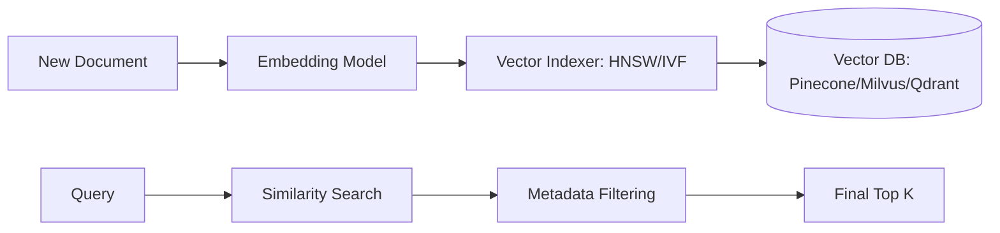

# 🗄️ Vector Databases: The Long-term Memory of AI
> **Objective:** Master the specialized database systems designed to store, index, and retrieve high-dimensional vectors, enabling millisecond-scale semantic search across billions of documents | **Language:** Hinglish | **Standard:** 2026 Expert Framework

---

## 🧭 1. Beginner-Friendly Hinglish Explanation
Vector Database ka matlab hai AI ke liye ek "Special Almirah" jahan har cheez apne "Matlab" (Meaning) ke hisaab se rakhi jati hai.

- **The Problem:** SQL (MySQL/Postgres) numbers aur text dhoondne mein acche hain, par wo "Similar meanings" nahi dhoond sakte.
- **The Solution:** Vector DB. 
  - Ye text ko nahi, balki uske "Embeddings" (Vectors) ko store karta hai.
  - Jab aap search karte ho, ye math use karke batata hai ki "Kaunse vectors paas-paas hain".
- **Intuition:** Normal DB ek dictionary jaisa hai (Alphabetical). Vector DB ek "Library" jaisa hai jahan saari "Sci-Fi" books ek hi section mein hain, bhale hi unka naam kuch bhi ho.

---

## 🧠 2. Deep Technical Explanation
Vector databases differ from traditional DBs in their **Indexing** and **Querying** mechanisms:

1. **Storage:** Storing vectors ($\vec{v} \in \mathbb{R}^d$) along with their metadata (e.g., source URL, timestamp).
2. **Indexing (ANN Algorithms):**
   - **HNSW (Hierarchical Navigable Small World):** A multi-layer graph for lightning-fast search.
   - **IVF (Inverted File Index):** Dividing space into clusters (Voronoi cells).
   - **PQ (Product Quantization):** Compressing vectors to save RAM.
3. **Filtering:** Applying "Hard filters" (e.g., `where user_id = 5`) *during* or *before* the vector search.
4. **Consistency:** Modern Vector DBs support ACID properties and horizontal scaling (Sharding).

---

## 📐 3. Mathematical Intuition
The core operation is **$k$-Nearest Neighbors ($k$-NN)**.
In a high-dimensional space, the distance $D$ between two vectors $A$ and $B$ is calculated:
- **Cosine Distance:** $1 - \frac{A \cdot B}{\|A\| \|B\|}$ (Focus on angle/meaning).
- **Euclidean (L2):** $\sqrt{\sum (A_i - B_i)^2}$ (Focus on magnitude).
For NLP, **Cosine** is the gold standard because it cares about semantic direction, not text length.

---

## 🏗️ 4. Architecture Diagrams


---

## 💻 5. Production-Ready Examples
Comparison of leading 2026 Vector DBs:
| Feature | Pinecone | Qdrant | Milvus | pgvector |
| :--- | :--- | :--- | :--- | :--- |
| **Type** | Managed (SaaS) | Open Source | Distributed | Postgres Plugin |
| **Indexing** | Proprietary | HNSW | Multiple | HNSW/IVFFlat |
| **Best For** | Fast Start | High Speed | Enterprise Scale | Existing SQL users |

Using **Qdrant** (The Python-friendly choice):
```python
from qdrant_client import QdrantClient
client = QdrantClient(":memory:") # For testing

# 1. Create Collection
client.recreate_collection(
    collection_name="my_docs",
    vectors_config=VectorParams(size=1536, distance=Distance.COSINE)
)

# 2. Upsert (Upload)
client.upsert(
    collection_name="my_docs",
    points=[PointStruct(id=1, vector=[0.1, 0.2, ...], payload={"text": "Hello"})]
)
```

---

## 🌍 6. Real-World Use Cases
- **Recommendation Engines:** "Customers who liked this song also liked these 5 songs" (based on audio embeddings).
- **Face Recognition:** Comparing a face vector to a database of millions of people in milliseconds.

---

## ❌ 7. Failure Cases
- **Stale Index:** If you update metadata but forget to update the vector, the search will return old information.
- **Dimensionality Mismatch:** Trying to search a 1536-dim query in a 768-dim index.

---

## 🛠️ 8. Debugging Guide
| Problem | Reason | Solution |
| :--- | :--- | :--- |
| **Search is slow** | No HNSW index | Rebuild the collection with **HNSW enabled**. |
| **Results are irrelevant** | Bad distance metric | Ensure model uses **Cosine** if DB is set to **Cosine**. |

---

## ⚖️ 9. Tradeoffs
- **Managed SaaS (Low maintenance / High cost)** vs **Self-hosted (High control / Low cost).**

---

## 🛡️ 10. Security Concerns
- **Unauthorized Access:** If an attacker gets your Vector DB API key, they can retrieve your entire company's knowledge base via semantic search.

---

## 📈 11. Scaling Challenges
- **RAM is Expensive:** Keeping a billion 1536D vectors in RAM costs a fortune. **Fix: Use Disk-based indices like DiskANN.**

---

## 💰 12. Cost Considerations
- A typical production vector DB setup costs between $\$100 - \$500$ per month for a million documents.

---

## ✅ 13. Best Practices
- **Namespace your data.** Separate 'Development' and 'Production' data in different collections.
- **Include high-quality metadata.** (e.g., version, author, category) to allow for powerful filtering.
- **Monitor Recall.** Periodically check if the search is finding what it should.

漫
---

## 📝 14. Interview Questions
1. "How does HNSW differ from standard $k$-NN search?"
2. "When would you choose Milvus over pgvector?"
3. "Explain 'Product Quantization' and its impact on accuracy."

---

## 🚀 15. Latest 2026 LLM Engineering Patterns
- **Multimodal Vector DBs:** Storing images, video, and text in the same index to allow "Search image by text" queries.
- **Self-Optimizing Indices:** DBs that automatically switch between IVF and HNSW based on query patterns.
漫
