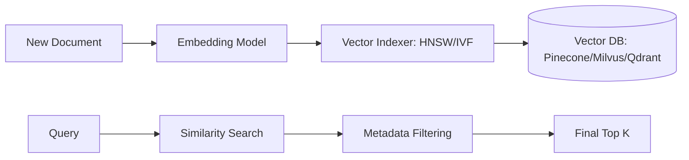

# 🗄️ Vector Databases: AI ka Long-term Memory
> **Udddeshya:** In specialized database systems ko master karo jo store, index, aur retrieve karte hain high-dimensional vectors, aur enable karte hain millisecond-scale semantic search billions of documents mein | **Language:** Hinglish | **Standard:** 2026 Expert Framework

---

## 🧭 1. Beginner-Friendly Hinglish Explanation
Vector Database ka matlab hai AI ke liye ek "Special Almirah" jahan har cheez apne "Matlab" (Meaning) ke hisaab se rakhi jati hai.

- **Samashya:** SQL (MySQL/Postgres) numbers aur text dhoondne mein acche hain, par wo "Similar meanings" nahi dhoond sakte.
- **Hal:** Vector DB. 
  - Ye text ko nahi, balki uske "Embeddings" (Vectors) ko store karta hai.
  - Jab aap search karte ho, ye math use karke batata hai ki "Kaunse vectors paas-paas hain".
- **Intuition:** Normal DB ek dictionary jaisa hai (Alphabetical). Vector DB ek "Library" jaisa hai jahan saari "Sci-Fi" books ek hi section mein hain, bhale hi unka naam kuch bhi ho.

---

## 🧠 2. Deep Technical Explanation
Vector databases, traditional DBs se bhinn hote hain apne **Indexing** aur **Querying** mechanisms mein:

1. **Storage:** Vectors ($\vec{v} \in \mathbb{R}^d$) ko unke metadata ke saath store karna (e.g., source URL, timestamp).
2. **Indexing (ANN Algorithms):**
   - **HNSW (Hierarchical Navigable Small World):** Ek multi-layer graph lightning-fast search ke liye.
   - **IVF (Inverted File Index):** Space ko clusters mein divide karna (Voronoi cells).
   - **PQ (Product Quantization):** Vectors ko compress karna RAM save karne ke liye.
3. **Filtering:** Hard filters apply karna (e.g., `where user_id = 5`) vector search ke *during* ya *before*.
4. **Consistency:** Modern Vector DBs ACID properties aur horizontal scaling (Sharding) support karte hain.

---

## 📐 3. Mathematical Intuition
Core operation hai **$k$-Nearest Neighbors ($k$-NN)**.
High-dimensional space mein, do vectors $A$ aur $B$ ke beech ka distance $D$ calculate hota hai:
- **Cosine Distance:** $1 - \frac{A \cdot B}{\|A\| \|B\|}$ (angle/meaning par focus karta hai).
- **Euclidean (L2):** $\sqrt{\sum (A_i - B_i)^2}$ (magnitude par focus karta hai).
NLP ke liye, **Cosine** gold standard hai kyunki ye semantic direction par dhyan deta hai, text length par nahi.

---

## 🏗️ 4. Architecture Diagrams

```mermaid
graph LR
    Input[New Document] --> Embed[Embedding Model]
    Embed --> Indexer[Vector Indexer: HNSW/IVF]
    Indexer --> Storage[(Vector DB: Pinecone/Milvus/Qdrant)]
    User[Query] --> Search[Similarity Search]
    Search --> Metadata[Metadata Filtering]
    Metadata --> Results[Final Top K]
```

---

## 💻 5. Production-Ready Examples
2026 ke leading Vector DBs ka comparison:
| Feature | Pinecone | Qdrant | Milvus | pgvector |
| :--- | :--- | :--- | :--- | :--- |
| **Type** | Managed (SaaS) | Open Source | Distributed | Postgres Plugin |
| **Indexing** | Proprietary | HNSW | Multiple | HNSW/IVFFlat |
| **Best For** | Fast Start | High Speed | Enterprise Scale | Existing SQL users |

Using **Qdrant** (The Python-friendly choice):
```python
from qdrant_client import QdrantClient
client = QdrantClient(":memory:") # For testing

# 1. Create Collection
client.recreate_collection(
    collection_name="my_docs",
    vectors_config=VectorParams(size=1536, distance=Distance.COSINE)
)

# 2. Upsert (Upload)
client.upsert(
    collection_name="my_docs",
    points=[PointStruct(id=1, vector=[0.1, 0.2, ...], payload={"text": "Hello"})]
)
```

---

## 🌍 6. Real-World Use Cases
- **Recommendation Engines:** "Customers jinhone ye song pasand kiya, unhe ye 5 songs bhi pasand aaye" (audio embeddings par base).
- **Face Recognition:** Face vector ko millions of people ke database se compare karna milliseconds mein.

---

## ❌ 7. Failure Cases
- **Stale Index:** Agar aap metadata update karte hain lekin vector update karna bhool jaate hain, toh search old information return karega.
- **Dimensionality Mismatch:** 1536-dim query ko 768-dim index mein search karna.

---

## 🛠️ 8. Debugging Guide
| Problem | Reason | Solution |
| :--- | :--- | :--- |
| **Search slow hai** | HNSW index nahi | Collection rebuild karo **HNSW enabled** ke saath. |
| **Results irrelevant hain** | Galat distance metric | Suno ki model **Cosine** use kare agar DB **Cosine** par set hai. |

---

## ⚖️ 9. Tradeoffs
- **Managed SaaS (Low maintenance / High cost)** vs **Self-hosted (High control / Low cost).**

---

## 🛡️ 10. Security Concerns
- **Unauthorized Access:** Agar attacker ko apna Vector DB API key mil jaye, toh wo semantic search ke through aapki poori company ki knowledge base retrieve kar sakta hai.

---

## 📈 11. Scaling Challenges
- **RAM is Expensive:** Billion 1536D vectors ko RAM mein rakhna bahut mehnga hai. **Fix: Disk-based indices use karo like DiskANN.**

---

## 💰 12. Cost Considerations
- Ek typical production vector DB setup $\$100 - \$500$ per month ke beech mein kharch hota hai million documents ke liye.

---

## ✅ 13. Best Practices
- **Namespace your data.** 'Development' aur 'Production' data ko different collections mein separate karo.
- **High-quality metadata include karo.** (e.g., version, author, category) taki aap powerful filtering kar sako.
- **Monitor Recall.** Periodically check karo ki search wahi dhoondh raha hai jo usse dhoondhna chahiye.

漫
---

## 📝 14. Interview Questions
1. "HNSW standard $k$-NN search se kaise alag hai?"
2. "Aap Milvus ko pgvector par kab choose karenge?"
3. "'Product Quantization' ko aur accuracy par iske impact ko explain karo."

---

## 🚀 15. Latest 2026 LLM Engineering Patterns
- **Multimodal Vector DBs:** Images, video, aur text ko same index mein store karna "Search image by text" queries allow karne ke liye.
- **Self-Optimizing Indices:** DBs jo automatically IVF aur HNSW ke beech switch karte hain query patterns ke based par.
漫