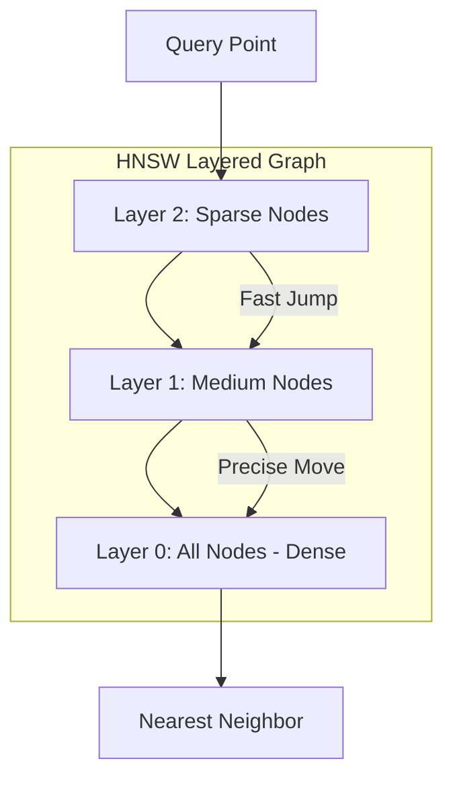

# HNSW & IVF: Vector Search ke Engines

## 1. Shuruat Ke Liye Hinglish Samjhai 🇮🇳
Bhai, socho tumhare paas 1 crore vectors hain. Agar tum har naye query ko 1-by-1 sabse compare karoge, toh search karne mein ghanto lag jayenge (O(N) complexity). 

**HNSW** aur **IVF** wahi "Shortcuts" hain jo search ko millisecond mein khatam kar dete hain. 
- **IVF (Inverted File Index)**: Yeh puraani library ke card-catalog jaisa hai. Yeh pure space ko chote-chote groups (Clusters) mein baant deta hai. Tum sirf sabse nazdeek wale cluster mein search karte ho.
- **HNSW (Hierarchical Navigable Small World)**: Yeh "Social Networking" jaisa hai. Ek layer par bade jumps (Delhi to Mumbai), aur niche wali layer par chote jumps (Street to House). Yeh graph-based hai aur bohot tez hai.

---

## 2. Gahri Technical Samjhai
ANN (Approximate Nearest Neighbor) algorithms vector search ko scale karne ke liye critical hain.
- **IVF**: K-Means use karta hai vectors ko $nlist$ clusters mein partition karne ke liye. Query time par, ye sirf top $nprobe$ clusters mein search karta hai.
- **HNSW**: Ek multi-layered graph banata hai jahan top layers sparse hote hain (long-range edges) aur bottom layers dense (local edges). Yeh greedy search use karta hai nearest neighbor find karne ke liye graph layers ko traverse karke.
- **Flat Index**: Koi optimization nahi. Exact search. Perfect accuracy lekin $O(N)$ speed.

---

## 3. Ganitiya Intuition
HNSW search complexity approximately **$O(\log N)$** hai.
IVF search complexity **$O(\frac{N}{nlist} \times nprobe)$** hai.
IVF mein $nprobe$ ya HNSW mein $efSearch$ ko tune karke tum **Recall-vs-Latency** tradeoff ko control kar sakte ho. Zyada probes = better accuracy lekin slower search.

---

## 4. Architecture ke Diagrams


---

## 5. Production Ke Liye Examples
`FAISS` ka use karke IVF aur HNSW index build karna:

```python
import faiss
import numpy as np

d = 128 # dimension
nb = 100000 # database size
xb = np.random.random((nb, d)).astype('float32')

# 1. IVF Index
nlist = 100 # number of clusters
quantizer = faiss.IndexFlatL2(d)
index_ivf = faiss.IndexIVFFlat(quantizer, d, nlist)
index_ivf.train(xb)
index_ivf.add(xb)
index_ivf.nprobe = 10 # search 10 clusters

# 2. HNSW Index
index_hnsw = faiss.IndexHNSWFlat(d, 32) # 32 is the number of neighbors
index_hnsw.add(xb)
```

---

## 6. Asli Duniya ke Use Cases
- **Pinterest**: HNSW use karke billions of images mein search karna.
- **Real-time Ad Matching**: IVF use karke user ke liye best ad <20ms mein find karna.

---

## 7. Failure ke Cases
- **Curse of Dimensionality**: Bahut high dimensions mein, HNSW graphs bohot "flat" ho jate hain, aur search performance gir jati hai.
- **Index Stale-ness**: IVF mein, agar tumhara naya data tumhare "Training" data se bahut alag hai, toh clusters suboptimal ho jayenge.

---

## 8. Debugging Guide
1. **Recall Check**: Tumhare IVF/HNSW results ko `Flat` index se compare karo. Agar top 1 results <90% time match karte hain, toh `nprobe` ya `efSearch` badha do.
2. **Build Time**: HNSW build hone mein time lagata hai aur bahut RAM use karta hai. Agar RAM kam hai toh IVF-PQ use karo.

---

## 9. Tradeoffs
| Metric | Flat (Exact) | IVF | HNSW |
|---|---|---|---|
| Latency | Bahut Zyada | Kam | Bahut Kam |
| Accuracy | 100% | Medium-High | Zyada |
| Memory | Kam | Medium | Zyada |

---

## 10. Security Concerns
- **Graph Traversal Attack**: Attacker specific vectors create karta hai jo HNSW graph mein "Bottlenecks" create karte hain, jisse sabki searches slow ho jati hain.

---

## 11. Scaling Challenges
- **RAM Bottleneck**: Speed ke liye HNSW ko RAM mein rehna padta hai. 1 Billion 1536D vectors store karne ke liye ~6TB RAM chahiye!

---

## 12. Cost Considerations
- **IVF-PQ**: IVF ke saath Product Quantization use karke memory 10x-20x tak reduce ho sakti hai, jisse server costs drastically cut hote hain.

---

## 13. Best Practices
- Low-latency, high-accuracy needs ke liye **HNSW** use karo (Small se Medium scale).
- Massive scale (Billions of vectors) ke liye **IVF-PQ** use karo jahan memory cost concern hai.
- Cosine Similarity ke liye hamesha L2-normalize vectors use karo.

---

## 14. Interview ke Sawal
1. HNSW mein "Small World" property kaise apply hoti hai?
2. IVF index mein 'Quantizer' ka kya role hai?

---

## 15. 2026 ke Latest Patterns
- **DiskANN**: Ek algorithm jo HNSW-like performance allow karta hai jab vectors RAM ke bajaye SSD/NVMe pe store hote hain.
- **GPU-HNSW**: NVIDIA GPUs par HNSW implement karke millions of vectors microseconds mein search karna.