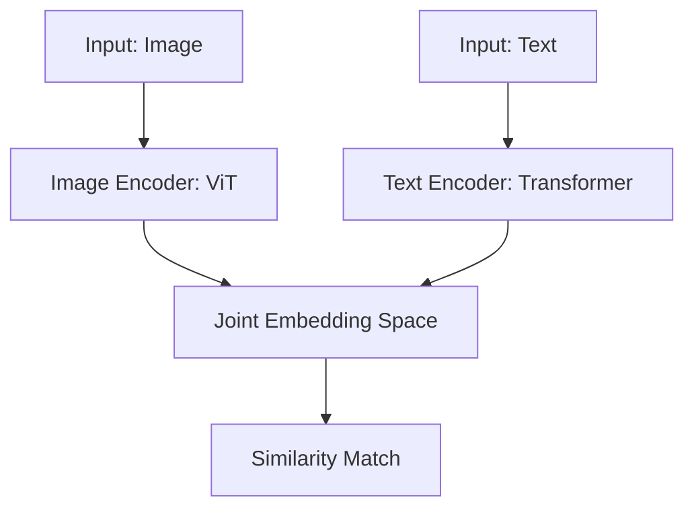

# Multi-Modal Vector Search: Images, Audio, aur Text

## 1. Beginner-friendly Hinglish Explanation 🇮🇳
Bhai, socho tumne Google par search kiya "Lal rang ki car" aur tumhe sirf photos milin. Yeh kaise hota hai? Google ne "Lal rang ki car" (Text) aur "Car ki Photo" (Image) dono ko ek hi space mein rakh diya hai.

**Multi-Modal Vector Search** wahi technique hai. Ismein hum CLIP jaise models use karte hain jo Text aur Image (ya Audio/Video) ko "Join" kar dete hain. Matlab tum text se image dhund sakte ho, aur image se related text! Yeh 2026 mein e-commerce aur security ke liye sabse powerful tool hai. Is module mein hum samjhenge ki kaise alag-alag types ka data ek saath "Talk" kar sakta hai.

---

## 2. Deep Technical Explanation
Multi-modal search different data modalities ko ek single **Joint Embedding Space** mein map karta hai.
- **CLIP (Contrastive Language-Image Pretraining)**: OpenAI ka foundation model. Ye Image Encoder aur Text Encoder ko simultaneously train karta hai taaki (image, text) pairs ke beech cosine similarity maximize ho.
- **Image-to-Image**: Visually similar images dhundho.
- **Text-to-Image**: Natural language descriptions ka use karke images search karo.
- **Audio-to-Text**: Semantic intent ke basis par podcasts ya recordings mein search karo.

---

## 3. Mathematical Intuition
Contrastive Learning Loss (**InfoNCE**):
Objective ye hai ki positive pair $(I_i, T_i)$ ke beech distance ko minimize karo aur $N-1$ negative pairs $(I_i, T_j)$ ke liye maximize karo.
$$\mathcal{L} = -\log \frac{\exp(\cos(I_i, T_i) / \tau)}{\sum_{j=1}^N \exp(\cos(I_i, T_j) / \tau)}$$
jahan $\tau$ ek temperature parameter hai. Ye model ko pixels aur words ke beech "Shared Meaning" create karne ke liye force karta hai.

---

## 4. Architecture Diagrams


---

## 5. Production-ready Examples
Multi-modal search ke liye `OpenCLIP` ka use:

```python
import open_clip
import torch
from PIL import Image

model, _, preprocess = open_clip.create_model_and_transforms('ViT-B-32', pretrained='laion2b_s34b_b79k')
tokenizer = open_clip.get_tokenizer('ViT-B-32')

# 1. Encode Image
image = preprocess(Image.open("dog.jpg")).unsqueeze(0)
image_features = model.encode_image(image)

# 2. Encode Text
text = tokenizer(["a photo of a dog", "a photo of a cat"])
text_features = model.encode_text(text)

# 3. Calculate Similarity
similarity = (100.0 * image_features @ text_features.T).softmax(dim=-1)
print(f"Probabilities: {similarity}")
```

---

## 6. Real-world Use Cases
- **Visual Search**: Apne phone ko ek dress par point karo aur Amazon par dhundho.
- **Content Moderation**: Automatically un images ko flag karo jo "Violent" text description se match karein.
- **Digital Asset Management**: Text queries ka use karke 1M stock photos mein search karna.

---

## 7. Failure Cases
- **Attribute Confusion**: Model "A man holding a dog" aur "A dog holding a man" ke beech distinguish nahi kar sakta. Ye "Man" aur "Dog" ko capture karta hai lekin relationship miss kar deta hai.
- **Counting Errors**: CLIP jaise models counting mein notoriously bad hain (e.g., "Three apples" vs "Two apples").

---

## 8. Debugging Guide
1. **Zero-Shot Accuracy**: Model ko standard datasets jaise ImageNet par test karo bina fine-tuning ke.
2. **Feature Visualization**: UMAP ka use karo dekhne ke liye ki kya tumhare Image vectors aur Text vectors same concepts ke liye actually cluster kar rahe hain.

---

## 9. Tradeoffs
| Feature | Unimodal (Sirf Text) | Multi-modal |
|---|---|---|
| Complexity | Low | High |
| Search Scope | Text data | Images, Audio, Video |
| Compute | Low | High (Large Vision Models) |

---

## 10. Security Concerns
- **Adversarial Noise**: Image mein thoda sa "Invisible Noise" add karna jisse model ko lagta hai ki kuch completely different hai (e.g., AI ko "Gun" "Banana" jaisa lagta hai).

---

## 11. Scaling Challenges
- **Video Search**: Millions of videos ke liye 24 frames per second encode karna ek massive compute bottleneck hai. Hum ise solve karne ke liye "Keyframe Extraction" use karte hain.

---

## 12. Cost Considerations
- **Vision Model Latency**: Image encoders (jaise ViT-L) small text encoders (jaise MiniLM) se kaafi heavier aur slower hote hain.

---

## 13. Best Practices
- Hamesha search se pehle image aur text vectors ko **Normalize** karo.
- 2026 mein state-of-the-art performance ke liye **ViT (Vision Transformer)** based encoders ka use karo.

---

## 14. Interview Questions
1. CLIP mein contrastive loss function kaise kaam karta hai?
2. Multi-modal vector spaces mein "Modality Gap" kya hai?

---

## 15. Latest 2026 Patterns
- **Any-to-Any Models**: Models jo Image, Audio, aur Text as input le sakte hain aur kuch bhi output kar sakte hain (e.g., GPT-4o, Gemini 1.5).
- **Temporal Video Embeddings**: Vectors jo video mein time ke saath "Action" ya "Story" capture karte hain, sirf static frames nahi.