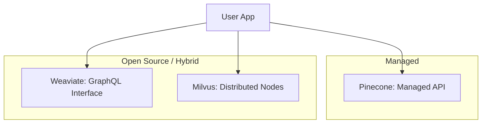

# Vector DB ki Tulna: Pinecone vs. Weaviate vs. Milvus

## 1. Shuruati Hinglish Samjhai 🇮🇳
Bhai, market mein bohot saari Vector Databases hain, aur har koi kehti hai "Main best hoon". Toh tum kaise chunoge? 

- **Pinecone**: Yeh "Managed Service" hai. Tumhe server setup karne ki zaroorat nahi, bas API use karo. Yeh unke liye hai jo "Set it and forget it" chahte hain.
- **Weaviate**: Yeh "Open Source" hai aur bohot flexible hai. Ismein "Object-oriented" feel hai. Agar tumhe Hybrid Search (Keyword + Vector) chahiye, toh yeh best hai.
- **Milvus**: Yeh "Heavyweight" champion hai. Agar tumhare paas 100 Crore (1 Billion) vectors hain, toh Milvus se tez kuch nahi. Yeh complex hai, par massive scale ke liye bani hai.

---

## 2. Deep Technical Samjhai
Vector DB choose karna depends on tumhari scale, budget, aur infrastructure preferences par.
- **Pinecone**: Serverless, proprietary hai. Low latency aur ease of use par focus karta hai. Startups ke liye great hai.
- **Weaviate**: GraphQL-based hai, text/image conversion ke built-in modules hain. Hybrid Search aur Knowledge Graphs ke liye strong support hai.
- **Milvus**: Cloud-native hai, decoupled storage aur compute. Storage ke liye MinIO aur metadata ke liye Etcd use karta hai. Distributed billion-scale search ke liye built hai.
- **Chroma**: Local testing aur small production apps ke liye developer-favorite (Simple, persistent).

---

## 3. Mathematical Intuition
Performance ko **QPS (Queries Per Second)** aur **Recall** se measure kiya jata hai.
Ek high-performance DB jaise Milvus 10,000+ QPS tak pahunch sakta hai 1M vector dataset par, search ko multiple query nodes mein parallelize karke.
$$Total\_Latency = \max(Node\_Latency) + Aggregation\_Overhead$$
Decoupled architectures (Milvus) allow karte hain Query Nodes ko Data Nodes se independently scale karna.

---

## 4. Architecture Diagrams


---

## 5. Production-ready Udaharan
Har ek ke liye simple connection test (Conceptual):

```python
# Pinecone
import pinecone
pinecone.init(api_key="...", environment="...")

# Weaviate
import weaviate
client = weaviate.Client("http://localhost:8080")

# Milvus
from pymilvus import connections
connections.connect("default", host="localhost", port="19530")
```

---

## 6. Asli Duniya ke Use Cases
- **Pinecone**: 1 din mein website ke liye ek quick RAG bot banana.
- **Weaviate**: Library ya research firm ke liye knowledge-heavy system.
- **Milvus**: Ek global image search engine (jaise Google Images clone).

---

## 7. Failure Cases
- **Lock-in**: Pinecone ke unique features use karne se baad mein open-source DB mein move karna mushkil ho sakta hai.
- **Complexity**: Kubernetes ke saath production Milvus cluster set karna small team ke liye nightmare ho sakta hai.

---

## 8. Debugging Guide
1. **Consistency Analysis**: Check karo ki jo vector tumne abhi "Upserted" kiya hai woh immediately searchable hai ya nahi. Most Vector DBs "Eventually Consistent" hote hain.
2. **Metadata Limits**: Check karo ki jaisi tum zyada metadata fields add karte ho, tumhari DB significantly slow ho jaati hai ya nahi.

---

## 9. Tradeoffs
| Feature | Pinecone | Weaviate | Milvus |
|---|---|---|---|
| Ease of Use | 10/10 | 7/10 | 5/10 |
| Scalability | High | Medium | Ultra-High |
| Cost Control | Low (Fixed) | High (Self-host) | High (Self-host) |

---

## 10. Security Concerns
- **Multi-tenancy**: Yeh ensure karna ki User A ki search kabhi shared index mein User B ke private documents return na kare. **Namespaces** ya **Metadata Filtering** use karo.

---

## 11. Scaling Challenges
- **Cold Storage**: Purane vectors ko cheaper storage mein move karna bina search index ko break kiye.

---

## 12. Cost Considerations
- **Pinecone**: Index size ke liye pay karo. Jab aap millions of vectors store karte ho toh expensive ho sakta hai.
- **Milvus/Weaviate**: Server/cloud instance (EC2/GCP) ke liye pay karo. Very high volumes ke liye better hai.

---

## 13. Best Practices
- Local development ke liye **Chroma** ya **FAISS** se start karo.
- Pehle 100k users ke liye **Pinecone** mein move karo.
- Agar aap 100M+ vectors hit karne ka plan karte ho toh **Milvus** consider karo.

---

## 14. Interview Questions
1. Milvus ko "distributed" scaling ke liye Weaviate se better kyun maana jata hai?
2. Ek "Serverless" Vector DB ke kya benefits hain?

---

## 15. Latest 2026 Patterns
- **Pgvector (Postgres)**: Standard Postgres SQL ke andar vector search. Bohot si apps ke liye yeh "Good enough" hai aur dedicated Vector DB se kaafi simple hai.
- **Hybrid-Cloud Vector Search**: Index ko cloud mein rakhna lekin actual data security ke liye on-premise rakhna.