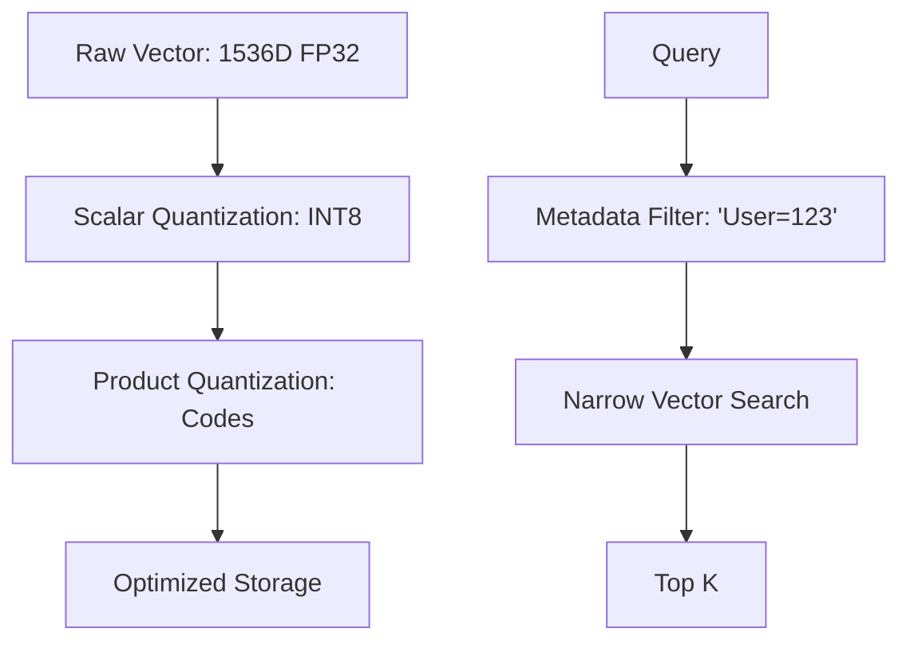

# Vector Database Optimization: Speed aur Scale

## 1. Beginner-friendly Hinglish Explanation 🇮🇳
Bhai, socho tumne ek Vector DB bana li. Ab tumhare paas 100 users hain, sab kuch badhiya chal raha hai. Par jab 1,000,000 users aayenge, toh kya tumhari DB handle kar payegi? 

**Vector Database Optimization** wahi "Secret Sauce" hai jo system ko fatne se bachata hai. Ismein hum seekhte hain ki kaise vectors ko chota karein (Quantization), kaise data ko partition karein, aur kaise memory manage karein. Yeh bilkul waise hi hai jaise ek choti car ko Ferrari banana—tameez se engine (Indexing) aur weight (Compression) optimize karke.

---

## 2. Gehri Technical Explanation
Vector DB ko optimize karna **Speed-Accuracy-Memory (SAM)** triangle ko balance karne jaisa hai.
- **Scalar Quantization (SQ)**: FP32 values ko INT8 mein convert karna. Memory ko 4x reduce karta hai minimal accuracy loss ke saath.
- **Product Quantization (PQ)**: Sub-vectors ko codes mein compress karna. Memory ko 64x tak reduce karta hai but accuracy zyada loss hota hai.
- **Namespace/Filtering**: Metadata ka use karke search space ko restrict karna before vector comparisons.
- **Sharding**: Index ko multiple machines mein split karna horizontal scaling ke liye.

---

## 3. Mathematical Intuition
Flat index ka memory usage: $N \times D \times 4$ bytes hai.
**SQ8 (INT8)** ke saath: $N \times D \times 1$ byte.
**PQ (e.g., $m=d/8$)** ke saath: $N \times (d/8) \times 1$ byte.
1536 dimensions ke 1M vectors ke liye:
- Flat: 6.1 GB
- SQ8: 1.5 GB
- PQ: 192 MB
Yeh optimization aapko same RAM mein 30x zyada data fit karne deta hai.

---

## 4. Architecture Diagrams


---

## 5. Production-ready Examples
Metadata Filtering ke saath search ko optimize karna:

```python
# Pinecone example with metadata filtering
index.query(
    vector=[0.1, 0.2, ...],
    top_k=10,
    filter={
        "genre": {"$eq": "comedy"},
        "year": {"$gt": 2020}
    }
)
# Metadata filtering is often faster than vector search 
# because it drastically reduces the number of vectors to compare.
```

---

## 6. Real-world Use Cases
- **Enterprise RAG**: "Department" ya "Access Level" ke hisaab se documents ko filter karna searching se pehle.
- **Social Media**: Sirf user ke "Following" list se posts recommend karna.

---

## 7. Failure Cases
- **Quantization Overkill**: Critical medical data ke liye PQ ka use karna, jahan 2% accuracy drop galat diagnosis ka karan ban sakta hai.
- **Metadata Bottleneck**: Bohot zyada complex filters ka hona kabhi kabhi vector search se bhi slow ho sakta hai agar database SQL-like queries ke liye optimized na ho.

---

## 8. Debugging Guide
1. **Search Latency P99**: Apne slowest queries ko monitor karo. Kya woh large filters ya high dimensions ki wajah se slow hain?
2. **Memory Leaks**: Check karo ki kya aapka Vector DB disk par swap to nahi kar raha (Slow death).

---

## 9. Tradeoffs
| Method | Accuracy | Memory | Speed |
|---|---|---|---|
| FP32 (None) | 100% | High | Medium |
| INT8 (SQ) | 99% | Medium | Fast |
| PQ (Comp) | 90% | Very Low | Very Fast |

---

## 10. Security Concerns
- **Filter Bypass**: Metadata filter ko trick karke kisi aur user ya department ke vectors retrieve karna.

---

## 11. Scaling Challenges
- **Re-indexing**: Jab aap apna embedding model badalte ho (e.g., OpenAI se Llama), toh aapko har single document ko scratch se re-embed aur re-index karna padta hai.

---

## 12. Cost Considerations
- **VRAM vs Disk**: In-memory DBs jaise Pinecone expensive hote hain. Disk-based DBs jaise Milvus ya Zilliz cheaper hote hain lekin slower.

---

## 13. Best Practices
- **Pre-filtering**: Hamesha pehle metadata se filter karo vector search space ko reduce karne ke liye.
- **Async Upserts**: Index update hone ka intzaar mat karo user ko confirm karne se pehle (Latency optimization).
- **Use FP16**: Zyadatar LLM tasks ke liye, FP16 aur FP32 mein koi farak nahi padta, lekin FP16 2x memory bachata hai.

---

## 14. Interview Questions
1. Scalar Quantization kya hai aur yeh precision ko kaise affect karta hai?
2. Production RAG system mein metadata filtering kyun important hai?

---

## 15. Latest 2026 Patterns
- **Serverless Vector DBs**: Aise databases jo "Scale to Zero" ho jaate hain jab use mein na hon, low-traffic apps ke liye massive costs bachate hain.
- **GPU-Accelerated Indexing**: High-end GPUs ka use karke billions of HNSW edges ko minutes mein build karna, weeks lagne wale CPU operations ke bajaye.