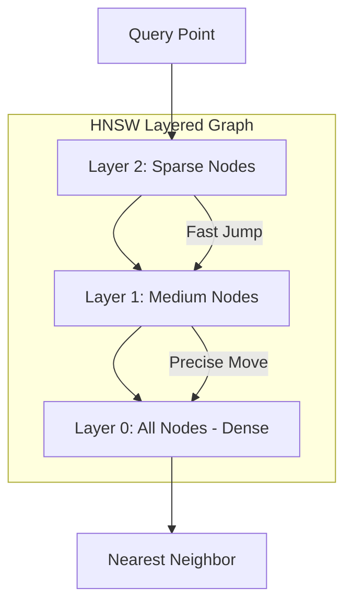

# HNSW & IVF: The Engines of Vector Search

## 1. Beginner-friendly Hinglish Explanation 🇮🇳
Bhai, socho tumhare paas 1 crore vectors hain. Agar tum har naye query ko 1-by-1 sabse compare karoge, toh search karne mein ghanto lag jayenge (O(N) complexity). 

**HNSW** aur **IVF** wahi "Shortcuts" hain jo search ko millisecond mein khatam kar dete hain. 
- **IVF (Inverted File Index)**: Yeh puraani library ke card-catalog jaisa hai. Yeh pure space ko chote-chote groups (Clusters) mein baant deta hai. Tum sirf sabse nazdeek wale cluster mein search karte ho.
- **HNSW (Hierarchical Navigable Small World)**: Yeh "Social Networking" jaisa hai. Ek layer par bade jumps (Delhi to Mumbai), aur niche wali layer par chote jumps (Street to House). Yeh graph-based hai aur bohot tez hai.

---

## 2. Deep Technical Explanation
ANN (Approximate Nearest Neighbor) algorithms are critical for scaling vector search.
- **IVF**: Uses K-Means to partition vectors into $nlist$ clusters. At query time, it only searches the top $nprobe$ clusters.
- **HNSW**: Builds a multi-layered graph where the top layers are sparse (long-range edges) and bottom layers are dense (local edges). It uses a greedy search to find the nearest neighbor by traversing the graph layers.
- **Flat Index**: No optimization. Exact search. Perfect accuracy but $O(N)$ speed.

---

## 3. Mathematical Intuition
HNSW search complexity is approximately **$O(\log N)$**.
IVF search complexity is **$O(\frac{N}{nlist} \times nprobe)$**.
By tuning $nprobe$ in IVF or $efSearch$ in HNSW, you can control the **Recall-vs-Latency** tradeoff. More probes = better accuracy but slower search.

---

## 4. Architecture Diagrams


---

## 5. Production-ready Examples
Using `FAISS` to build an IVF and HNSW index:

```python
import faiss
import numpy as np

d = 128 # dimension
nb = 100000 # database size
xb = np.random.random((nb, d)).astype('float32')

# 1. IVF Index
nlist = 100 # number of clusters
quantizer = faiss.IndexFlatL2(d)
index_ivf = faiss.IndexIVFFlat(quantizer, d, nlist)
index_ivf.train(xb)
index_ivf.add(xb)
index_ivf.nprobe = 10 # search 10 clusters

# 2. HNSW Index
index_hnsw = faiss.IndexHNSWFlat(d, 32) # 32 is the number of neighbors
index_hnsw.add(xb)
```

---

## 6. Real-world Use Cases
- **Pinterest**: Searching through billions of images using HNSW.
- **Real-time Ad Matching**: Finding the best ad for a user in < 20ms using IVF.

---

## 7. Failure Cases
- **Curse of Dimensionality**: In very high dimensions, HNSW graphs become too "flat", and search performance drops.
- **Index Stale-ness**: In IVF, if your new data is very different from your "Training" data, the clusters will be suboptimal.

---

## 8. Debugging Guide
1. **Recall Check**: Compare your IVF/HNSW results with a `Flat` index. If the top 1 results match < 90% of the time, increase `nprobe` or `efSearch`.
2. **Build Time**: HNSW takes a long time to build and uses a lot of RAM. If you are low on RAM, use IVF-PQ.

---

## 9. Tradeoffs
| Metric | Flat (Exact) | IVF | HNSW |
|---|---|---|---|
| Latency | Very High | Low | Very Low |
| Accuracy | 100% | Medium-High | High |
| Memory | Low | Medium | High |

---

## 10. Security Concerns
- **Graph Traversal Attack**: An attacker crafting specific vectors that create "Bottlenecks" in the HNSW graph, slowing down everyone's searches.

---

## 11. Scaling Challenges
- **RAM Bottleneck**: HNSW must stay in RAM for speed. Storing 1 Billion 1536D vectors requires ~6TB of RAM!

---

## 12. Cost Considerations
- **IVF-PQ**: Using Product Quantization with IVF can reduce memory by 10x-20x, drastically cutting server costs.

---

## 13. Best Practices
- Use **HNSW** for low-latency, high-accuracy needs (Small to Medium scale).
- Use **IVF-PQ** for massive scale (Billions of vectors) where memory cost is a concern.
- Always L2-normalize vectors for Cosine Similarity.

---

## 14. Interview Questions
1. How does the "Small World" property apply to HNSW?
2. What is the role of the 'Quantizer' in an IVF index?

---

## 15. Latest 2026 Patterns
- **DiskANN**: An algorithm that allows HNSW-like performance while storing the vectors on SSD/NVMe instead of RAM.
- **GPU-HNSW**: Implementing HNSW on NVIDIA GPUs to search millions of vectors in microseconds.
