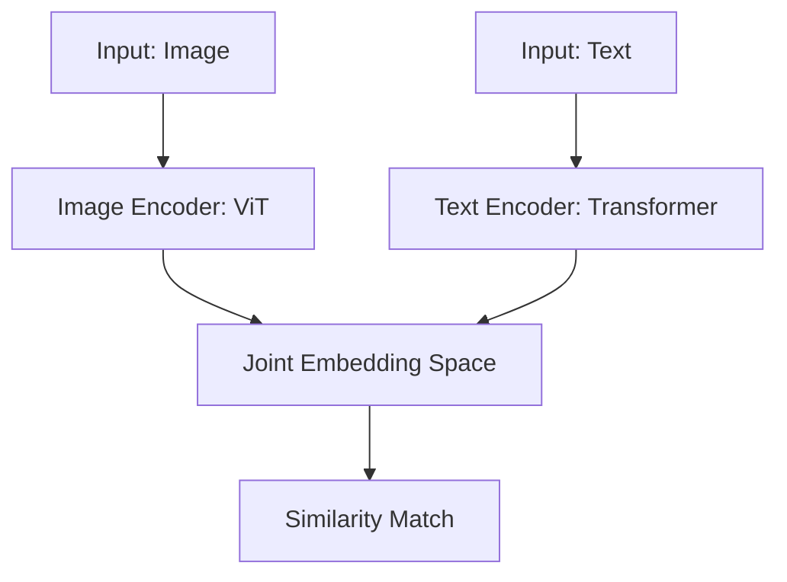

# Multi-Modal Vector Search: Images, Audio, and Text

## 1. Beginner-friendly Hinglish Explanation 🇮🇳
Bhai, socho tumne Google par search kiya "Lal rang ki car" aur tumhe sirf photos milin. Yeh kaise hota hai? Google ne "Lal rang ki car" (Text) aur "Car ki Photo" (Image) dono ko ek hi space mein rakh diya hai.

**Multi-Modal Vector Search** wahi technique hai. Ismein hum CLIP jaise models use karte hain jo Text aur Image (ya Audio/Video) ko "Join" kar dete hain. Matlab tum text se image dhund sakte ho, aur image se related text! Yeh 2026 mein e-commerce aur security ke liye sabse powerful tool hai. Is module mein hum samjhenge ki kaise alag-alag types ka data ek saath "Talk" kar sakta hai.

---

## 2. Deep Technical Explanation
Multi-modal search maps different data modalities into a single **Joint Embedding Space**.
- **CLIP (Contrastive Language-Image Pretraining)**: The foundation model from OpenAI. It trains an Image Encoder and a Text Encoder simultaneously to maximize the cosine similarity between (image, text) pairs.
- **Image-to-Image**: Find visually similar images.
- **Text-to-Image**: Search images using natural language descriptions.
- **Audio-to-Text**: Search through podcasts or recordings based on semantic intent.

---

## 3. Mathematical Intuition
Contrastive Learning Loss (**InfoNCE**):
The objective is to minimize the distance between a positive pair $(I_i, T_i)$ and maximize it for $N-1$ negative pairs $(I_i, T_j)$.
$$\mathcal{L} = -\log \frac{\exp(\cos(I_i, T_i) / \tau)}{\sum_{j=1}^N \exp(\cos(I_i, T_j) / \tau)}$$
where $\tau$ is a temperature parameter. This forces the model to create a "Shared Meaning" between pixels and words.

---

## 4. Architecture Diagrams


---

## 5. Production-ready Examples
Using `OpenCLIP` for Multi-modal search:

```python
import open_clip
import torch
from PIL import Image

model, _, preprocess = open_clip.create_model_and_transforms('ViT-B-32', pretrained='laion2b_s34b_b79k')
tokenizer = open_clip.get_tokenizer('ViT-B-32')

# 1. Encode Image
image = preprocess(Image.open("dog.jpg")).unsqueeze(0)
image_features = model.encode_image(image)

# 2. Encode Text
text = tokenizer(["a photo of a dog", "a photo of a cat"])
text_features = model.encode_text(text)

# 3. Calculate Similarity
similarity = (100.0 * image_features @ text_features.T).softmax(dim=-1)
print(f"Probabilities: {similarity}")
```

---

## 6. Real-world Use Cases
- **Visual Search**: Pointing your phone at a dress and finding it on Amazon.
- **Content Moderation**: Automatically flagging images that match a "Violent" text description.
- **Digital Asset Management**: Searching through 1M stock photos using text queries.

---

## 7. Failure Cases
- **Attribute Confusion**: Model can't distinguish between "A man holding a dog" and "A dog holding a man". It captures "Man" and "Dog" but misses the relationship.
- **Counting Errors**: Models like CLIP are notoriously bad at counting (e.g., "Three apples" vs "Two apples").

---

## 8. Debugging Guide
1. **Zero-Shot Accuracy**: Test the model on standard datasets like ImageNet without fine-tuning.
2. **Feature Visualization**: Use UMAP to see if your Image vectors and Text vectors are actually clustering together for the same concepts.

---

## 9. Tradeoffs
| Feature | Unimodal (Text Only) | Multi-modal |
|---|---|---|
| Complexity | Low | High |
| Search Scope | Text data | Images, Audio, Video |
| Compute | Low | High (Large Vision Models)|

---

## 10. Security Concerns
- **Adversarial Noise**: Adding a tiny bit of "Invisible Noise" to an image that makes the model think it's something completely different (e.g., a "Gun" looks like a "Banana" to the AI).

---

## 11. Scaling Challenges
- **Video Search**: Encoding 24 frames per second for millions of videos is a massive compute bottleneck. We use "Keyframe Extraction" to solve this.

---

## 12. Cost Considerations
- **Vision Model Latency**: Image encoders (like ViT-L) are much heavier and slower than small text encoders (like MiniLM).

---

## 13. Best Practices
- Always **Normalize** both image and text vectors before search.
- Use **ViT (Vision Transformer)** based encoders for state-of-the-art performance in 2026.

---

## 14. Interview Questions
1. How does the contrastive loss function work in CLIP?
2. What is the "Modality Gap" in multi-modal vector spaces?

---

## 15. Latest 2026 Patterns
- **Any-to-Any Models**: Models that can take Image, Audio, and Text as input and output anything (e.g., GPT-4o, Gemini 1.5).
- **Temporal Video Embeddings**: Vectors that capture the "Action" or "Story" over time in a video, not just static frames.
