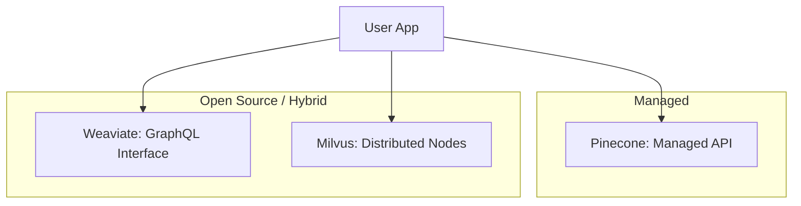

# Vector DB Comparison: Pinecone vs. Weaviate vs. Milvus

## 1. Beginner-friendly Hinglish Explanation 🇮🇳
Bhai, market mein bohot saari Vector Databases hain, aur har koi kehti hai "Main best hoon". Toh tum kaise chunoge? 

- **Pinecone**: Yeh "Managed Service" hai. Tumhe server setup karne ki zaroorat nahi, bas API use karo. Yeh unke liye hai jo "Set it and forget it" chahte hain.
- **Weaviate**: Yeh "Open Source" hai aur bohot flexible hai. Ismein "Object-oriented" feel hai. Agar tumhe Hybrid Search (Keyword + Vector) chahiye, toh yeh best hai.
- **Milvus**: Yeh "Heavyweight" champion hai. Agar tumhare paas 100 Crore (1 Billion) vectors hain, toh Milvus se tez kuch nahi. Yeh complex hai, par massive scale ke liye bani hai.

---

## 2. Deep Technical Explanation
Choosing a Vector DB depends on your scale, budget, and infrastructure preferences.
- **Pinecone**: Serverless, proprietary. Focuses on low latency and ease of use. Great for startups.
- **Weaviate**: GraphQL-based, built-in modules for text/image conversion. Strong support for Hybrid Search and Knowledge Graphs.
- **Milvus**: Cloud-native, decoupled storage and compute. Uses MinIO for storage and Etcd for metadata. Built for distributed billion-scale search.
- **Chroma**: The developer-favorite for local testing and small production apps (Simple, persistent).

---

## 3. Mathematical Intuition
Performance is measured by **QPS (Queries Per Second)** and **Recall**.
A high-performance DB like Milvus can reach 10,000+ QPS on a 1M vector dataset by parallelizing the search across multiple query nodes.
$$Total\_Latency = \max(Node\_Latency) + Aggregation\_Overhead$$
Decoupled architectures (Milvus) allow scaling Query Nodes independently of Data Nodes.

---

## 4. Architecture Diagrams


---

## 5. Production-ready Examples
Simple connection test for each (Conceptual):

```python
# Pinecone
import pinecone
pinecone.init(api_key="...", environment="...")

# Weaviate
import weaviate
client = weaviate.Client("http://localhost:8080")

# Milvus
from pymilvus import connections
connections.connect("default", host="localhost", port="19530")
```

---

## 6. Real-world Use Cases
- **Pinecone**: Building a quick RAG bot for a website in 1 day.
- **Weaviate**: A knowledge-heavy system for a library or a research firm.
- **Milvus**: A global image search engine (like Google Images clone).

---

## 7. Failure Cases
- **Lock-in**: Using Pinecone's unique features might make it hard to move to an open-source DB later.
- **Complexity**: Setting up a production Milvus cluster with Kubernetes can be a nightmare for a small team.

---

## 8. Debugging Guide
1. **Consistency Analysis**: Check if a vector you just "Upserted" is immediately searchable. Most Vector DBs are "Eventually Consistent".
2. **Metadata Limits**: Check if your DB slows down significantly as you add more metadata fields.

---

## 9. Tradeoffs
| Feature | Pinecone | Weaviate | Milvus |
|---|---|---|---|
| Ease of Use | 10/10 | 7/10 | 5/10 |
| Scalability | High | Medium | Ultra-High |
| Cost Control | Low (Fixed) | High (Self-host) | High (Self-host) |

---

## 10. Security Concerns
- **Multi-tenancy**: Ensuring that User A's search never returns User B's private documents in a shared index. Use **Namespaces** or **Metadata Filtering**.

---

## 11. Scaling Challenges
- **Cold Storage**: Moving older vectors to cheaper storage without breaking the search index.

---

## 12. Cost Considerations
- **Pinecone**: Pay for the index size. Can get expensive as you store millions of vectors.
- **Milvus/Weaviate**: Pay for the server/cloud instance (EC2/GCP). Better for very high volumes.

---

## 13. Best Practices
- Start with **Chroma** or **FAISS** for local development.
- Move to **Pinecone** for the first 100k users.
- Consider **Milvus** if you plan to hit 100M+ vectors.

---

## 14. Interview Questions
1. Why is Milvus considered better for "distributed" scaling than Weaviate?
2. What are the benefits of a "Serverless" Vector DB?

---

## 15. Latest 2026 Patterns
- **Pgvector (Postgres)**: Vector search inside standard Postgres SQL. For many apps, this is "Good enough" and much simpler than a dedicated Vector DB.
- **Hybrid-Cloud Vector Search**: Keeping the index in the cloud but the actual data on-premise for security.
