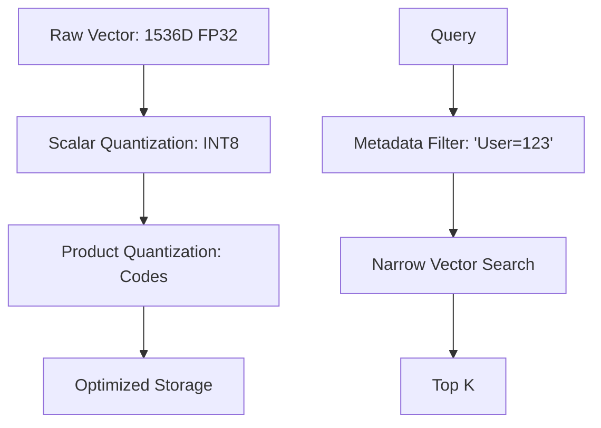

# Vector Database Optimization: Speed & Scale

## 1. Beginner-friendly Hinglish Explanation 🇮🇳
Bhai, socho tumne ek Vector DB bana li. Ab tumhare paas 100 users hain, sab kuch badhiya chal raha hai. Par jab 1,000,000 users aayenge, toh kya tumhari DB handle kar payegi? 

**Vector Database Optimization** wahi "Secret Sauce" hai jo system ko fatne se bachata hai. Ismein hum seekhte hain ki kaise vectors ko chota karein (Quantization), kaise data ko partition karein, aur kaise memory manage karein. Yeh bilkul waise hi hai jaise ek choti car ko Ferrari banana—tameez se engine (Indexing) aur weight (Compression) optimize karke.

---

## 2. Deep Technical Explanation
Optimizing a Vector DB involves balancing the **Speed-Accuracy-Memory (SAM)** triangle.
- **Scalar Quantization (SQ)**: Converting FP32 values to INT8. Reduces memory by 4x with minimal accuracy loss.
- **Product Quantization (PQ)**: Compressing sub-vectors into codes. Reduces memory by up to 64x but loses more accuracy.
- **Namespace/Filtering**: Using metadata to restrict the search space before doing vector comparisons.
- **Sharding**: Splitting the index across multiple machines for horizontal scaling.

---

## 3. Mathematical Intuition
Memory usage of a Flat index: $N \times D \times 4$ bytes.
With **SQ8 (INT8)**: $N \times D \times 1$ byte.
With **PQ (e.g., $m=d/8$)**: $N \times (d/8) \times 1$ byte.
For 1M vectors of 1536 dimensions:
- Flat: 6.1 GB
- SQ8: 1.5 GB
- PQ: 192 MB
The optimization allows you to fit 30x more data in the same RAM.

---

## 4. Architecture Diagrams


---

## 5. Production-ready Examples
Optimizing a search with Metadata Filtering:

```python
# Pinecone example with metadata filtering
index.query(
    vector=[0.1, 0.2, ...],
    top_k=10,
    filter={
        "genre": {"$eq": "comedy"},
        "year": {"$gt": 2020}
    }
)
# Metadata filtering is often faster than vector search 
# because it drastically reduces the number of vectors to compare.
```

---

## 6. Real-world Use Cases
- **Enterprise RAG**: Filtering documents by "Department" or "Access Level" before searching.
- **Social Media**: Recommending posts only from a user's "Following" list.

---

## 7. Failure Cases
- **Quantization Overkill**: Using PQ for critical medical data where a 2% accuracy drop could lead to a wrong diagnosis.
- **Metadata Bottleneck**: Having too many complex filters can sometimes be slower than the vector search itself if the database isn't optimized for SQL-like queries.

---

## 8. Debugging Guide
1. **Search Latency P99**: Monitor your slowest queries. Are they slow because of large filters or high dimensions?
2. **Memory Leaks**: Check if your Vector DB is swapping to disk (Slow death).

---

## 9. Tradeoffs
| Method | Accuracy | Memory | Speed |
|---|---|---|---|
| FP32 (None) | 100% | High | Medium |
| INT8 (SQ) | 99% | Medium | Fast |
| PQ (Comp) | 90% | Very Low | Very Fast |

---

## 10. Security Concerns
- **Filter Bypass**: Tricking the metadata filter to retrieve vectors that belong to a different user or department.

---

## 11. Scaling Challenges
- **Re-indexing**: When you change your embedding model (e.g., from OpenAI to Llama), you must re-embed and re-index every single document from scratch.

---

## 12. Cost Considerations
- **VRAM vs Disk**: In-memory DBs like Pinecone are expensive. Disk-based DBs like Milvus or Zilliz are cheaper but slower.

---

## 13. Best Practices
- **Pre-filtering**: Always filter by metadata FIRST to reduce the vector search space.
- **Async Upserts**: Don't wait for the index to update before confirming to the user (Latency optimization).
- **Use FP16**: For most LLM tasks, FP16 is indistinguishable from FP32 but saves 2x memory.

---

## 14. Interview Questions
1. What is Scalar Quantization and how does it affect precision?
2. Why is metadata filtering important in a production RAG system?

---

## 15. Latest 2026 Patterns
- **Serverless Vector DBs**: Databases that "Scale to Zero" when not in use, saving massive costs for low-traffic apps.
- **GPU-Accelerated Indexing**: Building billions of HNSW edges in minutes using high-end GPUs instead of weeks on CPUs.
