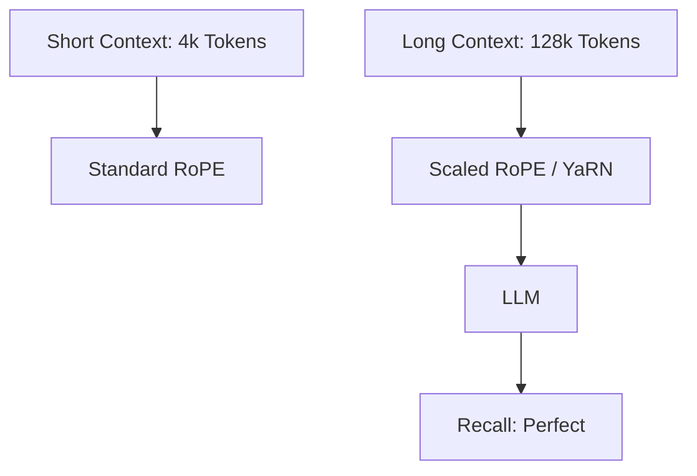

# Extending Context Window: From 4k to 1M+ Tokens

## 1. Beginner-friendly Hinglish Explanation 🇮🇳
Bhai, socho tum ek aisi movie dekh rahe ho jahan tum har 5 minute baad pichli kahani bhool jate ho. Bore ho jaoge na? Puraane LLMs ka "Context Window" chota tha (jaise 2k ya 4k tokens). Agar tum unhe poori book doge, toh woh shuruat ka part bhool jayenge.

**Extending Context Window** wahi technology hai jisse hum model ki "Yaddasht" (Memory) badhate hain. Aaj kal ke models (jaise Gemini ya Llama-3) 128k se lekar 1 Million+ tokens tak yaad rakh sakte hain. Iske liye humein sirf hardware nahi, balki math (Attention mechanism) mein bhi badlav karne padte hain. Is module mein hum wahi "Memory hacks" seekhenge.

---

## 2. Deep Technical Explanation
Context window extension involves overcoming the quadratic complexity of attention and the limitations of positional encodings.
- **Architectural Changes**: Grouped Query Attention (GQA) and Flash Attention.
- **Positional Extrapolation**: Modifying RoPE (Rotary Positional Embeddings) to handle larger indices.
- **Memory Management**: PagedAttention (vLLM) to handle massive KV caches.
- **Inference Efficiency**: Speculative decoding and activation sparse methods.

---

## 3. Mathematical Intuition
The main challenge is that a model trained on sequence length $L$ fails on $L + \Delta$ because the positional embeddings are out of distribution.
To fix this, we use **Linear Interpolation**:
$$\theta_i = \theta \cdot s$$
where $s$ is the scaling factor. This "Squeezes" the 128k sequence into the 4k space the model was trained on, allowing it to generalize without full retraining.

---

## 4. Architecture Diagrams


---

## 5. Production-ready Examples
Checking the context limit of a model:

```python
from transformers import AutoConfig

config = AutoConfig.from_pretrained("meta-llama/Llama-3-8B-Instruct")
print(f"Max Position Embeddings: {config.max_position_embeddings}")
# Output: 8192 (or 131072 for long-context versions)

# To extend it manually (Naively):
config.max_position_embeddings = 16384
# Note: This requires fine-tuning (Continued Pre-training) to work well.
```

---

## 6. Real-world Use Cases
- **Legal/Compliance**: Uploading 10 different 100-page contracts and asking for contradictions.
- **Codebase Analysis**: Chatting with an entire GitHub repository.
- **Movie Summarization**: Analyzing a full script to find character arcs.

---

## 7. Failure Cases
- **Lost in the Middle**: Even with 1M context, models often ignore facts in the middle of the prompt.
- **VRAM Explosion**: A 128k context Llama-3-8B can take 20GB+ of VRAM just for the KV Cache.

---

## 8. Debugging Guide
1. **Needle-in-a-Haystack Test**: Hide a random fact in a 100k token document and see if the model can find it.
2. **Perplexity over Distance**: Check if PPL increases as you move further into the long sequence.

---

## 9. Tradeoffs
| Feature | Small Context (8k) | Large Context (128k) |
|---|---|---|
| Latency | Fast | Slow |
| Cost | Low | Very High |
| RAG necessity | High | Medium |

---

## 10. Security Concerns
- **Context Denial of Service**: Sending a 1M token request that fills up all GPU memory, blocking other users.

---

## 11. Scaling Challenges
- **The Attention Bottleneck**: Even with optimizations, $O(N^2)$ still hurts at 1 Million tokens. We need "Linear Attention" or "Ring Attention".

---

## 12. Cost Considerations
- **API Billing**: 1 Million tokens on GPT-4o can cost $5-$10 for a *single* request.

---

## 13. Best Practices
- Use **GQA** (Grouped Query Attention) to save 8x KV cache memory.
- Use **Flash Attention 2** for 2x speedup.
- If accuracy in the middle is critical, use **RAG** instead of a massive context window.

---

## 14. Interview Questions
1. Why can't a model trained on 2k tokens naturally work on 8k tokens?
2. What is the "Needle-in-a-Haystack" test?

---

## 15. Latest 2026 Patterns
- **Ring Attention**: Distributing the attention calculation in a "Ring" across 100s of GPUs to support **Infinite Context**.
- **Context Compression**: Using an LLM to "Compress" 1M tokens into 1k "Summary Tokens" that retain full meaning.
