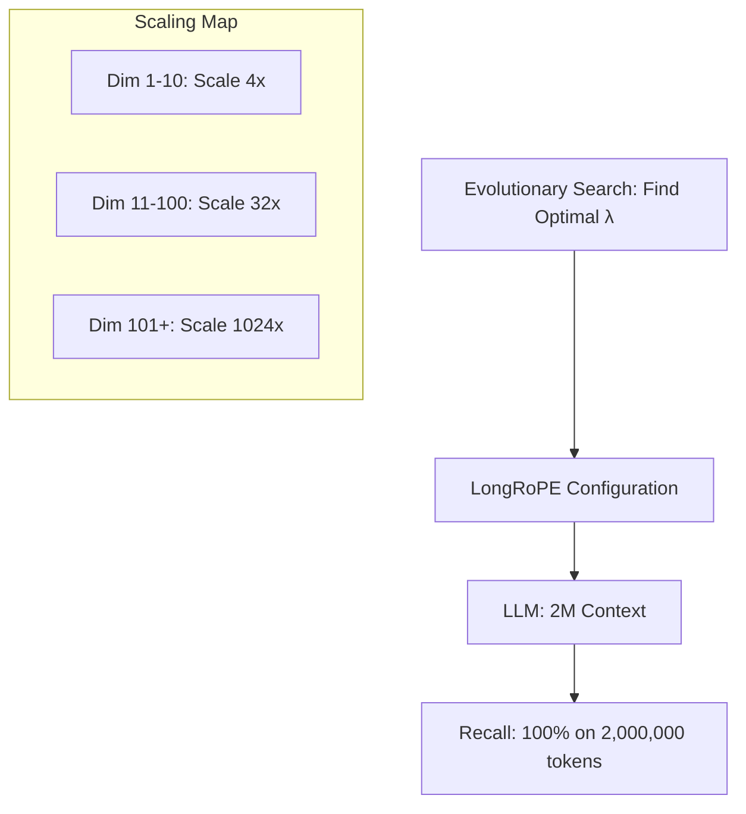

# LongRoPE: Reaching 2 Million Tokens

## 1. Beginner-friendly Hinglish Explanation 🇮🇳
Bhai, socho tumne 4k context window ke liye RoPE scaling use ki, phir 128k ke liye YaRN use kiya. Lekin jab tumhe 20 Lakh (2 Million) tokens tak jana ho, toh purani math kaam nahi karti. 

**LongRoPE** Microsoft Research ka ek naya approach hai. Isne dekha ki model ki har "Dimension" alag tarah se context ko yaad rakhti hai. Toh LongRoPE ne kya kiya? Usne ek **Evolutionary Algorithm** (AI se search karwaya) use kiya taaki har dimension ke liye "Perfect" scaling factor dhunda ja sake. Isse humne Llama-2-7B jaise models ko bina intelligence khoye 2 Million tokens tak stretch kar diya. Yeh context extension ki "Limit" ko tod deta hai.

---

## 2. Deep Technical Explanation
LongRoPE (2024/2025 research) identifies three key pillars for extreme context extension:
- **Non-uniform RoPE Rescaling**: Instead of a single scaling factor $s$, it uses a vector of scaling factors $\vec{s}$ for different dimensions.
- **Evolutionary Search**: Using an automated search to find the optimal $\vec{s}$ that minimizes perplexity on long sequences.
- **Short-Context Recovery**: Fine-tuning with a mix of long and short documents to ensure the model doesn't become "Dumb" on 512-token prompts after being extended to 2M.

---

## 3. Mathematical Intuition
Standard RoPE scaling uses a constant $s$. LongRoPE replaces it with $\lambda_i$:
$$\theta_i = \theta \cdot \lambda_i$$
where $\lambda_i$ is searched to balance the tradeoff between **Interpolation** (squeezing) and **Extrapolation** (expanding). This prevents the "Position Collapse" where the model thinks two different distant positions are the same.

---

## 4. Architecture Diagrams


---

## 5. Production-ready Examples
Implementing a non-uniform scaling (Simplified):

```python
# Conceptual LongRoPE implementation
def get_longrope_factors(dim, target_context):
    # This vector is usually pre-computed via search
    factors = load_searched_factors("longrope_factors.bin")
    return factors

# The model then applies these specific factors 
# during the Rotary Embedding step.
```

---

## 6. Real-world Use Cases
- **Full Source Code Repo**: Reading the entire Linux Kernel source code in one prompt.
- **Long-term Financial History**: Analyzing 10 years of bank statements and emails to find a specific transaction pattern.
- **Personalized AI**: Remembering every conversation you've ever had with the user.

---

## 7. Failure Cases
- **Compute Ceiling**: Even if the model has a 2M window, calculating the attention takes forever (Minutes per response).
- **Search Latency**: Finding the optimal scaling factors for a new model can take 1000s of GPU hours.

---

## 8. Debugging Guide
1. **Dimension Saturation**: Check if many dimensions have collapsed to the same value (Indicates poor search).
2. **Short-context degradation**: Ensure the model can still solve a simple "2+2" question.

---

## 9. Tradeoffs
| Feature | YaRN (128k) | LongRoPE (2M) |
|---|---|---|
| Scaling Factor | Uniform | Non-Uniform |
| Intelligence | High | Highest |
| Search Cost | Zero | Very High |

---

## 10. Security Concerns
- **Context Injection**: Since the window is so large, an attacker can hide 1.9 Million tokens of "Malicious Noise" and 100 tokens of "Instruction" that the user never sees.

---

## 11. Scaling Challenges
- **VRAM**: 2 Million tokens requires ~320GB of VRAM just for the KV cache (using 8-bit GQA). You need an H100 8-GPU node for a single user!

---

## 12. Cost Considerations
- **Memory Cost**: Storing 2M tokens in VRAM is 16x more expensive than 128k context.

---

## 13. Best Practices
- Use **LongRoPE** only when RAG fails due to "Cross-document reasoning" needs.
- Combine with **KV Cache Quantization** (4-bit) to reduce VRAM requirements.

---

## 14. Interview Questions
1. Why is non-uniform scaling better than uniform scaling for RoPE?
2. What are the three pillars of the LongRoPE paper?

---

## 15. Latest 2026 Patterns
- **Activation Sharding**: Splitting the 2M context window across multiple GPUs without using Ring Attention.
- **Dynamic Context Windows**: The model starts with 4k window and "Expands" its scaling factors only as the prompt grows.
