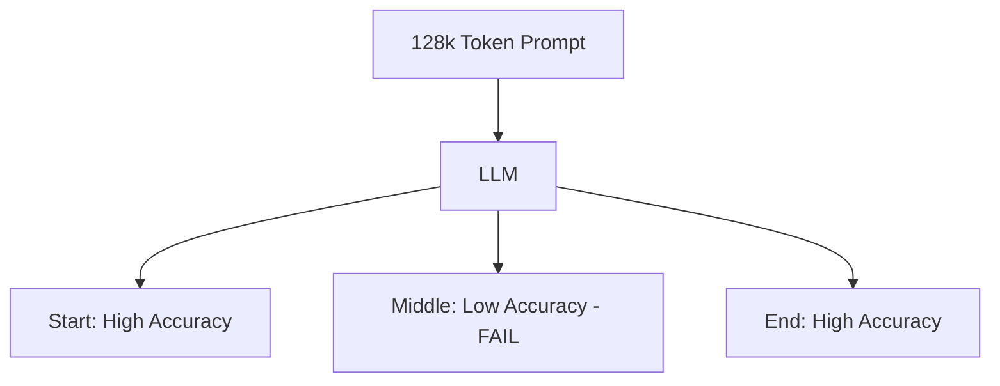

# Lost in the Middle Revisited: Why Size Isn't Everything

## 1. Beginner-friendly Hinglish Explanation 🇮🇳
Bhai, socho tumne ek 1000-page ki book padhi aur kisi ne tumse pucha: "Page 452 par hero ne kya pehna tha?". Tumhe shayad yaad na ho, lekin tumhe yeh zaroor yaad hoga ki book shuru kaise hui aur khatam kaise hui. 

LLMs ke saath bhi yahi hota hai. Use **Lost in the Middle** kehte hain. Model ko "Prompt" ke shuruat aur aakhri part bohot achhe se yaad rehte hain, lekin beech wala part woh "Gajini" ki tarah bhool jata hai. Sirf 1M context window hone se problem solve nahi hoti, kyunki model use "Dhyan" (Attention) nahi de pata. Is module mein hum dekhenge ki is weakness ko kaise overcome karein.

---

## 2. Deep Technical Explanation
Research shows that LLM performance on retrieval tasks follows a U-shaped curve.
- **Primacy Bias**: Strong attention on the first few tokens (often including system prompt).
- **Recency Bias**: Strong attention on the most recent tokens (closest to the output).
- **Middle Neglect**: The middle tokens have lower attention weights and are often "filtered out" by the model's layers.
- **Cause**: Training data mostly consists of short context, or the attention mechanism gets diluted in extremely long sequences.

---

## 3. Mathematical Intuition
The **Attention Entropy** increases with sequence length $N$.
In the middle of a 128k sequence, the attention probability mass is spread across too many tokens:
$$P(a_{ij}) = \frac{\exp(q_i \cdot k_j)}{\sum_{k=1}^N \exp(q_i \cdot k_k)}$$
As $N \to \infty$, $P(a_{ij}) \to 0$.
Unless a token $j$ has an extremely strong "Signal", it becomes "Noise" to the query $i$.

---

## 4. Architecture Diagrams


---

## 5. Production-ready Examples
Testing for "Lost in the Middle" (The Needle-in-a-Haystack script):

```python
def needle_in_haystack(model, context_size, needle_position):
    # 1. Generate a long 'haystack' of filler text
    # 2. Insert the 'needle' (a secret fact) at needle_position (e.g., 50%)
    # 3. Ask the model to retrieve the fact
    # 4. Check if it fails
    pass

# Mitigation: If you find a failure at 50%, move critical context 
# to the very beginning or very end of the prompt.
```

---

## 6. Real-world Use Cases
- **Medical Diagnostics**: If a patient's critical allergy is mentioned in the middle of a 50-page record, the LLM might miss it and suggest a dangerous drug.
- **Contract Analysis**: Missing a "Termination Clause" hidden in the middle of a dense PDF.

---

## 7. Failure Cases
- **False Confidence**: The model says "The information is not present" even though it's right there in the middle.
- **Hallucinated Retrieval**: The model makes up an answer because it can't find the real one in the "Middle fog".

---

## 8. Debugging Guide
1. **Heatmap Analysis**: Visualize the attention weights for a long query. If the middle part of the heatmap is "Dim", your model is lost.
2. **Context Shuffling**: Shuffle your context chunks and see if the answer changes.

---

## 9. Tradeoffs
| Strategy | Benefit | Drawback |
|---|---|---|
| Large Context | Easy to use | Expensive / Low Middle Accuracy |
| RAG | High Accuracy | Complex Setup / Latency |
| Long-Context FT | Better Recall | Expensive Training |

---

## 10. Security Concerns
- **Attention Hijacking**: Placing "Attention-Grabbing" tokens (like `!!! URGENT !!!`) in a document to make the model ignore the middle content.

---

## 11. Scaling Challenges
- **Fine-tuning for Recall**: It's hard to find high-quality training data that specifically forces the model to attend to the middle.

---

## 12. Cost Considerations
- **Waste of Tokens**: If the model ignores the middle 80%, you are effectively paying for 100k tokens but getting the intelligence of 20k tokens.

---

## 13. Best Practices
- **Put important info at the end**: LLMs have the strongest recency bias.
- **Summarize first**: Summarize the long document into a 2k "Executive Summary" and use that instead.
- **Use RAG**: RAG is still superior for pinpoint accuracy in massive datasets.

---

## 14. Interview Questions
1. Why does performance drop in the middle of a long prompt?
2. How can prompt engineering solve the "Lost in the Middle" problem?

---

## 15. Latest 2026 Patterns
- **Activation Shifting**: Dynamically shifting the "Attention Focus" to different parts of the context window during decoding.
- **Long-Context RAG**: Only retrieving the 10 most relevant pages but feeding them as a single long context to preserve inter-page relationships.
