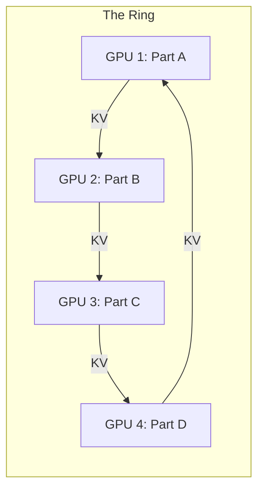

# Ring Attention: The Path to Infinite Context

## 1. Beginner-friendly Hinglish Explanation 🇮🇳
Bhai, socho tumhe ek 1 crore tokens ki book padhni hai. Ek GPU ke paas itni memory nahi hoti ki woh pura "Attention Matrix" store kar sake. Toh tum kya karoge?

**Ring Attention** wahi "Jugad" hai. Ismein hum bohot saare GPUs (jaise 128 ya 1024) ko ek "Ghere" (Ring) mein khada kar dete hain. Har GPU document ka ek chota hissa padhta hai aur phir "Key" aur "Value" vectors ko agle GPU ko pass kar deta hai. Yeh bilkul "Passing the parcel" game jaisa hai. Isse hum 1 Million, 10 Million, ya usse bhi zyada tokens handle kar sakte hain bina "Out of Memory" huye. Yeh long-context LLMs ka "Ultimate weapon" hai.

---

## 2. Deep Technical Explanation
Ring Attention is a distributed attention mechanism that overlaps communication with computation.
- **Problem**: Standard attention requires $O(N^2)$ memory. Even with Flash Attention, a single GPU can't hold the KV cache for 1M tokens.
- **Solution**: Distribute the sequence across $P$ GPUs. Each GPU computes attention for its local block of queries and then "Rotates" the KV blocks around the ring.
- **Asynchronous Communication**: While computing attention for block $i$, the GPU is already sending block $i-1$ to the next neighbor and receiving block $i+1$.

---

## 3. Mathematical Intuition
The attention $O = \text{softmax}(QK^T)V$ is split into chunks.
Each GPU holds $Q_{local}, K_{local}, V_{local}$.
The ring rotation allows every GPU to eventually see every $K$ and $V$ in the sequence.
$$\text{Output}_i = \sum_{j=1}^P \text{Attention}(Q_i, K_j, V_j)$$
Total time complexity remains $O(N^2/P)$ per GPU, but memory per GPU is $O(N/P)$, which is linear scaling!

---

## 4. Architecture Diagrams


---

## 5. Production-ready Examples
Conceptual Ring Attention loop (Python-like pseudo-code):

```python
import torch.distributed as dist

def ring_attention(q_local, k_local, v_local):
    out = 0
    l_max = -inf
    curr_k, curr_v = k_local, v_local
    
    for step in range(world_size):
        # 1. Compute local attention (using Flash Attention)
        attn_out, l_new = compute_flash_attn(q_local, curr_k, curr_v)
        
        # 2. Update output (online softmax logic)
        out = update_out(out, attn_out, l_max, l_new)
        l_max = max(l_max, l_new)
        
        # 3. Rotate KV blocks across GPUs
        curr_k = dist.send_recv_rotate(curr_k)
        curr_v = dist.send_recv_rotate(curr_v)
        
    return out
```

---

## 6. Real-world Use Cases
- **Whole-Genome Sequencing**: Analyzing DNA sequences with billions of base pairs.
- **Long Video Understanding**: Processing 1-hour long videos as a single sequence of tokens.
- **Scientific Simulation**: Correlating data across years of climate logs.

---

## 7. Failure Cases
- **Network Latency**: If your GPUs aren't connected by ultra-fast InfiniBand/NVLink, the time spent "Passing" the KV blocks will be more than the compute time.
- **Non-determinism**: Numerical stability issues when doing "Online Softmax" across 1000 nodes.

---

## 8. Debugging Guide
1. **Communication vs Compute Ratio**: If GPUs are idle for 50% of the time, your network is the bottleneck.
2. **Correctness Test**: Compare Ring Attention output with single-GPU attention on a smaller sequence (e.g., 32k).

---

## 9. Tradeoffs
| Feature | Single GPU (Flash) | Ring Attention |
|---|---|---|
| Max Sequence | 128k (Limit) | Infinite (Scales with GPUs) |
| Networking | None | Extreme (High bandwidth) |
| Latency | Fast | Linear increase with nodes |

---

## 10. Security Concerns
- **Data Sniffing**: Since KV blocks are moving across the network, they could be intercepted if the inter-GPU network isn't encrypted (rare in clusters but possible).

---

## 11. Scaling Challenges
- **The "Ring Wall"**: As the ring grows to 10,000 GPUs, the probability of a single GPU failing and breaking the whole ring increases dramatically.

---

## 12. Cost Considerations
- **Hardware**: You need an "H100 Cluster" to make Ring Attention efficient. Doing this on T4s over Ethernet will be 100x slower.

---

## 13. Best Practices
- Use **Async P2P (Peer-to-Peer)** communication to hide the latency.
- Combine with **GQA** to reduce the size of the parcels being passed in the ring.

---

## 14. Interview Questions
1. How does Ring Attention solve the memory bottleneck of the Attention Matrix?
2. Why is InfiniBand crucial for Ring Attention?

---

## 15. Latest 2026 Patterns
- **Striped Attention**: A variation that balances the workload better between GPUs to avoid "Idle" time.
- **Hierarchical Ring**: Using a small ring inside a node (fast NVLink) and a larger ring between nodes (InfiniBand).
