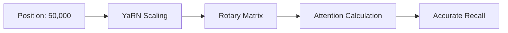

# RoPE Scaling & YaRN: Squeezing More Context

## 1. Beginner-friendly Hinglish Explanation 🇮🇳
Bhai, socho tum ek scale (ruler) use kar rahe ho jo sirf 30cm tak measure kar sakta hai. Ab tumhe 100cm measure karna hai. Tum kya karoge? 
1. Ya toh tum 100cm ka bada scale banao (Retraining - Expensive!).
2. Ya phir tum har 1cm ko 0.3cm maan lo (Interpolation). 

**RoPE Scaling** wahi "Ruler scaling" hai. **YaRN** iska ek advanced version hai jo ensure karta hai ki model high-frequency details (jaise comma, full-stop) na bhool jaye jab hum scale badhate hain. Isse hum 4k tokens par trained model ko 128k tokens par chalne layak bana dete hain bina uski intelligence khoe.

---

## 2. Deep Technical Explanation
RoPE (Rotary Positional Embeddings) represents positions as rotations in a 2D plane. 
- **Linear Scaling**: Divide the position index by a factor $s$. This "smushes" the high-frequency waves, causing the model to lose fine-grained details.
- **NTK-aware Scaling**: Modifies the base of the rotation frequency to prevent losing high-frequency information.
- **YaRN (Yet another RoPE extensioN)**: Uses "Attention Scaling" and "Frequency Interpolation" to achieve near-perfect performance at 10x-32x context extensions.

---

## 3. Mathematical Intuition
The RoPE frequency for dimension $d$ is:
$$f_i = \text{base}^{-2i/d}$$
In **Linear Scaling**, we replace $pos$ with $pos/s$.
In **NTK Scaling**, we change the base:
$$\text{base}_{new} = \text{base} \cdot s^{d/(d-2)}$$
This ensures that the "wavelength" of the highest frequency remains constant even as the context grows.

---

## 4. Architecture Diagrams


---

## 5. Production-ready Examples
Implementing NTK-aware scaling in a config:

```python
# In a HuggingFace config.json
"rope_scaling": {
    "type": "ntk",
    "factor": 4.0 # Extends 8k to 32k
}

# In 2026, many models use Dynamic RoPE Scaling
# which adjusts the factor based on the actual sequence length during inference.
```

---

## 6. Real-world Use Cases
- **Upgrading Old Models**: Taking a Llama-2-7B (4k context) and making it work on 32k context for a specialized RAG app.
- **Long-form Writing**: Helping a model maintain plot consistency over a 50,000-word novel.

---

## 7. Failure Cases
- **Information Washout**: If the scaling factor is too high (e.g., 100x), the "signal-to-noise" ratio of positions becomes too low, and the model starts mixing up the order of words.
- **Training Gap**: If the model wasn't fine-tuned with the new scale, it might hallucinate more.

---

## 8. Debugging Guide
1. **Perplexity Degradation**: Plot PPL as sequence length increases. If it spikes at 8k (for a 4k model), your scaling is failing.
2. **Frequency Analysis**: Ensure that high-frequency components of the embedding are still active.

---

## 9. Tradeoffs
| Method | Accuracy | Extrapolation Limit |
|---|---|---|
| Linear | Low | 2x - 4x |
| NTK-Aware | Medium | 8x - 16x |
| YaRN | High | 32x - 64x |

---

## 10. Security Concerns
- **Position Confusion Attacks**: Crafting a prompt that exploits the "Interpolated" space to make the model attend to the wrong part of the document.

---

## 11. Scaling Challenges
- **Context Fine-tuning**: Even with YaRN, you usually need 500-1000 steps of "Continued Pre-training" on long documents to stabilize the model.

---

## 12. Cost Considerations
- **Training Tokens**: You need a dataset of very long documents (books, codebases) to fine-tune the scale. These are harder to curate than short chat pairs.

---

## 13. Best Practices
- Use **YaRN** for extensions > 4x.
- Always use **BFloat16** to avoid numerical overflow in the frequency calculations.

---

## 14. Interview Questions
1. Why does Linear Scaling fail at very large context windows?
2. How does NTK scaling differ from simple interpolation?

---

## 15. Latest 2026 Patterns
- **LongRoPE**: A search-based method that finds the "Optimal" scaling factor for each individual dimension, allowing 2M+ context windows.
- **Rotary Persistence**: Training models with "Decaying" rotations to focus more on local context while still keeping global context.
