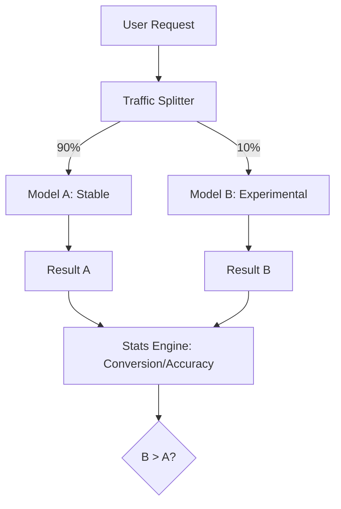

# A/B Testing LLMs: Data-Driven Deployment

## 1. Beginner-friendly Hinglish Explanation 🇮🇳
Bhai, socho tumne ek naya prompt likha hai aur tumhe lagta hai ki yeh puraane waale se "Better" hai. Lekin "Lagta hai" aur "Hai" mein farak hota hai. 

**A/B Testing** wahi tareeka hai jismein hum 50% users ko puraana prompt dikhate hain (Model A) aur 50% ko naya (Model B). Phir hum dekhte hain ki kaunse model mein users ne zyada "Thumbs Up" diye, ya kisne zyada purchases karwayi. Bina A/B testing ke, tum andhere mein teer chala rahe ho. Production mein hamesha "Data" ki sunni chahiye, apne "Gut feeling" ki nahi.

---

## 2. Deep Technical Explanation
A/B testing for LLMs ka matlab hai do different configurations (Models, Prompts, ya RAG strategies) ko live environment mein compare karna.
- **Random Assignment**: Users ko Group A ya Group B mein assign kiya jata hai unke UserID ke basis par (Consistent hashing).
- **Metric Tracking**: Business-level KPIs (Conversion, Click-through rate) aur model-level KPIs (Accuracy, Hallucination rate) track karna.
- **Statistical Significance**: p-values ka use karke ensure karna ki Model B *actually* better hai aur sirf lucky nahi.
- **Canary Deployment**: 1% traffic Model B ko dekar shuru karna aur gradually increase karna agar errors na hon.

---

## 3. Mathematical Intuition
**Chi-Squared Test** Conversion ke liye:
Agar Model A ke 1000 mein se 100 successes the, aur Model B ke 1000 mein se 120.
$$ \chi^2 = \sum \frac{(O-E)^2}{E} $$
jahan $O$ Observed hai aur $E$ Expected hai.
Agar $p < 0.05$, to hum 95% confidence ke saath keh sakte hain ki Model B behtar hai.
LLMs ke liye, hum **Elo ratings** bhi use karte hain jo human/AI comparisons se derived hote hain test phase mein.

---

## 4. Architecture Diagrams


---

## 5. Production-ready Examples
Simple traffic splitting logic:

```python
import hashlib

def get_variant(user_id, experiment_name):
    # Deterministic hashing ensures user always gets the same variant
    hash_val = int(hashlib.md5(f"{user_id}_{experiment_name}".encode()).hexdigest(), 16)
    return "B" if (hash_val % 100) < 10 else "A" # 10% traffic to B

user_id = "user_789"
variant = get_variant(user_id, "new_prompt_v2")

if variant == "B":
    response = call_model_b(prompt)
else:
    response = call_model_a(prompt)
```

---

## 6. Real-world Use Cases
- **E-commerce Chatbots**: Testing karna ki kya "Friendly" persona "Formal" se zyada sales lead karta hai.
- **Coding Assistants**: Testing karna ki kya prompt mein "Type Hints" add karne se generated code mein bugs kam hote hain.

---

## 7. Failure Cases
- **Metric Dilution**: Ek saath bahut cheezon ki testing (Prompt + Model + Temperature). Agar results improve hote hain, to pata nahi chalega ki kaunsa change cause hua.
- **Small Sample Size**: Sirf 50 users se conclusions nikalna. Results noisy aur unreliable honge.

---

## 8. Debugging Guide
1. **Consistency Check**: Ensure karo ki ek hi user subah Model A aur shaam Model B na dekhe. Isse user experience kharab hota hai.
2. **Health Check**: Agar Model B ka 500 Error rate > 1% hai, to experiment ko turant band kar do.

---

## 9. Tradeoffs
| Feature | Shadow Deployment | A/B Testing |
|---|---|---|
| User Impact | Zero | High |
| Real Feedback | None | High |
| Implementation | Complex | Medium |

---

## 10. Security Concerns
- **Variant Leakage**: Ek malicious user ko pata chalna ki wo "Experimental" group mein hai aur "Stable" version mein na hone wali vulnerabilities find karne ki koshish karna.

---

## 11. Scaling Challenges
- **Latency Overload**: Production mein do different models run karne ka matlab hai ki tumhe dono ke liye sufficient GPU capacity maintain karni padegi, khaaskar split ke dauran.

---

## 12. Cost Considerations
- **Infrastructure Cost**: Agar Model B bada model hai (e.g., 70B vs 8B), to test period mein operational costs badh jayenge.

---

## 13. Best Practices
- **Test one variable at a time**.
- **Define success metrics ko test shuru karne se PEHLE define karo**.
- **Use a "Kill Switch"**: Ek automated tareeka jisse saara traffic turant Model A ko revert kiya ja sake agar kuch galat ho.

---

## 14. Interview Questions
1. Aap kaise ensure karte hain ki A/B testing user experience degrade na kare?
2. "Statistical Significance" kya hai aur LLM evals ke liye yeh kyun important hai?

---

## 15. Latest 2026 Patterns
- **Multi-Armed Bandit (MAB)**: Fixed 50/50 split ki jagah, ek algorithm real-time mein "Sikhata" hai ki kaunsa model behtar hai aur gradually winner ko zyada traffic bhejta hai.
- **Counterfactual Evaluation**: Past user data ka use karke "Simulate" karna ki kya hota agar unhone Model B dekha hota, jo live tests par time aur money bachata hai.