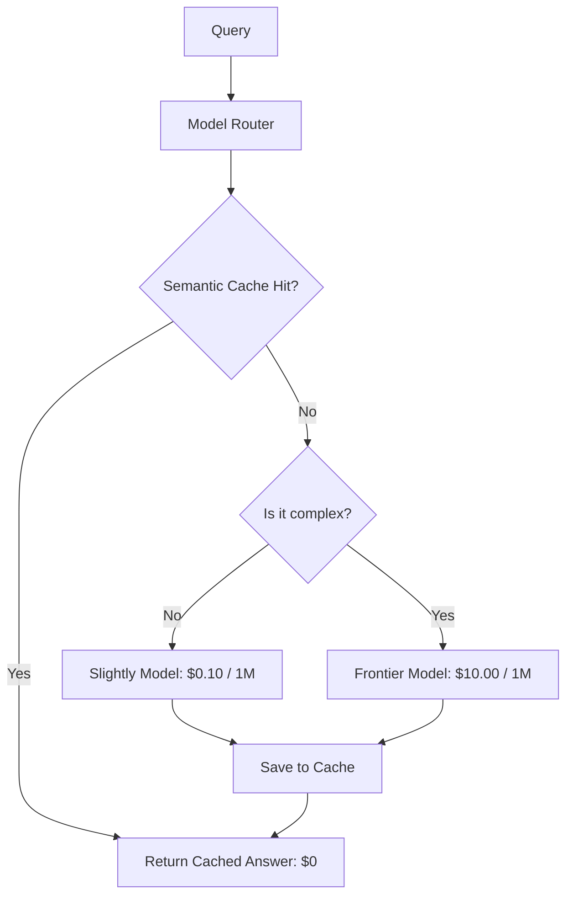

# 💸 Cost Optimization Strategies: AI Economics
> **Objective:** Engineering techniques master karo LLM operational costs by 80% or more reduce karne ke liye using semantic caching, model routing, quantization, and prompt engineering | **Language:** Hinglish | **Standard:** 2026 Expert Framework

---

## 🧭 1. Beginner-Friendly Hinglish Explanation
Cost Optimization ka matlab hai "AI ka kharcha kam karna bina quality giraye".

- **The Problem:** LLMs bahut mehenge ho sakte hain. Har token ka paisa lagta hai. Agar aapka app popular ho gaya, toh aapka bill lakhon mein aa sakta hai.
- **The Solution:** Cost Optimization. 
  - **Caching:** Agar do log ek hi sawal puchte hain, toh dusri baar model ko paise mat do, purana answer hi dikha do.
  - **Routing:** Chote kaamo ke liye sasta model (Llama-3 8B) aur bade kaamo ke liye mehenga model (GPT-4o) use karo.
- **Intuition:** Ye ek "Taxi" aur "Bus" jaisa hai. Office jane ke liye taxi theek hai, par roz sabke liye bus chalana sasta padta hai.

---

## 🧠 2. Gehri Technical Explanation
2026 mein operational costs char primary layers ke through manage kiye jaate hain:

1. **Semantic Caching (GPTCache/Redis):** Queries jo semantically similar hote hain unke liye responses store karna. Even if user puchta hai "What's the weather?" vs "How is the climate?", tab bhi cache hit hota hai.
2. **Model Cascading/Routing:** Ek "Router" model (bahut chota) query ki complexity predict karta hai aur use cheapest capable model bhejta hai.
3. **Token Pruning:** API bhejne se pehle prompt se "Useless" words (jaise 'please', 'thank you', 'a', 'the') hata dena.
4. **Prompt Caching:** Static prefixes ke liye provider-level caching (OpenAI/Anthropic) use karna (e.g., ek 100k-word PDF context).

---

## 📐 3. Ganitik Samajh
**Cost Saving Formula:**
$$\text{Total Cost} = (1 - \text{Hit Rate}) \times \text{LLM Cost} + \text{Hit Rate} \times \text{Cache Cost}$$
Agar aapka cache hit rate $30\%$ hai aur cache cost nearly $\$0$ hai, toh aapne instantly apna bill **$30\%$** cut kar liya.
**Prompt Caching** ke liye, aap ek baar "Write price" dete hain aur har baad ke query ke liye "Read price" (usually $90\%$ cheaper) dete hain.

---

## 🏗️ 4. Architecture Diagrams


---

## 💻 5. Production-Ready Udaaharan
Automated model routing aur cost tracking ke liye **LiteLLM** use karna:
```python
import litellm

# Router automatically tries the cheapest model first
response = litellm.completion(
    model="gpt-4o-mini", # Cheap
    messages=messages,
    fallbacks=["gpt-4o"] # Smart but expensive (only if mini fails)
)

print(f"Cost of this call: {response._response_ms}")
```

---

## 🌍 6. Asli Duniya ke Use Cases
- **Customer Support:** Aam sawaalon ke answers caching karna jaise "Where is my order?".
- **Content Generation:** Content ke "Drafts" generate karne ke liye sasta model use karna aur unhe "Finalize" karne ke liye sirf smart model.
- **Academic Research:** Ek popular paper ka summary caching karna jo 1000 students padh rahe hain.

---

## ❌ 7. Failure Cases
- **Stale Cache:** "Today's stock price" ke sawaal par kal ka answer dena. **Fix: Sensitive queries ke liye 'Time-to-Live' (TTL) set karo.**
- **Router Failure:** Router complex legal sawaal ko "Simple" samajhta hai aur chhote model ko bhejta hai jo galat answer deta hai.

---

## 🛠️ 8. Debugging Guide
| Problem | Reason | Solution |
| :--- | :--- | :--- |
| **Cache hit rate 0% hai** | Sirf exact match hota hai | Cache ke liye **Semantic Search** (Vector-based) mein switch karo. |
| **Costs abhi bhi high hain** | Long context baar baar repeat hota hai | Input tokens bachane ke liye **Prompt Caching** (header based) enable karo. |

---

## ⚖️ 9. Tradeoffs
- **Aggressive Caching (Zyada bachat / Purani info ka risk).**
- **No Caching (Zyada kharcha / Hamesha fresh info).**

---

## 🛡️ 10. Security Concerns
- **Cache Poisoning:** Agar attacker aapke cache mein galat answer daal sakta hai (e.g., ek sawaal poochhkar aur "Corrective" feedback dekar), toh baad ke saare users woh galat answer dekhenge.

---

## 📈 11. Scaling Challenges
- **The "Cache Context" Problem:** Ek user ke liye caching easy hai. Different "Privacy permissions" waale 1 million users ke liye caching hard hai. (User A ko User B ka cached private data nahi dekhna chahiye).

---

## 💰 12. Cost Considerations
- 2026 mein, "Input Tokens" usually "Output Tokens" se $10x$ cheaper hote hain. Model ko **concise** answers dene pe focus karo to sabse zyada paisa bachao.

漫
---

## 📝 14. Interview Questions
1. "Exact Caching aur Semantic Caching ke beech ka farak samjhao."
2. "'Model Cascading' kya hai aur ise kab use karna chahiye?"
3. "Prompt Caching long-context RAG ke liye costs kaise reduce karta hai?"

---

## 🚀 15. Latest 2026 LLM Engineering Patterns
- **Speculative Execution for Cost:** Chhota model run karna to predict kare ki bade model ki zaroorat hai ya nahi.
- **Token-Efficient Compression:** Specialized "Compressor" models use karna jo 1000-word prompt ko 100-token "Code" mein badalte hain jo LLM abhi bhi samajhta hai.
漫
漫