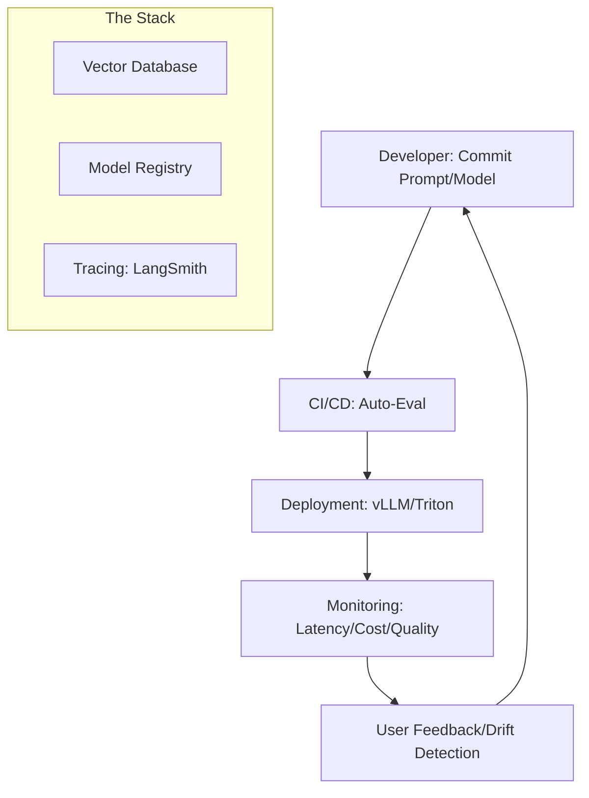

# LLMOps Fundamentals: Production mein AI

## 1. Beginner-friendly Hinglish Explanation 🇮🇳
Bhai, socho tumne apne laptop par ek badhiya AI model bana liya jo perfectly kaam kar raha hai. Ab tumhe ise 1 million users ke liye deploy karna hai. Kya tum apna laptop on rakhoge? Nahi na. 

**LLMOps (Large Language Model Operations)** wahi practice hai jismein hum seekhte hain ki kaise ek AI model ko production mein "Reliably" aur "Efficiently" chalaya jaye. Ismein models ki versioning, data ki safai, deployment, aur cost control sab aata hai. Yeh bilkul waise hi hai jaise ek choti shop ko "Amazon" level ka warehouse banana. Bina LLMOps ke, tumhara AI project sirf ek "Lab experiment" bankar reh jayega.

---

## 2. Gehra Technical Explanation
LLMOps, DevOps aur MLOps ko extend karta hai taaki Large Language Models ke unique challenges ko handle kiya ja sake.
- **Data Lifecycle**: Prompt templates, RAG datasets, aur synthetic data ko manage karna.
- **Model Lifecycle**: Model versions (Llama-3 v1 vs v2), quantization variants (4-bit vs 8-bit), aur adapters (LoRAs) ko manage karna.
- **Inference Lifecycle**: GPU clusters ko scale karna, throughput vs latency manage karna, aur caching.
- **Feedback Loop**: User ratings aur "thumbs-up/down" collect karna taaki model ko fine-tuning ke through improve kiya ja sake.

---

## 3. Mathematical Intuition
Operational efficiency **P99 Latency** aur **Throughput** se measure kiya jaata hai.
Throughput $T$:
$$T = \frac{\text{Total Tokens Generated}}{\text{Total Time} \times \text{Number of GPUs}}$$
LLMOps ka aim $T$ ko maximize karna hai jabki $P99 < 2s$ (first token ke liye) maintain kare. Iske liye batch sizes aur memory usage ko balance karna padta hai.

---

## 4. Architecture Diagrams


---

## 5. Production-ready Examples
Ek standard `docker-compose` production LLM stack ke liye:

```yaml
version: '3.8'
services:
  vllm-server:
    image: vllm/vllm-openai
    command: --model meta-llama/Llama-3-8B
    deploy:
      resources:
        reservations:
          devices:
            - driver: nvidia
              count: 1
              capabilities: [gpu]
  vector-db:
    image: qdrant/qdrant
  observability:
    image: arize-phoenix/phoenix
```

---

## 6. Real-world Use Cases
- **Scaling Startups**: Ek OpenAI API (Prototype) se ek self-hosted Llama-3 model par AWS/GCP (Production) par move karna.
- **Enterprise Governance**: Har prompt aur response ko track karna compliance aur auditing ke liye.

---

## 7. Failure Cases
- **Silent Degradation**: Model ke answers time ke saath kharab ho jaate hain (Model Drift) lekin "Success" code (HTTP 200) wahi rahta hai.
- **Cost Spike**: Ek recursive loop ya ek viral user raat bhar mein $10,000 ka GPU bill la sakta hai.

---

## 8. Debugging Guide
1. **Tracing**: **LangSmith** ya **Arize Phoenix** ka use karke exactly trace karo ki request kahan fail hui (Kya retrieval mein? Prompt mein? Model mein?).
2. **Error Analysis**: 100 failed requests ko cluster karo dekhne ke liye ki koi common pattern hai (jaise, "Saare failures medical questions ke baare mein hain").

---

## 9. Tradeoffs
| Feature | Managed (OpenAI/Anthropic) | Self-Hosted (Llama/vLLM) |
|---|---|---|
| Ops Overhead | Low | High |
| Privacy | Medium | High |
| Long-term Cost | High (per token) | Low (per GPU hour) |

---

## 10. Security Concerns
- **API Key Leakage**: Galti se apni $10,000/mo wali OpenAI key ko public GitHub repo mein commit kar dena.
- **Access Control**: Yeh ensure karna ki sirf authorized users hi internal company Vector DB ko query kar sakein.

---

## 11. Scaling Challenges
- **Cold Starts**: Naya GPU instance spin up karna aur 70B model load karne mein 5-10 minute lag sakte hain, jisse "Serverless" LLMs difficult ho jaate hain.

---

## 12. Cost Considerations
- **Token Budgeting**: Users ke liye "Quotas" implement karna taaki woh company ka AI budget ek din mein uda na dein.

---

## 13. Best Practices
- **Sab kuch version karo**: Models, Prompts, aur Datasets.
- **Automated Evals**: Kabhi bina "Golden Dataset" ke khilaf chalaye naya prompt deploy mat karo.
- **Monitor Token Usage**: Spending mein sudden spikes ke liye alerts set up karo.

---

## 14. Interview Questions
1. LLMOps, traditional MLOps se kaise different hai?
2. Production RAG system ke liye aap kon se key metrics monitor karenge?

---

## 15. Latest 2026 Patterns
- **PromptOps**: Prompt engineering ko ek first-class citizen treat karna jiska apna branching, testing, aur deployment cycles hain.
- **Multi-Model Orchestration**: Models ke beech dynamically switch karna (complex tasks ke liye GPT-4o, simple tasks ke liye Llama-3-8B) taaki cost aur speed optimize ho.