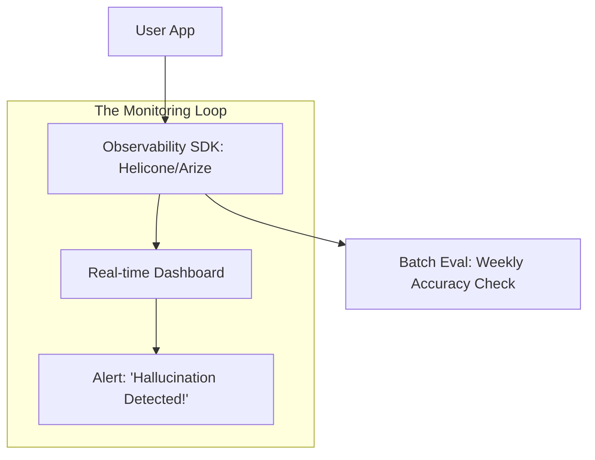

# 👁️ Model Monitoring and Observability: AI Auditing
> **Objective:** LLM performance, costs, aur quality ko real-time track karne ke liye tools aur techniques mein Mahir banein, basic logs se aage badhkar deep semantic observability tak | **Language:** Hinglish | **Standard:** 2026 Expert Framework

---

## 🧭 1. Beginner-Friendly Hinglish Explanation
Model Monitoring ka matlab hai "Model par nazar rakhna".

- **The Problem:** AI model ek "Black Box" jaisa hai. Aapko nahi pata ki wo andar kya soch raha hai ya wo kab "Galat" rasta pakad lega.
- **The Solution:** Observability. 
  - Hum har ek "Chat" ko record karte hain. 
  - Hum dekhte hain ki kitne tokens kharch hue (Money). 
  - Hum ye bhi check karte hain ki kya user khush hai ya nahi (Sentiment).
- **Intuition:** Ye ek "CCTV Camera" jaisa hai jo 24/7 AI ki harkaton par nazar rakhta hai takki galti hote hi hum "Alarm" baja sakein.

---

## 🧠 2. Deep Technical Explanation
Observability in 2026 consists of **Tracing, Feedback, and Evaluation**:

1. **Distributed Tracing (LangSmith/LangFuse):** Pure "Chain" of thoughts ko record karna. (e.g., User Query $\rightarrow$ Agent Thought $\rightarrow$ Tool Call $\rightarrow$ Result $\rightarrow$ Response).
2. **Semantic Monitoring:** Embeddings ka use karke model ke answers "Drifting" (time ke saath badalna) detect karna.
3. **Sentiment Analysis of Logs:** Pata lagana ki user kab gussa ho rahe hain ("You are stupid", "Wrong answer") aur un logs ko manual review ke liye flag karna.
4. **Latency Bucketing:** TTFT (Time to First Token) aur TPOT (Time per Output Token) track karna taaki server bottlenecks identify ho sakein.
5. **Cost Attribution:** Track karna ki kaun sa specific user ya department API tokens par sabse zyada kharch kar raha hai.

---

## 📐 3. Mathematical Intuition
**Drift Detection using KL Divergence:**
Hum Week 1 ($P$) aur Week 2 ($Q$) ke model outputs ki probability distribution compare karte hain.
$$D_{KL}(P \| Q) = \sum P(x) \log \frac{P(x)}{Q(x)}$$
Agar $D_{KL}$ ek threshold se badh jaye, to iska matlab hai ki model ka behavior kaafi badal gaya hai (possibly underlying API mein update ki wajah se).

---

## 🏗️ 4. Architecture Diagrams


---

## 💻 5. Production-Ready Examples
Integrating **LangSmith** for full-trace observability:
```python
import os
from langsmith import traceable

os.environ["LANGCHAIN_TRACING_V2"] = "true"

@traceable
def my_ai_function(query):
    # Every step inside this function will be recorded
    # including tool calls and internal logic.
    response = model.invoke(query)
    return response
```

---

## 🌍 6. Real-World Use Cases
- **Customer Support:** Pata lagana ki $20\%$ users ek specific "New Bug" ke baare mein poochh rahe hain jiska AI ko abhi tak nahi pata.
- **Cost Control:** Pata lagana ki ek developer ka test script 2 ghante mein \$2000 ke tokens use kar liya.
- **Quality Assurance:** Ek "Failed" conversation ko dobara play karna taaki exactly pata chale ki agent ne kahan galti ki.

---

## ❌ 7. Failure Cases
- **Metric Overload:** Itne saare alerts ki developer unhe ignore karna shuru kar dein (Alert Fatigue).
- **Sampling Error:** Sirf $1\%$ logs monitor karna aur baaki $99\%$ mein hui ek critical safety violation miss karna.
- **Privacy Leak:** "User Feedback" capture karna jisme unka private phone number ho aur use third party dashboard mein store karna.

---

## 🛠️ 8. Debugging Guide
| Problem | Reason | Solution |
| :--- | :--- | :--- |
| **Costs badh rahe hain lekin users same hain** | Model zyada wordy ho raha hai | **Conciseness Monitor** implement karein; long responses ko penalize karein. |
| **Model kuch users ke liye slow hai** | Region latency | **Multi-region model deployment** (Edge serving) use karein. |

---

## ⚖️ 9. Tradeoffs
- **Full Logging (Max Debugging / High Cost / Privacy Risk).**
- **Sampled Logging (Low Cost / Lower Privacy Risk / Might miss edge cases).**

---

## 🛡️ 10. Security Concerns
- **Dashboard Hijacking:** Agar kisi attacker ko aapke observability dashboard tak pahunch mil jaye, to wo aapke saare users ki private conversations dekh sakta hai. **Use 2FA and strict RBAC (Role-Based Access Control).**

---

## 📈 11. Scaling Challenges
- **Log Volume:** Agar aapke paas 100M tokens/day hai, to aapka "Observability Bill" aapke "Model Bill" se bada ho sakta hai. **Fix: Apne logs ko self-host karein ya intelligent sampling use karein.**

---

## 💰 12. Cost Considerations
- Observability platforms usually charge per "Trace" or "Token". Monitoring ke liye extra $5-10\%$ overhead ka budget rakhein.

漫
---

## 📝 14. Interview Questions
1. "AI agent ke context mein 'Trace' kya hai?"
2. "Human labels ke bina 'Semantic Drift' kaise detect karte hain?"
3. "Production LLM ke liye key performance metrics (KPIs) kya hain?"

---

## 🚀 15. Latest 2026 LLM Engineering Patterns
- **Real-time Hallucination Detection:** Main model ke saath ek tiny, cheap model chalaana har sentence mein facts ko "Verify" karne ke liye.
- **Automatic Feedback Loop:** Agar user "Thumbs Down" click karta hai, to system automatically us trace ko next model version ke liye "Fine-tuning" pipeline mein bhej deta hai.
漫
漫