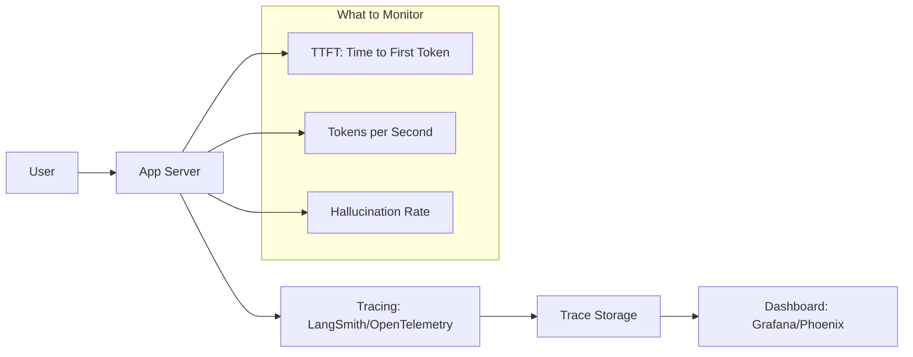

# Monitoring aur Observability: Black Box ke Andar Dekhna

## 1. Beginner-friendly Hinglish Explanation 🇮🇳
Bhai, jab tumhara AI system production mein jata hai, toh woh ek "Black Box" ban jata hai. Tumhe kaise pata chalega ki woh sahi answers de raha hai ya nahi? Ya phir users use kaise use kar rahe hain? 

**Monitoring aur Observability** wahi "X-ray" hai jo tumhe system ke andar ki khabar deti hai. 
- **Monitoring**: "Kya system chal raha hai?" (Latency, Error rate, Cost).
- **Observability**: "System aisa kyun behave kar raha hai?" (Tracing the prompt, checking the retrieved chunks, looking at the attention logs). 
Bina sahi monitoring ke, tum tab tak nahi jaonoge ki tumhara AI "Pagal" (Hallucinating) ho gaya hai jab tak koi customer complain na kare.

---

## 2. Gehri Technical Vyakhya
LLMs ke liye Observability standard HTTP metrics se aage badhti hai.
- **Traces**: Request ka full lifecycle dekhna - user ke query se lekar vector search, prompt construction, aur final model output tak.
- **Span Analysis**: Har sub-step ka time measure karna (e.g., "Vector search ne 200ms liya, Model generation ne 1.5s liya").
- **Quality Drift**: "Shadow Model" ya "LLM-Judge" ka use karke production outputs ko real-time mein score karna.
- **Cost Tracking**: Token usage ko specific users, features, ya organizations ke hisaab se attribute karna.

---

## 3. Mathematical Intuition
**Drift Detection**:
Hum user queries ke embeddings ki distribution monitor karte hain $P_{queries}$. Agar distribution significantly shift hoti hai (measured using **Kullback-Leibler Divergence** ya **Cosine Similarity** mean shift), iska matlab hai ki users aisi cheezein poochh rahe hain jinke liye model prepared nahi tha.
$$D_{KL}(P || Q) = \sum_i P(i) \log \frac{P(i)}{Q(i)}$$
High $D_{KL}$ ek signal hai ki apna RAG database update karein ya apne model ko fine-tune karein.

---

## 4. Architecture ke Diagrams


---

## 5. Production-ready Examples
`Arize Phoenix` ka upyog karte hue OTel tracing ke liye (Conceptual):

```python
from phoenix.trace.openai import OpenAIInstrumentor

# 1. Initialize Tracing
OpenAIInstrumentor().instrument()

# 2. Run your LLM code as usual
# All calls to OpenAI will now be automatically traced
# and visible in the Phoenix dashboard.

# 3. Check for Hallucinations in the background
# phoenix.eval(llm_judge, traces)
```

---

## 6. Real-world Use Cases
- **Enterprise Support**: Model jab specific product questions par baar baar "I don't know" bol raha ho toh detect karna (RAG mein aur docs add karne ka signal).
- **Abuse Detection**: Un users ko flag karna jo model ko "Jailbreak" karne ki koshish kar rahe hain, unke trace history ko analyze karke.

---

## 7. Failure Cases
- **Metric Overload**: 1000 alag alag cheezein monitor karna aur 1 cheez jo actually matters (Accuracy) ko ignore karna.
- **Latency of Observability**: Agar aapka monitoring system slow hai, toh yeh user ke response ko bhi slow kar sakta hai. **Asynchronous logging** ka upyog karein.

---

## 10. Security Concerns
- **PII in Logs**: Traces mein aksar full user prompt aur model response hota hai. Agar yeh logs encrypted nahi hain ya access-controlled nahi hain, toh yeh ek bada privacy risk hai.

---

## 11. Scaling Challenges
- **Massive Trace Volumes**: 1M users wale system ke har token ko store karna petabytes space le sakta hai. **Sampling** ka upyog karein (e.g., successful requests ka sirf 1% log karein lekin errors ka 100%).

---

## 12. Cost Considerations
- **Storage Cost**: Kai observability platforms "Spans" ya "Tokens" logged ke hisaab se charge karte hain.

---

## 13. Best Practices
- **TTFT (Time to First Token)**: User experience ke liye yeh sabse important latency metric hai.
- **Log the "Retrieved Chunks"**: Agar answer galat hai, toh aapko yeh jaanna hoga ki retriever failed ya generator failed.
- **Use OpenTelemetry (OTel)**: Ek vendor ke tracing format mein bandh na jaayein.

---

## 14. Interview Questions
1. LLMs ke context mein Monitoring aur Observability mein kya antar hai?
2. Production RAG application mein aap "Model Drift" kaise detect karenge?

---

## 15. 2026 ke Latest Patterns
- **AI-Native Observability**: Ek chhote model ka upyog karke aapke production traces ko "Watch" karna aur aapko tab alert karna jab woh kuch "Interesting" ya "Wrong" paaye.
- **Semantic Monitoring**: Vector space mein user queries ke "Meanings" ko monitor karna taaki aapke knowledge base mein automatically gaps find ho.