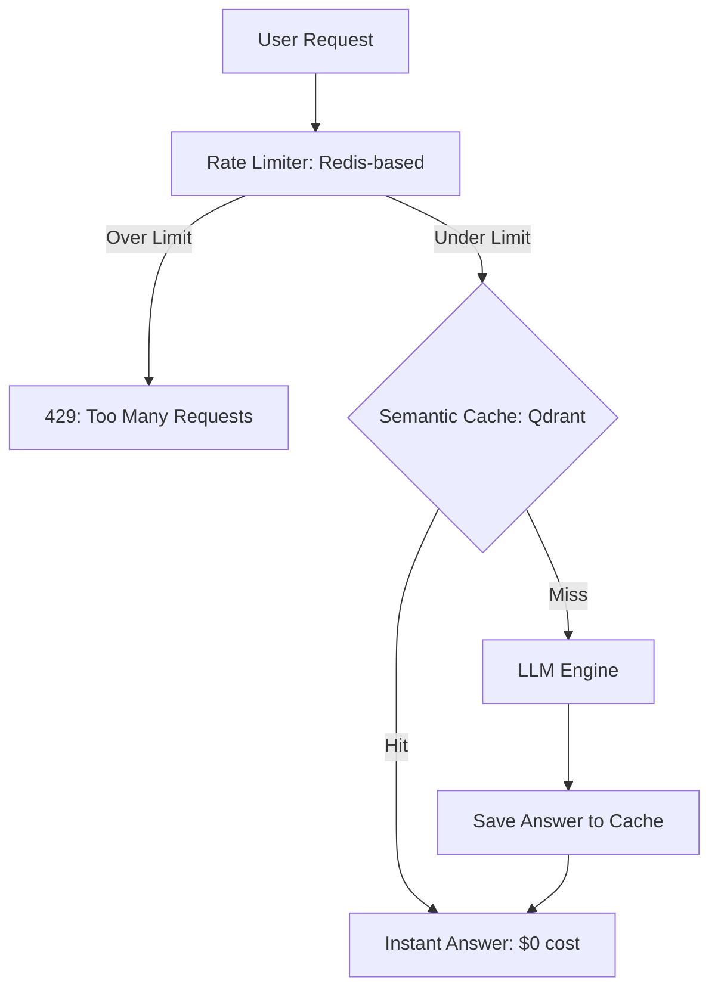

# 🚦 Rate Limiting aur Caching: Flow ko Control Karna
> **Objective:** Stable LLM services ke liye traffic management aur performance optimization techniques mein Mahir hona—specifically token-based rate limiting aur semantic caching strategies par focus karna | **Language:** Hinglish | **Standard:** 2026 Expert Framework

---

## 🧭 1. Beginner-Friendly Hinglish Explanation
Rate Limiting aur Caching ka matlab hai "Traffic ko control karna aur speed badhana".

- **The Problem:** 
  1. Ek user bohot saare sawal puch kar aapka pura GPU "Hog" kar sakta hai (Rate Limiting).
  2. Ek hi sawal 100 log puchenge toh 100 baar paise kyu dena? (Caching).
- **The Solution:** 
  - **Rate Limiting:** Har user ki ek limit set karna (e.g., 50 tokens per minute).
  - **Caching:** Popular answers ko "Memory" mein save karna takki agali baar instant answer mile.
- **Intuition:** Ye ek "Buffet Restaurant" jaisa hai. Rate limiting ye hai ki ek baar mein sirf ek plate milegi. Caching ye hai ki popular dishes pehle se taiyar rakhi jayein takki queue na lage.

---

## 🧠 2. Deep Technical Explanation
LLMs ke liye effective traffic management ke liye **Token-Aware** strategies chahiye hoti hain:

1. **Token-Bucket Algorithm:** "Requests per minute" ki jagah, hum "Tokens per minute" use karte hain. Ek user sirf 1 long request bhej kar apna poora "Bucket" ek ghante ke liye khatam kar sakta hai.
2. **Semantic Caching (Vector-based):** Query ke *meaning* ke basis par responses store karna. 
   - Query: "How to fix a flat tire?" $\rightarrow$ Cache Miss.
   - Query: "Flat tire repair guide" $\rightarrow$ Cache Hit (agar semantic similarity $> 0.95$ hai toh).
3. **Multi-layer Caching:** 
   - **L1 (Local Memory):** Ultra-fast, same user ke liye.
   - **L2 (Redis/Shared):** Global queries ke liye across all users.
4. **Tiered Rate Limiting:** Free users ko slow models/low limits milte hain; Paid users ko fast models/high limits milte hain.

---

## 📐 3. Mathematical Intuition
**Token Rate Limiting ($R$):**
Agar kisi user ka refill rate $\rho$ tokens/sec hai aur bucket size $B$ hai:
$$\text{Available Tokens} = \min(B, \text{Previous} + \rho \times \Delta t)$$
Ye "Bursty" traffic ko aapke GPU cluster ko crash karne se rokta hai, jabkay occasional long queries ko allow karta hai.

---

## 🏗️ 4. Architecture Diagrams


---

## 💻 5. Production-Ready Examples
Redis ke saath **Rate Limiting** implement karna (Conceptual):
```python
# Limit by Tokens Per Minute (TPM)
def check_rate_limit(user_id, tokens_requested):
    current_tokens = redis.get(f"user:{user_id}:tpm")
    if current_tokens + tokens_requested > MAX_TPM:
        raise Exception("Rate limit exceeded")
    redis.incrby(f"user:{user_id}:tpm", tokens_requested)
```

**Semantic Caching** set up karna:
```python
from gptcache import cache
from gptcache.embedding import OpenAI

# Initialize cache with semantic similarity
cache.init(
    embedding_handler=OpenAI(),
    similarity_threshold=0.9
)
# Next queries will check embeddings in a vector DB first.
```

---

## 🌍 6. Real-World Use Cases
- **Public Chatbots:** Ek single script/bot ko ek raat mein aapke \$10,000 ke API credits drain karne se rokna.
- **Internal Tools:** "Data Scientists" ko "HR" se zyada tokens dena kyunki unke queries (Code) long hote hain.
- **E-commerce:** Sale ke time "Return Policy" ya "Shipping Times" ke answers cache karna.

---

## ❌ 7. Failure Cases
- **Cache Drift:** Cache mein "Who is the Prime Minister?" ka purana answer pada hai. **Fix: News-related topics ke liye low TTL (Time To Live) set karo.**
- **False Cache Hit:** User puchta hai "Is the iPhone 15 good?" aur usse "Is the iPhone 14 good?" ka cached answer mil jaata hai kyunki ye semantically similar hain. **Fix: Higher similarity threshold (0.98) use karo.**

---

## 🛠️ 8. Debugging Guide
| Problem | Reason | Solution |
| :--- | :--- | :--- |
| **Legitimate users block ho rahe hain** | Limit 'Chat' ke liye bohot low hai | Rate limiting ke liye fixed windows ki jagah **Rolling Windows** use karo. |
| **Cache RAM bhar raha hai** | Eviction policy nahi hai | Redis mein **LRU (Least Recently Used)** eviction use karo. |

---

## ⚖️ 9. Tradeoffs
- **Semantic Cache (High hit rate / Risk of wrong answer / Vector DB cost).**
- **Exact Cache (100% accurate / Low hit rate / Fast).**

---

## 🛡️ 10. Security Concerns
- **Rate Limit Bypass:** Attackers aapke "Per-IP" limit ko bypass karne ke liye 1000 different IP addresses (Sybil attack) use kar rahe hain. **Fix: User ID / API Key se limit karo.**

---

## 📈 11. Scaling Challenges
- **The "Centralized Bottleneck":** Agar 100k users rate limiting ke liye ek hi Redis instance hit karte hain, toh Redis khud slow part ban jaata hai. **Fix: Distributed Rate Limiting (Cluster mode) use karo.**

---

## 💰 12. Cost Considerations
- Caching aapke LLM bill ka **$50\%-90\%$** bacha sakti hai. 2026 mein, caching ke bina ek app ko "un-engineered" maana jaata hai.

---

## ✅ 13. Best Practices
- **Sirf 'Static' information cache karo.**
- **Free users ke liye aggressive Rate Limits set karo.**
- **Har din 'Cache Hit Rate' KPI monitor karo.**
漫

---

## 📝 14. Interview Questions
1. "LLMs ke liye Request-based ki tulana mein Token-based rate limiting behtar kyun hai?"
2. "Cache mein 'Semantic Drift' ko aap kaise handle karte hain?"
3. "'Token Bucket' algorithm ko explain karein."

---

## 🚀 15. Latest 2026 LLM Engineering Patterns
- **Dynamic Rate Limits:** Agar aap "Good user" hain (high feedback score), toh system automatically aapki limit badha deta hai.
- **Proactive Caching:** AI "Predict" karta hai ki aaj kaunse questions popular honge (e.g., news events) aur cache ko pre-fill kar deta hai.
漫
漫
漫
漫
漫