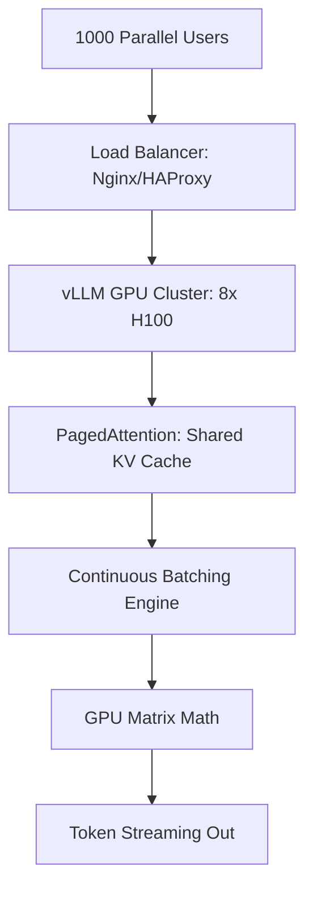

# 🏗️ Scalable Inference Infrastructure: Millions ko Serve Karna
> **Objective:** High-throughput LLM serving ke engineering ko master karna—dynamic batching aur PagedAttention se lekar multi-GPU orchestration aur auto-scaling GPU clusters tak | **Language:** Hinglish | **Standard:** 2026 Expert Framework

---

## 🧭 1. Beginner-Friendly Hinglish Explanation
Scalable Inference Infrastructure ka matlab hai "Ek aisa engine banana jo hazaro logo ko ek sath service de sake".

- **The Problem:** LLMs bahut heavy hote hain. Ek request ek poore GPU ko "Busy" kar sakti hai. Agar 100 log ek sath aayein, toh system crash ho jayega.
- **The Solution:** Scalable Infrastructure. 
  - **Dynamic Batching:** Alag-alag logo ke sawalo ko ek "Batch" mein daal kar GPU ko dena (Jaise ek bus mein 50 log jate hain).
  - **Auto-scaling:** Jab traffic badhe, toh apne aap naye GPUs "On" ho jayein.
- **Intuition:** Ye ek "Railway System" jaisa hai. Sirf engine (Model) kaafi nahi hai, aapko tracks (Infra) aur schedules (Batching) chahiye takki sab log time par pahunch sakein.

---

## 🧠 2. Deep Technical Explanation
LLMs ko scale pe serve karne ke liye **Memory aur Compute** bottleneck ko optimize karna hota hai:

1. **Continuous Batching (vLLM/TGI):** Ek poori batch ke khatam hone ka wait karne ke bajaye, jaise hi ek purani request ek token finish karti hai, nayi request batch mein add kar di jati hai.
2. **PagedAttention:** KV Cache ko OS Virtual Memory (paging) ki tarah manage karna. Isse memory fragmentation khatam hoti hai aur $10x$ zyada throughput possible hota hai.
3. **Speculative Decoding:** Ek chhote model se tokens ka "Guess" karna aur bade model se unhe "Verify" karna parallel mein, jisse generation speed double ho jati hai.
4. **Quantized Kernels:** AWQ ya GPTQ ka use karke bade models ko chhote GPUs mein fit karna, almost zero accuracy loss ke saath.
5. **Multi-Host Inference:** 405B model ko 8 ya 16 GPUs mein **Tensor Parallelism** use karke split karna.

---

## 📐 3. Mathematical Intuition
**Inference Throughput ($T$):**
$$T = \frac{\text{Batch Size} \times \text{Tokens per Second}}{\text{Hardware Latency}}$$
$T$ badhane ke liye hame **Batch Size** badhana hoga. Lekin batch size badhane se VRAM usage linearly increase hota hai. **PagedAttention** hume single A100 GPU par Batch Size 4 se 128 tak push karne ki capability deta hai.

---

## 🏗️ 4. Architecture Diagrams


---

## 💻 5. Production-Ready Examples
vLLM (jo 2026 ka gold standard hai) ke saath scalable model deploy karna:
```bash
# Start a multi-GPU serving engine
python -m vllm.entrypoints.openai.api_server \
    --model neural-chat-7b-v3-1 \
    --tensor-parallel-size 2 \
    --gpu-memory-utilization 0.9 \
    --max-num-seqs 256 # Massive batch size
```

Better UX ke liye client-side streaming:
```python
# Streaming tokens as they are generated
for chunk in client.chat.completions.create(..., stream=True):
    print(chunk.choices[0].delta.content, end="")
```

---

## 🌍 6. Real-World Use Cases
- **Social Media Bots:** Global network par 100,000 comments per second handle karna.
- **Gaming:** 1 million NPCs (non-player characters) ko serve karna jo real-time mein players se baat karte hain.
- **Legal Search:** Ek law firm ke liye 50,000 PDF documents ko ek single "Batch" mein process karna.

---

## ❌ 7. Failure Cases
- **VRAM Fragmentation:** System ke paas 80GB VRAM hai, lekin fragmentation ki wajah se, woh sirf 40GB use kar pata hai aur phir crash (OOM) ho jata hai. **Fix: vLLM use karein.**
- **Long-Response Starvation:** Ek user 5000-word essay maangta hai, jo GPU ko 2 minutes ke liye "Block" kar deta hai, jisse baaki sabke chhote sawaal ko wait karna padta hai. **Fix: Continuous Batching use karein.**

---

## 🛠️ 8. Debugging Guide
| Problem | Reason | Solution |
| :--- | :--- | :--- |
| **GPU 100% hai lekin throughput low hai** | Chhota batch size | **`max_num_seqs`** badhayein; GPU requests ke beech idle ho raha hai. |
| **Tokens bahut slow hain (1 per sec)** | KV Cache CPU par offload ho raha hai | **GPU memory utilization** badhayein ya chhota model use karein. |

---

## ⚖️ 9. Tradeoffs
- **High Batching (Max Throughput lekin High Latency per user).**
- **Low Batching (Low Latency per user lekin Low Total Throughput).**

---

## 🛡️ 10. Security Concerns
- **GPU Side-Channel Attacks:** Ek attacker token generation ke timing measure karke same batch mein doosre user ke prompt ke contents infer kar sakta hai.

---

## 📈 11. Scaling Challenges
- **The Cold Start Problem:** 70B model ko VRAM mein load karne mein 30-60 seconds lagte hain. Tum traffic spike ke liye instantly naya GPU "Spin up" nahi kar sakte.

---

## 💰 12. Cost Considerations
- H100 GPUs cost \$2-\$4 per hour. Agar tumhara throughput low hai, toh tum hundreds of dollars daily waste kar rahe ho. Hamesha **$80\%+$ GPU Utilization** ka aim rakho.

漫
---

## 📝 14. Interview Questions
1. "PagedAttention VRAM fragmentation problem ko kaise solve karta hai?"
2. "Tensor Parallelism aur Pipeline Parallelism ke beech kya difference hai?"
3. "'Continuous Batching' kya hai aur ye static batching se better kyun hai?"

---

## 🚀 15. Latest 2026 LLM Engineering Patterns
- **Serverless GPUs:** Platforms jaise Modal ya RunPod use karke specific tasks ke liye seconds mein GPUs spin up karna.
- **Pre-fill Caching:** Popular prompts ke "KV Cache" ko SSDs par store karna aur unhe milliseconds mein VRAM mein load karna taki slow pre-fill stage bypass ho.
漫
漫