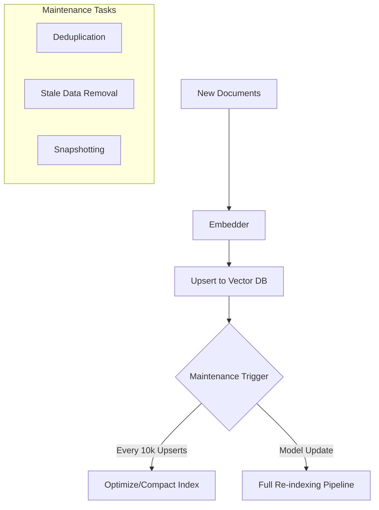

# Vector DB Maintenance: Engine ko Smooth Rakhna

## 1. Beginner-friendly Hinglish Explanation 🇮🇳
Bhai, socho tumne ek library banayi aur usmein 10,000 books rakh di. Agar tum nayi books bina kisi order ke rakhte jaoge, aur puraani bekaar books nahi hataoge, toh ek din sab kuch "Mess" ho jayega. 

**Vector DB Maintenance** wahi "Cleaning aur Indexing" ka kaam hai. Jab naya data aata hai, toh index ko "Refresh" karna padta hai. Jab purana data galat ho jata hai, toh use "Delete" ya "Update" karna padta hai. Iske bina tumhari search slow ho jayegi aur accuracy kam ho jayegi. Yeh bilkul waise hi hai jaise car ki "Service" karwana—tameez se karoge toh engine (Search) saalo saal chalega.

---

## 2. Deep Technical Explanation
Vector databases ko time ke saath performance degrade hone se bachane ke liye active maintenance chahiye hota hai.
- **Index Rebuilding**: Jab aap vectors add/delete karte hain, toh HNSW graph ya IVF clusters fragmented ho jaate hain. Aapko time-to-time index ko "Optimize" ya "Compact" karna padta hai.
- **Embedding Model Versioning**: Agar aap apna embedding model update karte hain (e.g., `text-embedding-ada-002` se `text-embedding-3-small`), toh aapko har single document ko re-index karna MANDATORY hai.
- **Stale Data Removal**: Outdated information ke liye TTL (Time to Live) ya metadata-based deletion implement karna.
- **Backup & Recovery**: Standard database practices apply hoti hain—vector index aur metadata store ka snapshot lena.

---

## 3. Mathematical Intuition
Index Fragmentation:
HNSW index mein, search ki quality graph ki connectivity par depend karti hai. Bahut saare deletions ke baad, graph "Disconnected" ho sakta hai (nodes ke islands).
**Recall** drop ko aise model kiya jaa sakta hai:
$$\text{Recall}_{\text{actual}} = \text{Recall}_{\text{baseline}} \times (1 - \text{Fragmentation Ratio})$$
Periodic rebuilding fragmentation ratio ko zero kar deta hai, baseline performance restore karte hue.

---

## 4. Architecture Diagrams


---

## 5. Production-ready Examples
Qdrant collection ko optimize karna (Conceptual):

```python
# Periodic optimization call
import requests

# Tells the database to compact segments and rebuild the index
requests.post("http://localhost:6333/collections/my_docs/optimize")

# Note: In production, do this during 'Off-peak' hours 
# because it can consume a lot of CPU/RAM.
```

---

## 6. Real-world Use Cases
- **News Aggregators**: 30 din se puraane articles delete karna, taaki search relevant aur fast rahe.
- **E-commerce**: Har hour vector space mein product prices aur descriptions update karna.

---

## 7. Failure Cases
- **"Model Drift" ka Jaal**: Embedding model change karna lekin re-index karna bhool jaana. Isse search accuracy 0% ho jayegi (Model aur DB "alag-alag bhasha" mein baat kar rahe hain).
- **Rebuild ke dauran Downtime**: Kuch databases index rebuild karte waqt searches block kar dete hain. Apne Vector DB ke liye "Blue-Green" deployment use karein.

---

## 8. Debugging Guide
1. **Search Latency Spikes**: Agar search har din slow hoti jaa rahi hai, toh aapka index fragmented hai.
2. **Missing Documents**: Check karein ki aapke "Upsert" calls succeed ho rahe hain ya rate limits ki wajah se fail ho rahe hain.

---

## 9. Tradeoffs
| Action | Fayda | Nuksan |
|---|---|---|
| Frequent Indexing | Real-time Search | High CPU/Cost |
| Batch Indexing | Low Cost | Search "Outdated" hoti hai |
| Full Re-index | Model Drift fix karta hai | Extremely Slow/Expensive |

---

## 10. Security Concerns
- **Orphaned Metadata**: Vector delete karna lekin SQL DB mein corresponding metadata delete karna bhool jaana, jo search results mein dikh sakta hai.

---

## 11. Scaling Challenges
- **Massive Deletions**: HNSW index se 1 Million vectors delete karna, unhe add karne se kaafi mushkil hai, kyunki ismein graph connections ko "Heal" karna padta hai.

---

## 12. Cost Considerations
- **Storage Overhead**: Index rebuild ke dauran, aapko 2x RAM/Disk space ki zaroorat ho sakti hai (old aur new index dono ek saath rakhne ke liye).

---

## 13. Best Practices
- **"Collection Version" implement karein**: e.g., `prod_v1`, `prod_v2`. Jab model change hota hai, background mein `prod_v2` build karein aur phir traffic switch karein.
- **"Delete Ratio" monitor karein**: Agar aap 20% se zyada data delete karte hain, toh full index rebuild ka time aa gaya hai.
- **Automated Deduplication**: Cost save karne ke liye, embedding se pehle check karein ki document pehle se exist karta hai ya nahi.

---

## 14. Interview Questions
1. Jab aap apna embedding model badalte hain toh re-indexing kyun zaroori hai?
2. High-traffic vector DB mein "Eventually Consistent" search ko kaise handle karte hain?

---

## 15. Latest 2026 Patterns
- **Serverless Auto-Indexing**: Databases jo automatically worker nodes spin up karte hain jab bhi fragmentation detect hoti hai, index rebuild karne ke liye.
- **Delta Re-indexing**: Full rebuild karne ki bajaye vector space ke sirf un parts ko update karna jo change hue hain.