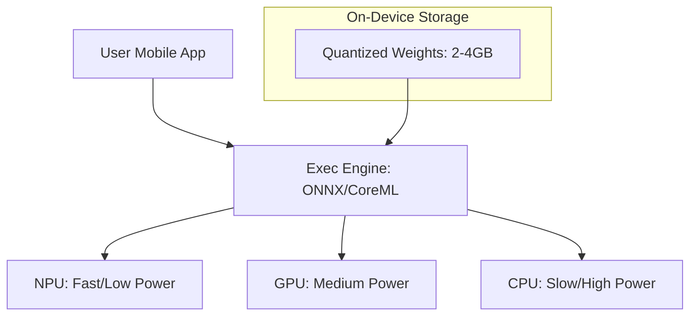

# Edge AI & Mobile LLMs: Intelligence in Your Pocket

## 1. Beginner-friendly Hinglish Explanation 🇮🇳
Bhai, kya tumne kabhi socha hai ki tumhara phone "Airplane Mode" mein bhi tumhari photo se background remove kar deta hai ya text translate kar deta hai? Yeh kaise hota hai? 

Yeh hai **Edge AI**. Iska matlab hai ki AI model kisi cloud server par nahi, balki seedha tumhare device (Phone, Laptop, Watch) par chal raha hai. **Mobile LLMs** (jaise Gemini Nano ya Llama-3-8B quantized) itne chote hote hain ki woh tumhare phone ki RAM mein fit ho jate hain. Isse teen bade fayde hote hain: **Speed** (No internet delay), **Privacy** (Data phone se bahar nahi jata), aur **Cost** (Company ka server bill bach jata hai). 2026 mein "Local AI" hi asli trend hai.

---

## 2. Deep Technical Explanation
Edge AI involves deploying optimized models on decentralized hardware.
- **Hardware Accelerators**: Using Apple's NPU (Neural Engine), Qualcomm's Hexagon, or Google's TPU on mobile chips.
- **Model Formats**: CoreML (Apple), TensorFlow Lite (Android), and ONNX.
- **Quantization**: Essential to fit models into 4GB-12GB mobile RAM. Usually 4-bit (GGUF/AWQ).
- **Execution Providers**: Software layers that translate AI math into hardware-specific instructions.

---

## 3. Mathematical Intuition
Mobile deployment is a **Memory-Bandwidth constrained** problem.
Modern mobile NPUs can reach 40+ TOPs (Tera Operations per Second).
However, the bottleneck is often the **RAM Bandwidth** (how fast data moves from LPDDR5 RAM to the chip).
If a 4-bit model takes 4GB RAM, and your phone's bandwidth is 50GB/s, your max theoretical speed is 12.5 tokens per second. Optimization focuses on reducing memory fetches per token.

---

## 4. Architecture Diagrams


---

## 5. Production-ready Examples
Using `MLX` (Apple's specialized framework for Silicon):

```python
import mlx.core as mx
from mlx_lm import load, generate

# 1. Load model optimized for Apple Silicon (NPU/GPU)
model, tokenizer = load("mlx-community/Llama-3-8B-4bit")

# 2. Run local inference
response = generate(model, tokenizer, prompt="Write a quick email.", verbose=True)

# Note: This runs entirely on the Macbook's M1/M2/M3 chip with zero API calls.
```

---

## 6. Real-world Use Cases
- **Privacy-Sensitive Chat**: Medical or financial apps where data cannot leave the device.
- **Real-time Translation**: Instant voice-to-voice translation in areas with no network.
- **Auto-complete**: Super-fast typing suggestions in mobile keyboards.

---

## 7. Failure Cases
- **Thermal Throttling**: Running a 7B model for 10 minutes makes the phone hot, causing the CPU to slow down to 1/10th speed.
- **Battery Drain**: Large model inference can kill a phone's battery in 2-3 hours of continuous use.

---

## 8. Debugging Guide
1. **NPU Utilization**: Use developer tools (like Xcode Instruments) to check if the NPU is actually being used or if the model is falling back to the slow CPU.
2. **Energy Profiling**: Measure the "Millijoules per token" to optimize battery life.

---

## 9. Tradeoffs
| Feature | Cloud LLM (GPT-4) | Mobile LLM (Llama-3-8B) |
|---|---|---|
| Availability | Needs Internet | Offline |
| Privacy | Low | 100% |
| Intelligence | Expert | Junior Assistant |

---

## 10. Security Concerns
- **Binary Reversal**: An attacker can download your app and extract the quantized model weights easily from the APK/IPA file.

---

## 11. Scaling Challenges
- **Fragmentation**: Optimizing for 1000 different Android phones with different NPUs is a maintenance nightmare. (Focus on iPhone/Samsung first).

---

## 12. Cost Considerations
- **Server Bill**: $0. You are using the user's hardware and electricity. This is the ultimate "Cost Optimization".

---

## 13. Best Practices
- **Use KV Cache Quantization**: Saves critical mobile RAM.
- **Early Exit**: Use a tiny model for simple tasks and "Escalate" to the cloud only for hard questions.
- **Optimize for NPU**: Avoid custom CUDA kernels; stay within the standard operators supported by CoreML/TFLite.

---

## 14. Interview Questions
1. Why is RAM bandwidth more important than TFLOPS for mobile LLM inference?
2. What are the benefits of using an NPU over a mobile GPU for AI?

---

## 15. Latest 2026 Patterns
- **Apple Intelligence (On-Device)**: Seamlessly switching between a 3B local model and a private cloud model based on query complexity.
- **LoRA-as-a-Feature**: Downloading 50MB "Skill adapters" (like 'Legal Expert') to enhance a base on-device model without re-downloading the whole 4GB model.
