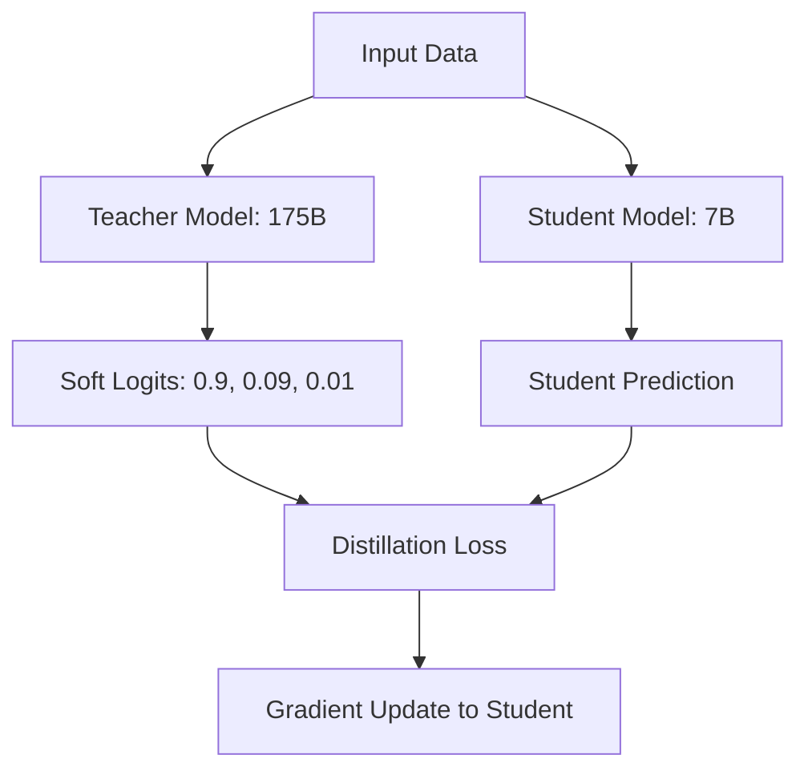

# Knowledge Distillation: From Giant to Genius

## 1. Beginner-friendly Hinglish Explanation 🇮🇳
Bhai, socho ek "Professor" (Teacher Model) hai jise sab kuch aata hai, aur ek "Student" (Student Model) hai jo chota aur tez hai. Student ke paas itni capacity nahi hai ki woh puri library padhe. 

**Knowledge Distillation** wahi process hai jahan Professor apna "Gyan" chote student ko transfer karta hai. Student sirf Professor ke "Answers" nahi seekhta, balki woh yeh bhi seekhta hai ki Professor ne woh answer kyun diya (Probabilities). Isse ek chota model (jaise 7B) bhi bade model (jaise 175B) ki tarah "Smart" behave karne lagta hai. Yeh bilkul "Guru-Shishya" parampara jaisa hai AI ki duniya mein.

---

## 2. Deep Technical Explanation
Knowledge distillation is a compression technique where a smaller "Student" model is trained to mimic the behavior of a larger "Teacher" model.
- **Logit Distillation**: The student minimizes the difference between its output probability distribution (logits) and the teacher's.
- **Feature Distillation**: The student tries to match the intermediate layer representations of the teacher.
- **Data Augmentation**: Using the teacher to generate high-quality "Synthetic Data" (Teacher-forcing) for the student.
- **Soft Targets**: Instead of learning "The answer is A", the student learns "A is 90% likely, B is 9% likely, and C is 1%". This "Soft" signal contains much more information about the relationship between words.

---

## 3. Mathematical Intuition
The distillation loss $\mathcal{L}$ is a combination of standard cross-entropy and **KL Divergence**:
$$\mathcal{L} = (1-\alpha) \mathcal{L}_{CE}(y, \hat{y}) + \alpha T^2 \mathcal{L}_{KL}(P_{teacher}, P_{student})$$
where $T$ is the **Temperature**. A higher $T$ "smoothens" the probability distribution, revealing the "Dark Knowledge" (the relative relationships between incorrect classes) to the student.

---

## 4. Architecture Diagrams


---

## 5. Production-ready Examples
Distilling a model using the `DistilBERT` style approach (Conceptual):

```python
import torch.nn.functional as F

def distillation_loss(student_logits, teacher_logits, labels, T=2.0, alpha=0.5):
    # 1. Soft targets from teacher
    soft_teacher = F.softmax(teacher_logits / T, dim=-1)
    soft_student = F.log_softmax(student_logits / T, dim=-1)
    
    # 2. KL Divergence for "Gyan" transfer
    distill_loss = F.kl_div(soft_student, soft_teacher, reduction='batchmean') * (T**2)
    
    # 3. Standard Cross Entropy for ground truth
    student_loss = F.cross_entropy(student_logits, labels)
    
    return alpha * distill_loss + (1 - alpha) * student_loss
```

---

## 6. Real-world Use Cases
- **DistilBERT**: A 40% smaller version of BERT that retains 97% of its performance.
- **TinyLlama**: Distilling the massive knowledge of Llama-2 into a 1.1B model for mobile devices.
- **Zephyr-7B**: A model that used distillation-based alignment (DPO on teacher outputs) to beat Llama-2-70B on chat benchmarks.

---

## 7. Failure Cases
- **Capacity Gap**: If the teacher is too smart (e.g., GPT-4) and the student is too small (e.g., 100M), the student might fail to learn anything and just produce noise.
- **Bias Inheritance**: The student learns all the hallucinations and biases of the teacher model.

---

## 8. Debugging Guide
1. **Logit Correlation**: Check the correlation between student and teacher logits. If it's low, your temperature $T$ might be too small.
2. **Layer Mapping**: If doing feature distillation, ensure you are mapping the right layers (e.g., Teacher layer 24 $\to$ Student layer 6).

---

## 9. Tradeoffs
| Feature | Training from Scratch | Distillation |
|---|---|---|
| Speed to Converge | Slow | Fast |
| Final Accuracy | Baseline | Higher (mimics teacher) |
| Resource Needed | Massive Data | High-end Teacher API/Weights|

---

## 10. Security Concerns
- **Model Stealing**: Using distillation to create a local copy of a proprietary cloud model (like GPT-4) by just querying its API and training on its responses.

---

## 11. Scaling Challenges
- **Compute for Teacher**: You need to run the large teacher model for every single training step of the student, which is very expensive. We often "Pre-compute" teacher logits to save time.

---

## 12. Cost Considerations
- **Storage**: Storing trillions of "Soft Logits" (floats) from a teacher model can take petabytes of disk space.

---

## 13. Best Practices
- Use a **Temperature $T$ between 2 and 5**.
- Start with a **Pre-trained student** instead of a random one.
- Use **Sequence-level distillation** (letting the teacher generate the whole sentence) for LLMs.

---

## 14. Interview Questions
1. What is "Soft Knowledge" or "Dark Knowledge" in distillation?
2. Why do we multiply the KL loss by $T^2$?

---

## 15. Latest 2026 Patterns
- **Iterative Distillation**: Student becomes the teacher for a smaller shishya (Recursive distillation).
- **On-the-fly Distillation**: Distilling the model during inference based on the user's specific context.
