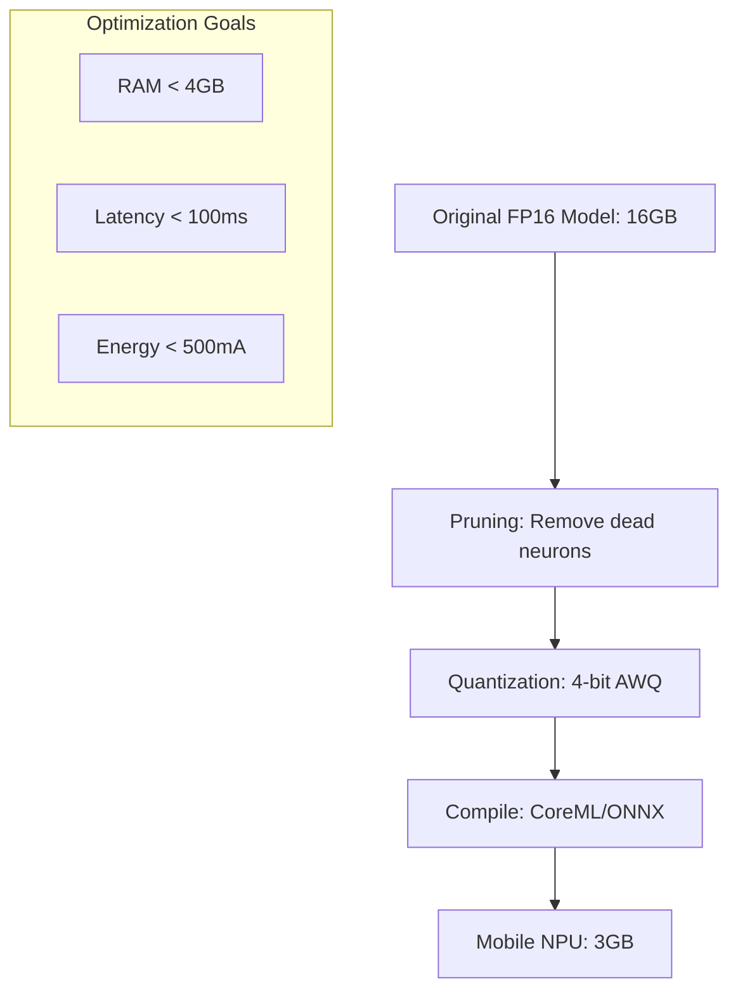

# On-Device Optimization: Squeezing Juice from Small Chips

## 1. Beginner-friendly Hinglish Explanation 🇮🇳
Bhai, socho tumhare paas ek 2GB RAM wala purana phone hai aur tum uspar "Llama" chalana chahte ho. Yeh bilkul waise hi hai jaise ek choti "Nano" car mein "Truck" ka engine fit karna. 

**On-Device Optimization** wahi "Enginerring Jugad" hai jo is namumkin kaam ko mumkin banata hai. Hum model ko "Sikod" (Compress) dete hain taaki woh kam jagah le. Hum **Pruning** use karte hain (bekaar connections ko katna), **Quantization** (precision kam karna), aur **Knowledge Distillation**. Is module mein hum seekhenge ki kaise ek AI model ko "Gym" le ja kar use "Slim" aur "Fast" banaya jaye.

---

## 2. Deep Technical Explanation
Optimization for edge devices focuses on three constraints: RAM, Latency, and Power.
- **Quantization (Post-Training)**: 4-bit (INT4) is the current standard. AWQ (Activation-aware Weight Quantization) preserves accuracy by keeping "important" weights in higher precision.
- **Pruning**: Removing neural connections that have weights near zero. Structural pruning removes entire layers or heads.
- **Speculative Decoding on Device**: Using a tiny 100M model to draft tokens for a 3B model on the same chip.
- **Graph Compilation**: Converting the model into a fixed execution graph (like TVM or XLA) to remove interpreter overhead.

---

## 3. Mathematical Intuition
**AWQ (Activation-aware Weight Quantization)**:
Standard quantization treats all weights equally. AWQ recognizes that a small percentage of weights (1%) are "Salient" and control the output.
$$\min_{s} \|W \cdot X - Q(W \cdot s) \cdot X / s\|$$
By finding an optimal scaling factor $s$, we protect these salient weights while aggressively compressing the rest to 4-bit. This reduces perplexity loss significantly compared to naive quantization.

---

## 4. Architecture Diagrams


---

## 5. Production-ready Examples
Optimizing for Android with `TensorFlow Lite` (Conceptual):

```python
import tensorflow as tf

# 1. Convert model to TFLite format
converter = tf.lite.TFLiteConverter.from_saved_model('my_llm')

# 2. Enable Post-Training Quantization
converter.optimizations = [tf.lite.Optimize.DEFAULT]
converter.target_spec.supported_types = [tf.float16] # Or INT8

tflite_model = converter.convert()

# 3. Save optimized model
with open('model.tflite', 'wb') as f:
  f.write(tflite_model)
```

---

## 6. Real-world Use Cases
- **Smart Watches**: Running a tiny 100M model for voice-to-text and intent classification.
- **Browser AI**: Using WebGPU to run a 2B model directly in Chrome/Safari for local page summarization.

---

## 7. Failure Cases
- **Catastrophic Accuracy Drop**: Pruning too many layers can make the model "Forget" grammar or logic entirely.
- **Hardware Incompatibility**: An INT8 optimized model might be slower than FP16 on hardware that doesn't have specialized INT8 arithmetic units.

---

## 8. Debugging Guide
1. **Perplexity Delta**: Measure PPL before and after optimization. A delta > 0.5 usually means your quantization is too aggressive.
2. **Layer Sensitivity**: Use tools like `Qualcomm AI Stack` to identify which specific layer is losing the most precision during quantization.

---

## 9. Tradeoffs
| Metric | Original (FP16) | Optimized (INT4) |
|---|---|---|
| RAM | 100% | 25% |
| Accuracy | 100% | 95-98% |
| Latency | Slow | Very Fast |

---

## 10. Security Concerns
- **Side-Channel Leakage**: Optimized models on shared edge hardware might leak information through timing attacks (how long a quantized multiplication takes).

---

## 11. Scaling Challenges
- **Device Diversity**: What works on an iPhone 15 Pro (A17 chip) might crash on a budget Android phone from 2021.

---

## 12. Cost Considerations
- **Engineering Time**: Tuning a model for edge deployment can take weeks of expert human work, which is more expensive than just renting a bigger GPU in the cloud.

---

## 13. Best Practices
- **Quantization-Aware Training (QAT)**: Instead of quantizing after training, simulate quantization *during* training so the model learns to handle the precision loss.
- **Use AWQ or GGUF**: These are currently the most reliable formats for preserving LLM intelligence at 4-bit.

---

## 14. Interview Questions
1. What is the difference between Weight Pruning and Neuron Pruning?
2. How does AWQ (Activation-aware Quantization) differ from standard RTN (Round-to-Nearest)?

---

## 15. Latest 2026 Patterns
- **Binary & Ternary LLMs**: Research into models that only use -1, 0, and 1 for weights, requiring almost zero multiplication and running on ultra-low-power chips.
- **Modular LoRA Adapters**: Keeping the base model on-device and downloading tiny "Task Adapters" (10-50MB) only when needed.
