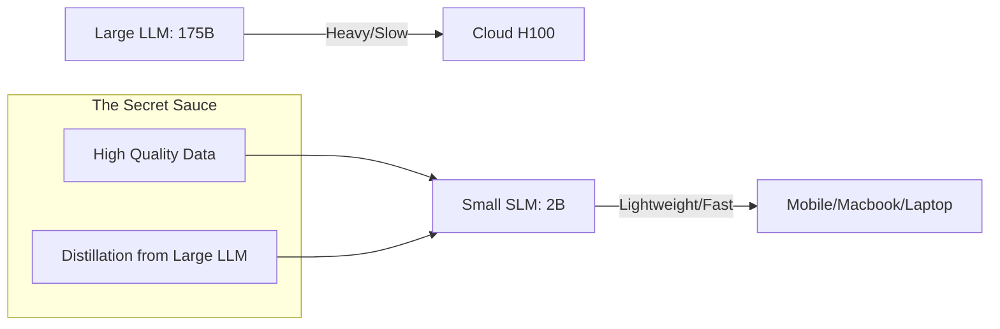

# SLM Fundamentals: Small is the New Big

## 1. Beginner-friendly Hinglish Explanation 🇮🇳
Bhai, har kaam ke liye humein "GPT-4" jaisa bada hathi (Elephant) nahi chahiye. Agar tumhe sirf email summarize karna hai ya code mein bug dhundna hai, toh ek chota aur fast model (jaise Llama-3-8B ya Phi-3) bhi wahi kaam kar sakta hai, aur woh bhi saste mein!

**Small Language Models (SLMs)** wahi models hain jo 1B se 10B parameters ke beech hote hain. Inka focus "Size" par nahi, balki "Quality of Data" par hota hai. Yeh bilkul waise hi hai jaise ek moti book padhne ke bajaye tum sirf "Summary notes" padho. 2026 mein industry "Bigger is Better" se "Smaller is Smarter" ki taraf move kar rahi hai.

---

## 2. Deep Technical Explanation
SLMs are models optimized for efficiency, low latency, and on-device deployment.
- **Parameter Count**: Usually between 100M and 10B.
- **Architecture**: Often use "Weight-sharing", "GQA", or "Depth-wise separable convolutions" to reduce size.
- **Data Quality (Textbook approach)**: SLMs like Microsoft's **Phi** are trained on high-quality synthetic "Textbooks" and curated web data, allowing them to outperform models 10x their size.
- **Training Objective**: Often focused on a specific domain (Code, Math, Chat) rather than general knowledge.

---

## 3. Mathematical Intuition
SLMs aim to maximize the **Information Density** per parameter.
If a model has $P$ parameters and is trained on $D$ tokens, the "Knowledge per Parameter" is $D/P$.
SLMs use a very high $D/P$ ratio (e.g., training a 1B model on 5 Trillion tokens), pushing the model to its theoretical limit of efficiency.

---

## 4. Architecture Diagrams


---

## 5. Production-ready Examples
Comparing memory usage (Conceptual):

```python
# Llama-3-70B (4-bit): ~40GB VRAM (Needs A100/H100)
# Phi-3-Mini-3.8B (4-bit): ~2.5GB VRAM (Runs on a Phone!)

# Production Tip: Use SLMs for:
# 1. Routing (Is this query for search or math?)
# 2. Summarization
# 3. Simple Chatbots
```

---

## 6. Real-world Use Cases
- **Mobile Assistants**: Offline voice assistants on your phone.
- **Edge Devices**: AI in security cameras for face/object detection.
- **Private Coding**: Running a 3B model locally on your laptop so your code never leaves your machine.

---

## 7. Failure Cases
- **Reasoning Gaps**: SLMs often fail at complex 10-step math problems that a 175B model solves easily.
- **World Knowledge**: A 2B model won't know every obscure history fact because it doesn't have enough "Storage" (Parameters) to memorize the whole internet.

---

## 8. Debugging Guide
1. **Perplexity Gap**: If the model starts hallucinating facts, it has hit its "Knowledge Ceiling".
2. **Instruction Following**: Smaller models often struggle with complex formatting (e.g., "Output JSON with exactly these 15 keys").

---

## 9. Tradeoffs
| Feature | Large LLM (70B+) | Small SLM (< 10B) |
|---|---|---|
| Latency | High | Very Low |
| Cost | High | Very Low |
| Intelligence | Expert | Specialist |

---

## 10. Security Concerns
- **Model Theft**: It's much easier to steal and run a 2B model than a 175B one.
- **Local Jailbreaks**: Since it's on-device, users have more tools to bypass safety filters compared to cloud-based APIs.

---

## 11. Scaling Challenges
- **Data Bottleneck**: Finding enough "High-quality" data to justify training a small model for 10 Trillion tokens.

---

## 12. Cost Considerations
- **Inference Savings**: Running a 3B model is 50x cheaper than GPT-4o for the same number of tokens.

---

## 13. Best Practices
- **Fine-tune for your task**: A general 3B model is okay, but a 3B model fine-tuned on *your* data is a beast.
- **Use Quantization**: Always run SLMs in 4-bit or 8-bit to maximize speed.

---

## 14. Interview Questions
1. Why is data quality more important for SLMs than for large LLMs?
2. What are the limitations of a 1B parameter model compared to a 70B model?

---

## 15. Latest 2026 Patterns
- **DeepSeek-V3 Style MOE**: Large models that act like "Small" models during inference by only activating 3B-5B parameters at a time.
- **Sub-1B Models**: 100M-500M parameter models that are used as "Speculative Drafters" or "Grammar Checkers".
