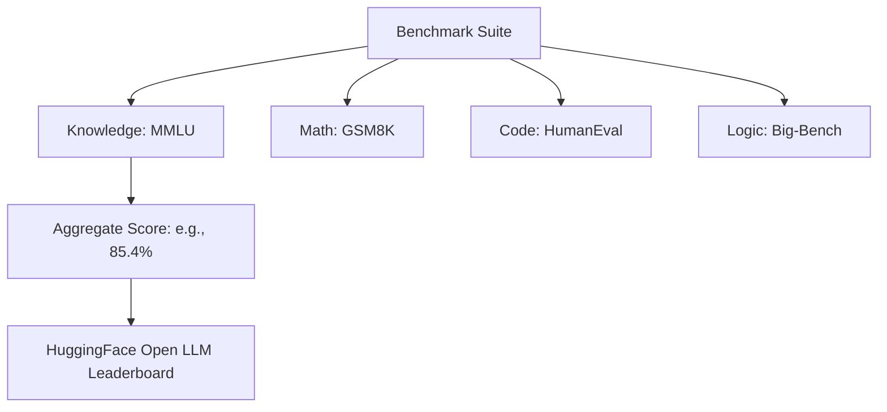

# 🏆 Benchmark Suites: MMLU, HumanEval, and Beyond
> **Objective:** Master the industry-standard benchmarks used to rank LLMs, understanding their strengths, weaknesses, and how to interpret scores like MMLU, GSM8K, and HumanEval | **Language:** Hinglish | **Standard:** 2026 Expert Framework

---

## 🧭 1. Beginner-Friendly Hinglish Explanation
Benchmark Suites ka matlab hai AI ka "National Entrance Exam".

- **The Problem:** Har company bolti hai "Hamara model best hai". Par hum kaise maanein?
- **The Solution:** Standard Benchmarks. 
  - **MMLU:** General knowledge (57 subjects like Law, History, Math).
  - **GSM8K:** School-level math word problems.
  - **HumanEval:** Coding skills (Python).
- **Intuition:** Ye ek "Olympic Games" jaisa hai jahan sabhi models ek hi ground par compete karte hain takki pata chale ki "Asli Gold Medalist" kaun hai.

---

## 🧠 2. Deep Technical Explanation
Modern benchmarks test specific dimensions of intelligence:

1. **MMLU (Massive Multitask Language Understanding):** Tests world knowledge and problem-solving across 57 subjects. A score of $80\%+$ is considered "Expert level".
2. **HumanEval / MBPP:** Tests a model's ability to write functional code. Evaluated using **Pass@k** (Running the code and checking if it actually works).
3. **GSM8K:** Tests multi-step mathematical reasoning. Requires the model to use "Chain of Thought" to get the right answer.
4. **HellaSwag:** Tests "Common Sense" by asking the model to predict the most likely next sentence in a daily scenario.
5. **TruthfulQA:** Specifically designed to catch models that "Hallucinate" or follow common human myths.

---

## 📐 3. Mathematical Intuition
**Pass@k (Coding Metric):**
Instead of just checking one answer, we generate $n$ samples and check if $k$ of them are correct. 
$$\text{Pass@k} = 1 - \frac{\binom{n-c}{k}}{\binom{n}{k}}$$
Where $c$ is the number of correct samples. This measures how "Reliable" a model is at coding.

---

## 🏗️ 4. Architecture Diagrams

---

## 💻 5. Production-Ready Examples
Comparison of 2026's top models on key benchmarks:
| Model | MMLU | HumanEval | GSM8K |
| :--- | :--- | :--- | :--- |
| **GPT-4o** | 88.7% | 84.9% | 92.0% |
| **Claude 3.5 Sonnet** | 88.0% | 92.0% | 96.4% |
| **Llama-3.1 405B** | 88.6% | 89.0% | 96.8% |
| **Gemma-2 27B** | 82.4% | 63.7% | 82.0% |

---

## 🌍 6. Real-World Use Cases
- **Model Selection:** Using HumanEval scores to decide which model to use for a "GitHub Copilot" clone.
- **R&D Validation:** A research team using GSM8K to see if their new "Attention mechanism" actually improved the model's math skills.

---

## ❌ 7. Failure Cases
- **Data Contamination:** The benchmark questions are on the internet $\rightarrow$ The model sees them during training $\rightarrow$ The model "Memorizes" the answers. This is the biggest problem in 2026.
- **Over-fitting to Benchmarks:** Models that are "Good at MMLU" but fail at "Talking to a human" because they were only trained on multiple-choice questions.

---

## 🛠️ 8. Debugging Guide
| Problem | Reason | Solution |
| :--- | :--- | :--- |
| **Model scores 100% on MMLU** | Massive Contamination | Use a **Private/Custom Benchmark** that the model has never seen. |
| **High MMLU but low HumanEval** | Knowledge but no logic | Focus on **Code-specific fine-tuning**. |

---

## ⚖️ 9. Tradeoffs
- **Academic Benchmarks (Standardized / Easy to compare / Prone to contamination).**
- **Internal Benchmarks (Custom / Secure / Hard to build / No baseline).**

---

## 🛡️ 10. Security Concerns
- **Benchmark Poisoning:** A developer "Injecting" benchmark answers into a public dataset so their model looks artificially smart on the leaderboard.

---

## 📈 11. Scaling Challenges
- **The Ceiling Effect:** Models are reaching $90\%+$ on many benchmarks. We need "Harder" exams (like GPQA—PhD level science questions) to find the difference between top models.

---

## 💰 12. Cost Considerations
- Running a full MMLU suite on your own fine-tuned model costs roughly \$10 - \$50 in compute.

漫
---

## 📝 14. Interview Questions
1. "What is 'Data Contamination' and why is it a problem for LLM benchmarks?"
2. "Explain the difference between MMLU and GSM8K."
3. "What does a high score on HumanEval indicate about a model?"

---

## 🚀 15. Latest 2026 LLM Engineering Patterns
- **LMSYS Chatbot Arena:** The 2026 "Gold Standard"—where humans chat with two anonymous models and vote on the winner. It's the only benchmark that can't be easily "Gamed".
- **LiveBench:** A benchmark that is updated every week with "New" news and coding problems to prevent model contamination.
漫
漫
