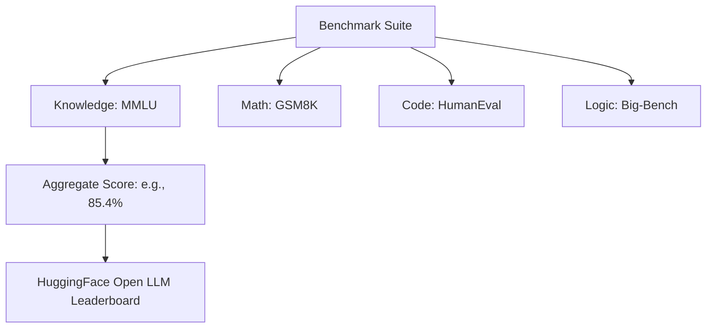

### 🏆 Benchmark Suites: MMLU, HumanEval, aur Beyond
> **Objective:** Industry-standard benchmarks ko master karna jo LLMs ko rank karne ke liye use hote hain, unki strengths, weaknesses, aur MMLU, GSM8K, HumanEval jaisi scores ko interpret karna seekhein | **Language:** Hinglish | **Standard:** 2026 Expert Framework

---

## 🧭 1. Beginner-Friendly Hinglish Samjhaaiye
Benchmark Suites ka matlab hai AI ka "National Entrance Exam".

- **Samasya:** Har company bolti hai "Hamara model best hai". Par hum kaise maanein?
- **Samadhan:** Standard Benchmarks.
  - **MMLU:** General knowledge (57 vishay jaise Law, History, Math).
  - **GSM8K:** School-level ke math word problems.
  - **HumanEval:** Coding skills (Python).
- **Samajh:** Ye ek "Olympic Games" jaisa hai jahan sabhi models ek hi ground par compete karte hain takki pata chale ki "Asli Gold Medalist" kaun hai.

---

## 🧠 2. Gahrai se Technical Samjhaaiye
Modern benchmarks intelligence ke specific dimensions ko test karte hain:

1. **MMLU (Massive Multitask Language Understanding):** Duniya ke gyaan aur problem-solving ko test karta hai 57 subjects mein. $80\%+$ ka score "Expert level" mana jata hai.
2. **HumanEval / MBPP:** Model ki ability test karta hai functional code likhne ki. **Pass@k** se evaluate kiya jata hai (Code run karke check karte hain ki actually work karta hai ya nahi).
3. **GSM8K:** Multi-step mathematical reasoning test karta hai. Model ko "Chain of Thought" use karna hota hai sahi answer pane ke liye.
4. **HellaSwag:** "Common Sense" test karta hai model ko daily scenario mein sabse likely next sentence predict karne ke liye.
5. **TruthfulQA:** Specifically designed hai un models ko pakadne ke liye jo "Hallucinate" karte hain ya common human myths follow karte hain.

---

## 📐 3. Ganit Samajh
**Pass@k (Coding Metric):**
Sirf ek answer check karne ke bajaye, hum $n$ samples generate karte hain aur check karte hain ki unme se $k$ correct hain.
$$\text{Pass@k} = 1 - \frac{\binom{n-c}{k}}{\binom{n}{k}}$$
Jahan $c$ correct samples ki number hai. Ye measure karta hai ki model coding mein kitna "Reliable" hai.

---

## 🏗️ 4. Architecture Diagram

```mermaid
graph TD
    Bench[Benchmark Suite] --> T1[Knowledge: MMLU]
    Bench --> T2[Math: GSM8K]
    Bench --> T3[Code: HumanEval]
    Bench --> T4[Logic: Big-Bench]
    T1 --> Score[Aggregate Score: e.g., 85.4%]
    Score --> Leaderboard[HuggingFace Open LLM Leaderboard]
```

---

## 💻 5. Production Ready Examples
2026 ke top models ka comparison key benchmarks par:
| Model | MMLU | HumanEval | GSM8K |
| :--- | :--- | :--- | :--- |
| **GPT-4o** | 88.7% | 84.9% | 92.0% |
| **Claude 3.5 Sonnet** | 88.0% | 92.0% | 96.4% |
| **Llama-3.1 405B** | 88.6% | 89.0% | 96.8% |
| **Gemma-2 27B** | 82.4% | 63.7% | 82.0% |

---

## 🌍 6. Real-World Use Cases
- **Model Selection:** HumanEval scores use karke decide karna ki "GitHub Copilot" clone ke liye kaunsa model use karein.
- **R&D Validation:** Ek research team GSM8K use karke check karti hai ki unka naya "Attention mechanism" actually model ki math skills improve kiya ya nahi.

---

## ❌ 7. Failure Cases
- **Data Contamination:** Benchmark questions internet par hain $\rightarrow$ Model unhe training mein dekhta hai $\rightarrow$ Model answers "Memorize" kar leta hai. 2026 mein ye sabse badi problem hai.
- **Over-fitting to Benchmarks:** Models jo "MMLU mein achhe hain" par "insaan se baat karne mein fail hote hain" kyunki unhe sirf multiple-choice questions par train kiya gaya.

---

## 🛠️ 8. Debugging Guide
| Problem | Reason | Solution |
| :--- | :--- | :--- |
| **Model scores 100% on MMLU** | Massive Contamination | Use a **Private/Custom Benchmark** that the model has never seen. |
| **High MMLU but low HumanEval** | Knowledge but no logic | Focus on **Code-specific fine-tuning**. |

---

## ⚖️ 9. Tradeoffs
- **Academic Benchmarks (Standardized / Compare karna easy / Contamination prone).**
- **Internal Benchmarks (Custom / Secure / Build karna mushkil / No baseline).**

---

## 🛡️ 10. Security Concerns
- **Benchmark Poisoning:** Ek developer public dataset mein benchmark answers "Inject" karta hai taaki unka model leaderboard par artificially smart lage.

---

## 📈 11. Scaling Challenges
- **The Ceiling Effect:** Models kai benchmarks par $90\%+$ reach kar rahe hain. Humein "Harder" exams chahiye (jaise GPQA—PhD level science questions) taki top models ke beech farak pata chal sake.

---

## 💰 12. Cost Considerations
- Apne fine-tuned model par full MMLU suite run karne ka compute cost roughly \$10 - \$50 hota hai.
漫
---

## 📝 14. Interview Questions
1. "Data Contamination" kya hai aur ye LLM benchmarks ke liye problem kyun hai?
2. MMLU aur GSM8K ke beech antar samjhaaiye.
3. HumanEval par high score model ke baare mein kya indicate karta hai?

---

## 🚀 15. Latest 2026 LLM Engineering Patterns
- **LMSYS Chatbot Arena:** 2026 ka "Gold Standard"—jahan insaan do anonymous models se chat karte hain aur winner ko vote karte hain. Ye aisa benchmark hai jise aasani se "Gamed" nahi kiya ja sakta.
- **LiveBench:** Ye benchmark har week "New" news aur coding problems ke saath update hota hai taaki model contamination se bacha ja sake.
漫
漫