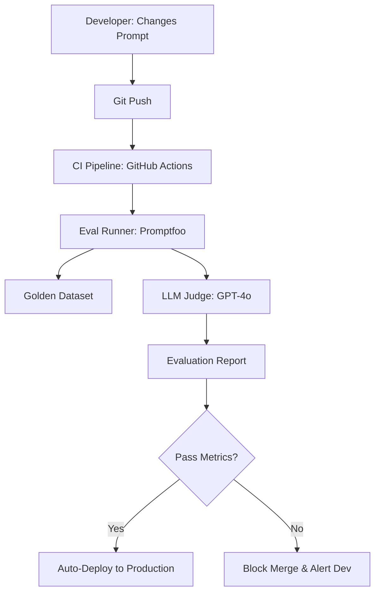

# 🔄 Continuous Evaluation Pipelines: AI CI/CD
> **Objective:** Master the integration of LLM evaluation into the software development lifecycle, ensuring every code or prompt change is automatically validated through automated testing pipelines | **Language:** Hinglish | **Standard:** 2026 Expert Framework

---

## 🧭 1. Beginner-Friendly Hinglish Explanation
Continuous Evaluation Pipeline ka matlab hai "AI ka Automatic Fitness Test".

- **The Problem:** AI ke prompts aur models hamesha badalte rehte hain. Ek chota sa change puri application ki "Logic" kharab kar sakta hai.
- **The Solution:** Continuous Evaluation. 
  - Jaise hi aap code ya prompt change karte ho, ek "Pipeline" chalti hai.
  - Wo 100-200 purane sawal model se puchti hai aur dekhti hai ki "Naya model pehle se behtar hai ya nahi?".
- **Intuition:** Ye ek "Quality Control" machine jaisa hai jo har nayi "Batch" ko check karti hai factory mein market bhejne se pehle.

---

## 🧠 2. Deep Technical Explanation
A production-grade AI pipeline consists of **CI (Continuous Integration)** and **CD (Continuous Deployment)** for models:

1. **The 'Golden Dataset':** A curated list of (Query, Reference Answer) pairs that define "Good" behavior for your app.
2. **The Test Runner:** A tool (like **Promptfoo** or **LangSmith**) that takes the naya prompt/model and runs it against the dataset.
3. **Automated Judging:** Using **LLM-as-a-Judge** to grade the results automatically.
4. **The Gatekeeper:** A CI rule (e.g., in GitHub Actions) that says: "Do not merge if Accuracy < 90%".
5. **Observability:** Storing all evaluation results in a database to track model "Drift" over months.

---

## 📐 3. Mathematical Intuition
**Regression Rate ($R$):**
$$R = \frac{\text{Passed in Old Version} \cap \text{Failed in New Version}}{\text{Total Test Cases}}$$
In 2026, a "Safe" release should have a **Regression Rate of $<1\%$**. Even if the overall accuracy increases, a high regression rate means the model is behaving "Differently", which can break user trust.

---

## 🏗️ 4. Architecture Diagrams


---

## 💻 5. Production-Ready Examples
Example **Promptfoo** config file (The industry standard for 2026):
```yaml
prompts:
  - "You are a helpful assistant. {{query}}"
  - "You are a professional support bot. {{query}}" # Test a new variation

providers:
  - openai:gpt-4o-mini
  - anthropic:claude-3-5-haiku

tests:
  - vars:
      query: "How do I cancel my plan?"
    assert:
      - type: javascript
        value: output.contains("Settings")
      - type: llm-rubric
        value: The tone should be helpful and professional.
```

---

## 🌍 6. Real-World Use Cases
- **Weekly Model Updates:** Every time OpenAI or Meta releases a new model, the pipeline checks if the app can switch to the new (cheaper) model without losing quality.
- **Prompt Engineering:** Testing 10 different "System Prompts" to find the one that gives the best JSON formatting.

---

## ❌ 7. Failure Cases
- **Benchmark Over-fitting:** The developer manually adds the "failed cases" to the training set, making the model look better in tests but not in the real world.
- **Judge Drift:** The Judge model itself is updated by the provider, changing your scores even though your code didn't change.

---

## 🛠️ 8. Debugging Guide
| Problem | Reason | Solution |
| :--- | :--- | :--- |
| **Pipeline is too expensive** | Judging too many cases | Use **Categorization**. Only judge 10 samples from each "Category" (e.g., Billing, Technical, Sales). |
| **Pipeline takes 1 hour** | Sequential API calls | Use **Async testing** and high-concurrency API keys. |

---

## ⚖️ 9. Tradeoffs
- **Full Dataset Eval (Highest confidence / High cost / Slow).**
- **Incremental Eval (Fast / Cheap / Might miss edge cases).**

---

## 🛡️ 10. Security Concerns
- **Eval Environment Leakage:** Ensure your CI pipeline doesn't have access to production databases during the "Test" phase. Use mock data.

---

## 📈 11. Scaling Challenges
- **The Data Lifecycle:** As your product grows, your Golden Dataset must grow too. Managing thousands of test cases across 20 languages is a full-time "AI Test Engineer" job.

---

## 💰 12. Cost Considerations
- A single CI run for a complex agent can cost \$10. If you have 20 developers pushing 5 times a day, your "Testing Bill" can hit \$1,000/day. **Fix: Use smaller models for CI testing.**

漫
---

## 📝 14. Interview Questions
1. "What is a 'Golden Dataset' in the context of LLM development?"
2. "How would you design a CI/CD pipeline for a prompt change?"
3. "Explain the 'Regression Rate' and why it matters more than 'Overall Accuracy'."

---

## 🚀 15. Latest 2026 LLM Engineering Patterns
- **Eval-Driven Development (EDD):** Writing the "Judge Rubric" and "Test Cases" *before* writing the prompt.
- **Shadow Deployments:** Running the new model in production "in the shadows" (seeing what it *would* have said) and comparing it to the live model before fully switching.
漫
漫
