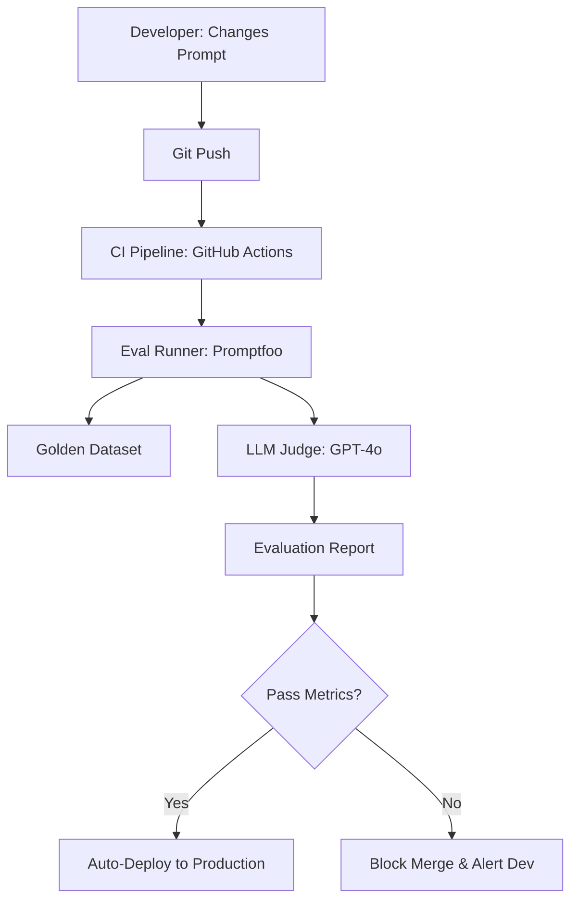

# 🔄 Continuous Evaluation Pipelines: AI CI/CD
> **Uddesshya:** LLM evaluation ko software development lifecycle mein integrate karna master karo, ensuring ki har code ya prompt change automatically validated ho automated testing pipelines ke through | **Language:** Hinglish | **Standard:** 2026 Expert Framework

---

## 🧭 1. Beginner-Friendly Hinglish Explanation
Continuous Evaluation Pipeline ka matlab hai "AI ka Automatic Fitness Test".

- **The Problem:** AI ke prompts aur models hamesha badalte rehte hain. Ek chota sa change puri application ki "Logic" kharab kar sakta hai.
- **The Solution:** Continuous Evaluation.
  - Jaise hi aap code ya prompt change karte ho, ek "Pipeline" chalti hai.
  - Wo 100-200 purane sawal model se puchti hai aur dekhti hai ki "Naya model pehle se behtar hai ya nahi?".
- **Intuition:** Ye ek "Quality Control" machine jaisa hai jo har nayi "Batch" ko check karti hai factory mein market bhejne se pehle.

---

## 🧠 2. Deep Technical Explanation
Production-grade AI pipeline models ke liye **CI (Continuous Integration)** aur **CD (Continuous Deployment)** se milkar banti hai:

1. **The 'Golden Dataset':** Aapke app ke liye "Good" behavior ko define karne wala (Query, Reference Answer) pairs ka curated list.
2. **The Test Runner:** Ek tool (jaise **Promptfoo** ya **LangSmith**) jo naya prompt/model lekar dataset ke against run karta hai.
3. **Automated Judging:** Results ko automatically grade karne ke liye **LLM-as-a-Judge** ka use karna.
4. **The Gatekeeper:** Ek CI rule (jaise GitHub Actions mein) jo kehta hai: "Merge mat karo agar Accuracy < 90% hai".
5. **Observability:** Months over model "Drift" ko track karne ke liye saare evaluation results ko database mein store karna.

---

## 📐 3. Mathematical Intuition
**Regression Rate ($R$):**
$$R = \frac{\text{Passed in Old Version} \cap \text{Failed in New Version}}{\text{Total Test Cases}}$$
2026 mein, ek "Safe" release ki **Regression Rate of $<1\%$** honi chahiye. Even if overall accuracy badh bhi jaye, ek high regression rate ka matlab hai ki model "Differently" behave kar raha hai, jo user trust ko tod sakta hai.

---

## 🏗️ 4. Architecture Diagrams

```mermaid
graph TD
    Dev[Developer: Changes Prompt] --> Git[Git Push]
    Git --> CI[CI Pipeline: GitHub Actions]
    CI --> Runner[Eval Runner: Promptfoo]
    Runner --> Dataset[Golden Dataset]
    Runner --> Judge[LLM Judge: GPT-4o]
    Judge --> Report[Evaluation Report]
    Report --> Gate{Pass Metrics?}
    Gate -->|Yes| Deploy[Auto-Deploy to Production]
    Gate -->|No| Reject[Block Merge & Alert Dev]
```

---

## 💻 5. Production-Ready Examples
Example **Promptfoo** config file (2026 ka industry standard):
```yaml
prompts:
  - "You are a helpful assistant. {{query}}"
  - "You are a professional support bot. {{query}}" # Test a new variation

providers:
  - openai:gpt-4o-mini
  - anthropic:claude-3-5-haiku

tests:
  - vars:
      query: "How do I cancel my plan?"
    assert:
      - type: javascript
        value: output.contains("Settings")
      - type: llm-rubric
        value: The tone should be helpful and professional.
```

---

## 🌍 6. Real-World Use Cases
- **Weekly Model Updates:** Jab bhi OpenAI ya Meta koi naya model release karta hai, pipeline check karti hai ki kya app naye (saste) model pe switch kar sakti hai bina quality khoye.
- **Prompt Engineering:** 10 alag-alag "System Prompts" ko test karna taaki wo mile jo sabse accha JSON formatting de.

---

## ❌ 7. Failure Cases
- **Benchmark Over-fitting:** Developer manually "failed cases" ko training set mein add kar deta hai, jisse model tests mein accha lagta hai lekin real world mein nahi.
- **Judge Drift:** Judge model khud provider ke through update ho jata hai, jisse aapke scores badalte hain chahe aapka code change na hua ho.

---

## 🛠️ 8. Debugging Guide
| Problem | Reason | Solution |
| :--- | :--- | :--- |
| **Pipeline bohot expensive hai** | Bahut saare cases judge kar rahe hain | **Categorization** use karo. Har "Category" (e.g., Billing, Technical, Sales) se sirf 10 samples judge karo. |
| **Pipeline 1 ghanta leta hai** | Sequential API calls ho rahi hain | **Async testing** aur high-concurrency API keys use karo. |

---

## ⚖️ 9. Tradeoffs
- **Full Dataset Eval (Sabse zyada confidence / High cost / Slow).**
- **Incremental Eval (Fast / Cheap / Ho sakta hai edge cases miss ho jayein).**

---

## 🛡️ 10. Security Concerns
- **Eval Environment Leakage:** Ensure karo ki "Test" phase ke dauran aapki CI pipeline ke paas production databases ka access na ho. Mock data use karo.

---

## 📈 11. Scaling Challenges
- **The Data Lifecycle:** Jaise-jaise aapka product badhta hai, waise-waise aapka Golden Dataset bhi badhna chahiye. 20 languages mein hazaron test cases manage karna ek full-time "AI Test Engineer" ka kaam hai.

---

## 💰 12. Cost Considerations
- Ek complex agent ke liye single CI run ki cost $10 ho sakti hai. Agar aapke paas 20 developers hain jo 5 baar daily push karte hain, toh aapka "Testing Bill" $1,000/day tak pahunch sakta hai. **Fix: CI testing ke liye chhote models use karo.**
漫
---

## 📝 14. Interview Questions
1. "LLM development ke context mein 'Golden Dataset' kya hota hai?"
2. "Aap prompt change ke liye CI/CD pipeline kaise design karoge?"
3. "'Regression Rate' ko explain karo aur ye 'Overall Accuracy' se zyada kyun matter karta hai."

---

## 🚀 15. Latest 2026 LLM Engineering Patterns
- **Eval-Driven Development (EDD):** Prompt likhne se *pehle* "Judge Rubric" aur "Test Cases" likhna.
- **Shadow Deployments:** Naye model ko production mein "in the shadows" run karna (dekhte hue ki wo *kya* bolta) aur fully switch karne se pehle live model se compare karna.
漫
漫