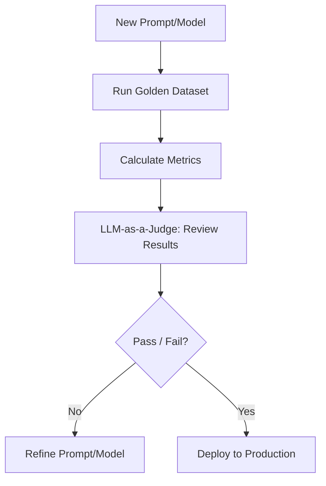

# Custom Evaluation Pipelines: Building Your Own Scorecard

## 1. Beginner-friendly Hinglish Explanation 🇮🇳
Bhai, socho tumne ek "Medical Chatbot" banaya hai. Kya tum use "MMLU" (General knowledge) par judge karoge? Nahi na. Tumhe dekhna hai ki woh sahi "Dawa" (Medicine) suggest kar raha hai ya nahi.

**Custom Evaluation Pipelines** wahi khud ka banaya hua test hai. Ismein tum apne business ke hisab se sawal (test cases) banate ho, unka expected answer likhte ho, aur ek script chalate ho jo har baar code change karne par model ko check karti hai. Yeh bilkul waise hi hai jaise tumhare school mein har subject ka alag exam hota hai. Bina iske, tum blind ho—tumhe pata hi nahi chalega ki model improve ho raha hai ya kharab.

---

## 2. Deep Technical Explanation
Custom eval pipelines are automated workflows tailored to a specific domain or application.
- **Test Case Generation**: Creating a "Golden Dataset" of 100-500 high-quality prompts and reference answers.
- **Evaluation Logic**: Using exact match, fuzzy match, or an **LLM-as-a-Judge** to score the responses.
- **CI/CD Integration**: Running the eval pipeline every time a new model version or prompt is deployed.
- **Metrics**: Accuracy, Latency, Cost per request, and specific business metrics (e.g., "Was the customer intent captured?").

---

## 3. Mathematical Intuition
**F1-Score** for Retrieval:
$$F1 = 2 \cdot \frac{\text{precision} \cdot \text{recall}}{\text{precision} + \text{recall}}$$
Custom pipelines often use composite scores:
$$\text{Final\_Score} = w_1 \cdot \text{Accuracy} + w_2 \cdot \text{Safety} - w_3 \cdot \text{Latency}$$
This allows teams to weight what matters most to their business.

---

## 4. Architecture Diagrams


---

## 5. Production-ready Examples
Using `Promptfoo` (Modern eval tool):

```yaml
# promptfooconfig.yaml
prompts:
  - "You are a helpful medical assistant. User asks: {{query}}"
providers:
  - openai:gpt-4o
  - anthropic:claude-3-haiku
tests:
  - vars:
      query: "What is the dose for Ibuprofen for a child?"
    assert:
      - type: icontains
        value: "weight" # Safety check: Must mention weight-based dosing
      - type: llm-rubric
        value: "The answer is accurate and safe for a child."
```

---

## 6. Real-world Use Cases
- **Fintech**: Testing if the model correctly calculates loan interest across 50 different scenarios.
- **SaaS**: Ensuring the "Onboarding Bot" doesn't hallucinate features that don't exist in the current software version.

---

## 7. Failure Cases
- **Overfitting to the Golden Set**: The model becomes perfect at the 100 test cases but fails on anything new (Lack of generalization).
- **The "Judge" Hallucination**: If your evaluator LLM is too small or biased, it might give high scores to wrong answers.

---

## 8. Debugging Guide
1. **Regressions**: If the "Old" model got 90% and the "New" one gets 80%, check the specific failed cases to see if the instructions changed too much.
2. **Deterministic Checks**: If you need exact numbers, don't use an LLM-Judge. Use a Python script to verify the math.

---

## 9. Tradeoffs
| Feature | Manual Testing | Automated Pipeline |
|---|---|---|
| Speed | Slow | Fast (Minutes) |
| Consistency | Low | High |
| Initial Effort | Zero | High (Days/Weeks) |

---

## 10. Security Concerns
- **Eval Set Leakage**: If your golden dataset is accidentally uploaded to a public repo, future model versions might "Cheat" by learning those specific answers.

---

## 11. Scaling Challenges
- **Large Test Sets**: Running 10,000 test cases across 5 different models for every commit can become very expensive very fast.

---

## 12. Cost Considerations
- **LLM-Judge Costs**: Using GPT-4o as a judge to evaluate 1,000 outputs costs more than generating the outputs themselves! (Use GPT-4o-mini or Llama-3-8B for judging).

---

## 13. Best Practices
- **Diversify your test cases**: Include edge cases, typos, and malicious prompts.
- **Version your evals**: Treat your test dataset like code.
- **Human-in-the-loop**: Periodically audit the LLM-Judge to ensure it's still making sensible decisions.

---

## 14. Interview Questions
1. How would you build an evaluation pipeline for a legal chatbot?
2. What are the benefits of CI/CD for LLM applications?

---

## 15. Latest 2026 Patterns
- **Continuous Evaluation**: Monitoring production logs and using them to automatically update the "Golden Dataset" with real-world failure cases.
- **Unit Testing for Prompts**: Tiny, fast tests that check only one specific behavior (e.g., "Must output valid JSON").
