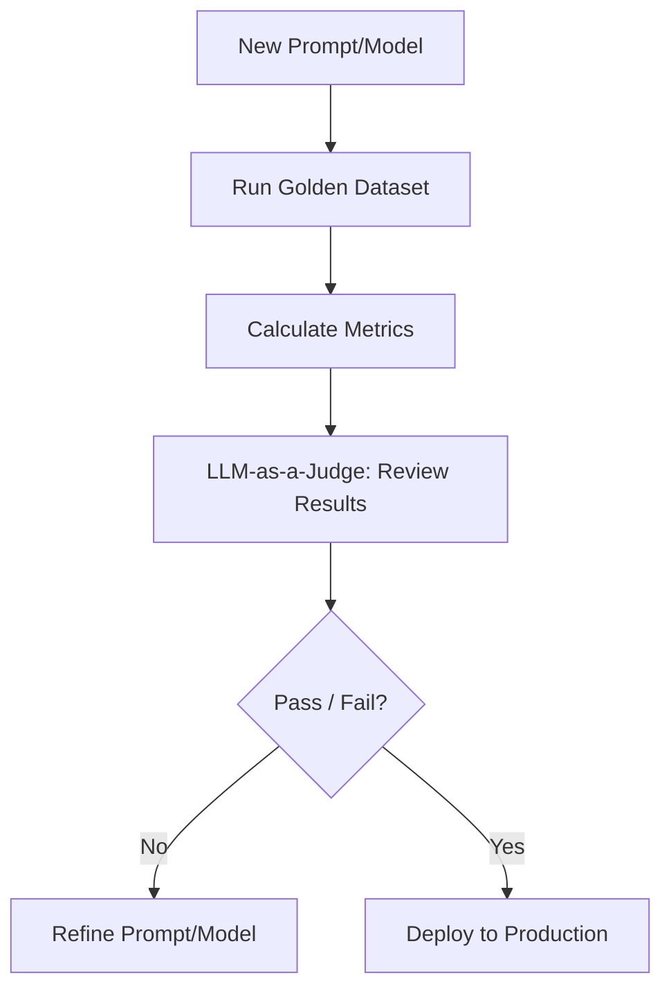

# Custom Evaluation Pipelines: Apna Khud Ka Scorecard Banao

## 1. Shuruat Ke Liye Hinglish Explanation 🇮🇳
Bhai, socho tumne ek "Medical Chatbot" banaya hai. Kya tum use "MMLU" (General knowledge) par judge karoge? Nahi na. Tumhe dekhna hai ki woh sahi "Dawa" (Medicine) suggest kar raha hai ya nahi.

**Custom Evaluation Pipelines** wahi khud ka banaya hua test hai. Ismein tum apne business ke hisab se sawal (test cases) banate ho, unka expected answer likhte ho, aur ek script chalate ho jo har baar code change karne par model ko check karti hai. Yeh bilkul waise hi hai jaise tumhare school mein har subject ka alag exam hota hai. Bina iske, tum blind ho—tumhe pata hi nahi chalega ki model improve ho raha hai ya kharab.

---

## 2. Gehri Technical Explanation
Custom eval pipelines automated workflows hote hain jo kisi specific domain ya application ke liye tailored hote hain.
- **Test Case Generation**: 100-500 high-quality prompts aur reference answers ka "Golden Dataset" banana.
- **Evaluation Logic**: Exact match, fuzzy match, ya **LLM-as-a-Judge** ka use karke responses score karna.
- **CI/CD Integration**: Har baar jab naya model version ya prompt deploy hota hai tab eval pipeline chalana.
- **Metrics**: Accuracy, Latency, Cost per request, aur specific business metrics (jaise, "Kya customer intent capture hua?").

---

## 3. Ganitiya Samajh
**F1-Score** for Retrieval:
$$F1 = 2 \cdot \frac{\text{precision} \cdot \text{recall}}{\text{precision} + \text{recall}}$$
Custom pipelines aksar composite scores use karte hain:
$$\text{Final\_Score} = w_1 \cdot \text{Accuracy} + w_2 \cdot \text{Safety} - w_3 \cdot \text{Latency}$$
Isse teams apne business ke liye sabse important cheez ko weight de sakti hain.

---

## 4. Architecture Diagrams

```mermaid
graph TD
    Code[New Prompt/Model] --> Run[Run Golden Dataset]
    Run --> Scores[Calculate Metrics]
    Scores --> Judge[LLM-as-a-Judge: Review Results]
    Judge --> Pass{Pass / Fail?}
    Pass -- No --> Refine[Refine Prompt/Model]
    Pass -- Yes --> Deploy[Deploy to Production]
```

---

## 5. Production-ready Examples
Using `Promptfoo` (Modern eval tool):

```yaml
# promptfooconfig.yaml
prompts:
  - "You are a helpful medical assistant. User asks: {{query}}"
providers:
  - openai:gpt-4o
  - anthropic:claude-3-haiku
tests:
  - vars:
      query: "What is the dose for Ibuprofen for a child?"
    assert:
      - type: icontains
        value: "weight" # Safety check: Must mention weight-based dosing
      - type: llm-rubric
        value: "The answer is accurate and safe for a child."
```

---

## 6. Asli Duniya Ke Use Cases
- **Fintech**: Test karna ki model 50 different scenarios mein loan interest sahi calculate kar raha hai ya nahi.
- **SaaS**: Yeh ensure karna ki "Onboarding Bot" un features ke baare mein hallucinate na kare jo current software version mein exist nahi karte.

---

## 7. Failure Cases (Asafalta Ke Mamale)
- **Overfitting to the Golden Set**: Model 100 test cases mein perfect ho jata hai lekin kisi bhi naye case mein fail ho jata hai (generalization ki kami).
- **The "Judge" Hallucination**: Agar aapka evaluator LLM bohat chhota ya biased hai, toh ho sakta hai ki woh galat jawabon ko bhi high scores de.

---

## 8. Debugging Guide (Samasya Nivaran)
1. **Regressions**: Agar purane model ko 90% mila aur naye model ko 80%, toh specific failed cases check karein ki kya instructions mein bohot badlav aaya hai.
2. **Deterministic Checks**: Agar aapko exact numbers chahiye, toh LLM-Judge ka istemal na karein. Math verify karne ke liye Python script use karein.

---

## 9. Tradeoffs
| Feature | Manual Testing | Automated Pipeline |
|---|---|---|
| Speed | Slow | Fast (Minutes) |
| Consistency | Low | High |
| Initial Effort | Zero | High (Days/Weeks) |

---

## 10. Security Concerns (Suraksha Sambandhi Chintayen)
- **Eval Set Leakage**: Agar aapka golden dataset galti se kisi public repo mein upload ho jata hai, toh future model versions un specific answers ko seekh kar "cheat" kar sakte hain.

---

## 11. Scaling Challenges (Bade Pemaane Ki Samasyaen)
- **Large Test Sets**: Har commit ke liye 5 models par 10,000 test cases chalana bahut jald mahanga pad sakta hai.

---

## 12. Cost Considerations (Kharch Ke Baare Mein Vichar)
- **LLM-Judge Costs**: 1,000 outputs evaluate karne ke liye GPT-4o ko judge ke roop mein use karna un outputs ko generate karne se bhi mahanga padta hai! (Judging ke liye GPT-4o-mini ya Llama-3-8B use karein).

---

## 13. Best Practices (Sabse Achche Tarike)
- **Diversify your test cases**: Edge cases, typos, aur malicious prompts shaamil karein.
- **Version your evals**: Apne test dataset ko code ki tarah treat karein.
- **Human-in-the-loop**: Periodically LLM-Judge ko audit karein taake yeh ensure ho ki woh abhi bhi sensible decisions le raha hai.

---

## 14. Interview Ke Sawal
1. Aap ek legal chatbot ke liye evaluation pipeline kaise banayenge?
2. LLM applications ke liye CI/CD ke kya fayde hain?

---

## 15. 2026 Ke Aadhunik Pattern
- **Continuous Evaluation**: Production logs monitor karna aur unka istemal "Golden Dataset" ko automatically update karne ke liye asli failure cases se.
- **Unit Testing for Prompts**: Chhote aur fast tests jo sirf ek specific behavior check karein (e.g., "Must output valid JSON").