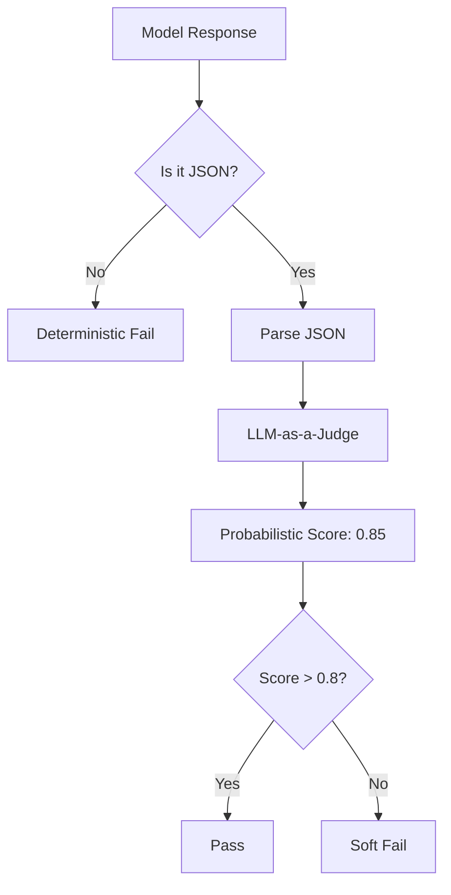

# 🎲 Deterministic vs Probabilistic Testing: Hard vs Soft Rules
> **Objective:** Master the balance between traditional unit tests (Deterministic) and modern LLM-based evaluations (Probabilistic) to create a comprehensive testing strategy for AI systems | **Language:** Hinglish | **Standard:** 2026 Expert Framework

---

## 🧭 1. Beginner-Friendly Hinglish Explanation
Deterministic vs Probabilistic Testing ka matlab hai "Pakke rules vs Andaze wale rules".

- **Deterministic Testing:** Ye purane "Software Engineering" jaisa hai. `1+1` hamesha `2` hona chahiye. JSON hamesha valid hona chahiye. (Koi shakk nahi).
- **Probabilistic Testing:** Ye "AI Evaluation" jaisa hai. Answer "Accha" hai ya nahi, ye fix nahi hai. Ye $90\%$ sahi ho sakta hai. (Doubt rehta hai).
- **Intuition:** Deterministic ek "Calculator" jaisa hai (fixed result). Probabilistic ek "Essay Competition" jaisa hai (Judge ki pasand par nirbhar).

---

## 🧠 2. Deep Technical Explanation
Effective AI testing requires both **Unit Tests** and **Eval Suits**:

1. **Deterministic Tests (The Guardrails):**
   - **Schema Validation:** Does the JSON match the Pydantic model?
   - **Tool Call Checks:** Did the model call the *exact* right function for a fixed input?
   - **Keyword Matching:** Did the model include "Must-have" legal disclaimers?
2. **Probabilistic Tests (The Nuance):**
   - **Semantic Similarity:** Does the answer mean the same as the reference?
   - **Style/Tone Checking:** Is the model's persona consistent?
   - **Reasoning Quality:** Is the logic sound even if the wording changes?

---

## 📐 3. Mathematical Intuition
**Confidence Intervals:**
In Probabilistic testing, we don't say "Pass" or "Fail". We say the model has a mean score $\mu$ with a standard deviation $\sigma$.
We run the test $N$ times to ensure the result is statistically significant:
$$\text{Margin of Error} = Z \frac{\sigma}{\sqrt{N}}$$
If the margin of error is too high, the test is "Flaky" and needs a better Judge or more test cases.

---

## 🏗️ 4. Architecture Diagrams


---

## 💻 5. Production-Ready Examples
Combining both in a Python test suite:
```python
def test_support_bot():
    query = "Refund my order #123"
    response = bot.invoke(query)
    
    # 1. Deterministic Check
    assert "refund_tool" in response.tool_calls[0].name, "Must call refund tool"
    assert response.tool_calls[0].args["order_id"] == "123", "Must extract correct ID"
    
    # 2. Probabilistic Check
    eval_score = judge.score(response.text, "The tone should be empathetic.")
    assert eval_score > 0.7, "Tone was too robotic or rude"
```

---

## 🌍 6. Real-World Use Cases
- **Medical AI:** Deterministic check to ensure it *never* gives a dosage amount, and Probabilistic check to ensure the explanation is easy for a patient to understand.
- **SQL Agents:** Deterministic check that the SQL code is valid, and Probabilistic check that the query actually answers the user's question.

---

## ❌ 7. Failure Cases
- **The "Flaky" Test:** A probabilistic test that passes one day and fails the next because the "Judge Model" was updated or changed its mind.
- **Rigid Determinism:** Failing an AI model because it used a synonym instead of the exact word you expected.

---

## 🛠️ 8. Debugging Guide
| Problem | Reason | Solution |
| :--- | :--- | :--- |
| **Tests are too slow** | Too many Judge calls | Move deterministic checks to the **beginning** of the pipeline to "Fail fast". |
| **Tests pass but AI is bad** | Logic is 'Gamed' | Add **Adversarial test cases** that try to trick the model. |

---

## ⚖️ 9. Tradeoffs
- **Deterministic (Reliable / Fast / Rigid / Hard to write for text).**
- **Probabilistic (Flexible / Slow / Flaky / Easy to write for text).**

---

## 🛡️ 10. Security Concerns
- **Regression Stealth:** A small change in the model might pass $99\%$ of deterministic tests but "Drift" in its probabilistic reasoning, leading to subtle bugs in production.

---

## 📈 11. Scaling Challenges
- **The "Version" Problem:** When you upgrade from Llama-2 to Llama-3, ALL your probabilistic thresholds might need to be re-calibrated.

---

## 💰 12. Cost Considerations
- Deterministic tests are free ($0.0001 in CPU). Probabilistic tests cost money (API tokens). Always run Deterministic tests first.

漫
---

## 📝 14. Interview Questions
1. "Give an example of a task that needs both deterministic and probabilistic testing."
2. "How do you handle 'Flakiness' in AI testing?"
3. "What is the role of Pydantic in deterministic LLM testing?"

---

## 🚀 15. Latest 2026 LLM Engineering Patterns
- **Assertion-based Evals:** Using libraries like `Promptfoo` to write assertions for AI (e.g., `assert output.contains('JSON')`, `assert output.matches_semantic('Polite')`).
- **Statistical Significance Testing:** Only accepting a "Win" in A/B testing if the $p$-value is $<0.05$.
漫
漫
