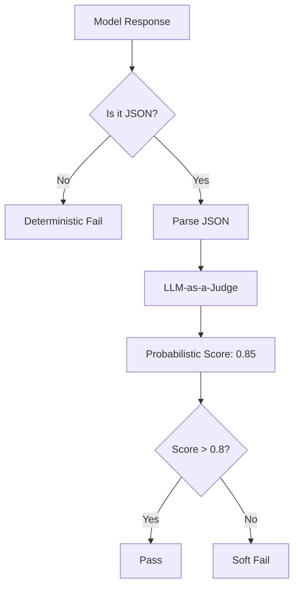

# 🎲 Deterministic vs Probabilistic Testing: Sakht vs Naram Rules
> **Objective:** Traditional unit tests (Deterministic) aur modern LLM-based evaluations (Probabilistic) ke beech balance master karna, taaki AI systems ke liye ek comprehensive testing strategy bana sakein | **Language:** Hinglish | **Standard:** 2026 Expert Framework

---

## 🧭 1. Beginner-Friendly Hinglish Explanation
Deterministic vs Probabilistic Testing ka matlab hai "Pakke rules vs Andaze wale rules".

- **Deterministic Testing:** Ye purane "Software Engineering" jaisa hai. `1+1` hamesha `2` hona chahiye. JSON hamesha valid hona chahiye. (Koi shakk nahi).
- **Probabilistic Testing:** Ye "AI Evaluation" jaisa hai. Answer "Accha" hai ya nahi, ye fix nahi hai. Ye $90\%$ sahi ho sakta hai. (Doubt rehta hai).
- **Intuition:** Deterministic ek "Calculator" jaisa hai (fixed result). Probabilistic ek "Essay Competition" jaisa hai (Judge ki pasand par nirbhar).

---

## 🧠 2. Deep Technical Explanation
Effective AI testing ke liye dono **Unit Tests** aur **Eval Suits** chahiye:

1. **Deterministic Tests (The Guardrails):**
   - **Schema Validation:** Kya JSON Pydantic model se match karta hai?
   - **Tool Call Checks:** Kya model ne fixed input ke liye *exact* right function call kiya?
   - **Keyword Matching:** Kya model ne "Must-have" legal disclaimers include kiye?
2. **Probabilistic Tests (The Nuance):**
   - **Semantic Similarity:** Kya answer ka matlab reference ke same hai?
   - **Style/Tone Checking:** Kya model ka persona consistent hai?
   - **Reasoning Quality:** Kya logic sound hai jab wording change ho?

---

## 📐 3. Mathematical Intuition
**Confidence Intervals:**
Probabilistic testing mein hum "Pass" ya "Fail" nahi kehte. Hum kehte hain ki model ka mean score $\mu$ hai with standard deviation $\sigma$.
Hum test $N$ baar chalaate hain taaki result statistically significant ho:
$$\text{Margin of Error} = Z \frac{\sigma}{\sqrt{N}}$$
Agar margin of error bahut zyada hai, to test "Flaky" hai aur behtar Judge ya aur test cases chahiye.

---

## 🏗️ 4. Architecture Diagrams

```mermaid
graph TD
    Response[Model Response] --> Logic{Is it JSON?}
    Logic -->|No| Fail[Deterministic Fail]
    Logic -->|Yes| Parse[Parse JSON]
    Parse --> Judge[LLM-as-a-Judge]
    Judge --> Score[Probabilistic Score: 0.85]
    Score --> Threshold{Score > 0.8?}
    Threshold -->|Yes| Pass[Pass]
    Threshold -->|No| Fail2[Soft Fail]
```

---

## 💻 5. Production-Ready Examples
Dono ko ek Python test suite mein combine karte hain:
```python
def test_support_bot():
    query = "Refund my order #123"
    response = bot.invoke(query)
    
    # 1. Deterministic Check
    assert "refund_tool" in response.tool_calls[0].name, "Must call refund tool"
    assert response.tool_calls[0].args["order_id"] == "123", "Must extract correct ID"
    
    # 2. Probabilistic Check
    eval_score = judge.score(response.text, "The tone should be empathetic.")
    assert eval_score > 0.7, "Tone was too robotic or rude"
```

---

## 🌍 6. Real-World Use Cases
- **Medical AI:** Deterministic check taaki ye kabhi dosage amount na de, aur Probabilistic check taaki explanation patient ko samajhne mein aasan ho.
- **SQL Agents:** Deterministic check ki SQL code valid hai, aur Probabilistic check ki query actually user ke sawaal ka jawab deti hai.

---

## ❌ 7. Failure Cases
- **The "Flaky" Test:** Ek probabilistic test jo ek din pass karta hai aur agle din fail ho jaata hai kyunki "Judge Model" update hua ya usne apna mind badal liya.
- **Rigid Determinism:** AI model ko fail karna kyunki usne exact word ke badle synonym use kiya.

---

## 🛠️ 8. Debugging Guide
| Samasya | Karan | Samadhan |
| :--- | :--- | :--- |
| **Tests bahut slow hain** | Bahut zyada Judge calls | Deterministic checks ko pipeline ke **shuruaat** mein le jaao taaki "Fail fast" ho. |
| **Tests pass hote hain lekin AI kharab hai** | Logic 'Gamed' kiya gaya hai | **Adversarial test cases** daalo jo model ko trick karne ki koshish karein. |

---

## ⚖️ 9. Tradeoffs
- **Deterministic (Vishwasniya / Tez / Sakht / Text ke liye likhna mushkil).**
- **Probabilistic (Lachila / Dheema / Flaky / Text ke liye likhna aasan).**

---

## 🛡️ 10. Security Concerns
- **Regression Stealth:** Model mein ek chhota sa badlav $99\%$ deterministic tests pass kar sakta hai lekin uske probabilistic reasoning mein "Drift" ho sakta hai, jisse production mein subtle bugs aa sakte hain.

---

## 📈 11. Scaling Challenges
- **The "Version" Problem:** Jab aap Llama-2 se Llama-3 mein upgrade karte hain, to aapke saare probabilistic thresholds ko re-calibrate karne ki zaroorat ho sakti hai.

---

## 💰 12. Cost Considerations
- Deterministic tests free hain ($0.0001 CPU mein). Probabilistic tests mein paisa lagta hai (API tokens). Hamesha pehle Deterministic tests chalao.
漫
---

## 📝 14. Interview Questions
1. "Ek task ka udaharan do jisme dono deterministic aur probabilistic testing ki zaroorat hai."
2. "AI testing mein 'Flakiness' ko kaise handle karte hain?"
3. "Deterministic LLM testing mein Pydantic ka kya role hai?"

---

## 🚀 15. Latest 2026 LLM Engineering Patterns
- **Assertion-based Evals:** `Promptfoo` jaisi libraries ka upyog karke AI ke liye assertions likhna (jaise, `assert output.contains('JSON')`, `assert output.matches_semantic('Polite')`).
- **Statistical Significance Testing:** A/B testing mein sirf "Win" accept karna agar $p$-value $<0.05$ ho.
漫
漫