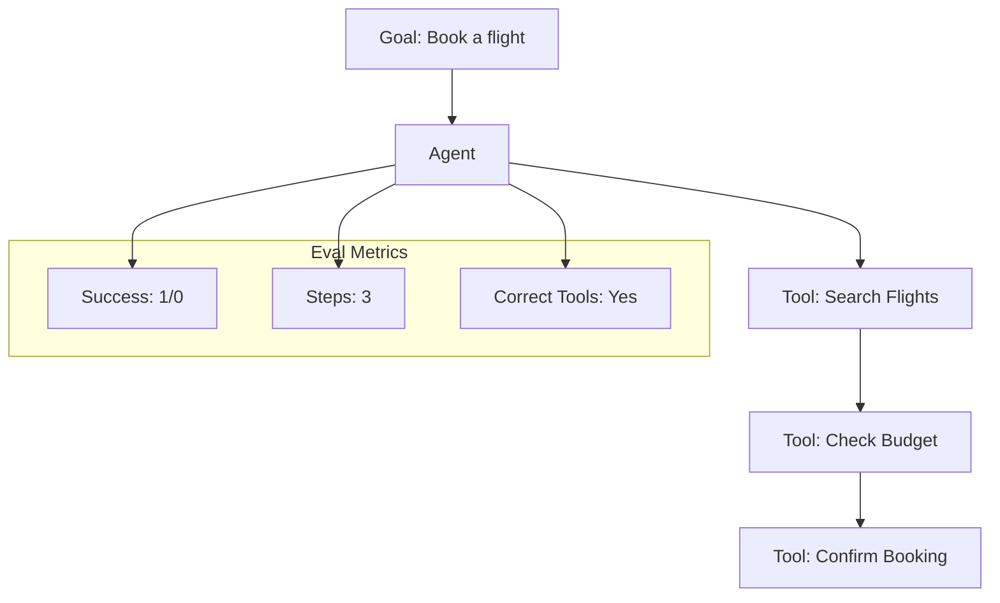

# Evaluating Agents: Testing the Loop

## 1. Beginner-friendly Hinglish Explanation 🇮🇳
Bhai, ek normal LLM ko test karna simple hai—ek sawal pucho aur answer check karo. Lekin **Agent** ko test karna mushkil hai kyunki woh ek loop mein kaam karta hai. Woh "Search" karega, "Code" likhega, phir "Sochega" aur phir shayad kuch aur karega. 

**Evaluating Agents** ka matlab hai sirf aakhri answer nahi, balki uske "Beech wale steps" (Trajectory) ko bhi judge karna. Kya usne sahi tool choose kiya? Kya usne galat query likhkar time waste kiya? Kya woh kisi loop mein toh nahi phans gaya? Is module mein hum seekhenge ki kaise ek complex "Agentic System" ki performance ko measure kiya jaye.

---

## 2. Deep Technical Explanation
Agent evaluation requires measuring both the **Process** and the **Outcome**.
- **Success Rate**: Did the agent reach the goal?
- **Trajectory Accuracy**: Were the intermediate steps (Tool calls, reasoning) correct?
- **Efficiency**: How many tokens/steps did it take? (Lower is better).
- **Robustness**: Can it recover if a tool returns an error or no results?
- **Safety**: Does the agent try to perform illegal actions (e.g., deleting files) when asked?

---

## 3. Mathematical Intuition
Agent performance can be modeled as a **Path Reward**.
Total Reward $R = \mathbb{1}(\text{Success}) - \gamma \times \text{Number of Steps}$
where $\gamma$ is a penalty for each step. This encourages the agent to be fast.
We also use **Trajectory Similarity** (comparing the agent's steps to an "Expert" path) using metrics like Levenshtein distance on the tool-call sequence.

---

## 4. Architecture Diagrams


---

## 5. Production-ready Examples
Evaluation using `AgentBench` (Conceptual):

```python
# Test Case
goal = "Find the revenue of Apple in 2023 and multiply it by 1.1"

# Evaluator checks:
# 1. Did it use a search tool?
# 2. Did it find the correct revenue ($383.29B)?
# 3. Is the final math correct ($421.62B)?

# If final answer is 421.62 but it didn't use search (it guessed), 
# then Trajectory Score = 0, even if Outcome = 1.
```

---

## 6. Real-world Use Cases
- **Customer Service Agents**: Testing if the bot can solve a refund issue in < 5 steps.
- **Data Analyst Agents**: Ensuring the agent writes valid SQL and doesn't hallucinate column names.
- **Coding Agents (Devin style)**: Running the code the agent wrote to see if it actually fixes the bug (Unit Testing).

---

## 7. Failure Cases
- **Infinite Tool Loops**: The agent keeps calling `search` with the same query.
- **Hallucinated Tools**: The agent tries to call a function that isn't in its toolbox.
- **Context Overload**: The agent's "Thought history" becomes so long that it forgets the original goal.

---

## 8. Debugging Guide
1. **Trace Visualization**: Use LangSmith or Phoenix to see the "DAG" of the agent's run.
2. **Intermediate Unit Tests**: Run a validator after every tool call. If the tool returned "Error", see if the agent noticed and fixed it.

---

## 9. Tradeoffs
| Metric | Outcome Only | Trajectory + Outcome |
|---|---|---|
| Speed | Fast | Slow |
| Detail | Low | High |
| Cost | Low | High (evaluating every step) |

---

## 10. Security Concerns
- **Remote Code Execution (RCE)**: If your agent can run Python, an evaluator must ensure it doesn't try to `rm -rf /`. Always run agent evals in a sandboxed environment (Docker).

---

## 11. Scaling Challenges
- **Non-determinism**: Agent runs are often non-deterministic. You might need to run the same test 5 times and take the average success rate.

---

## 12. Cost Considerations
- **Step Multiplier**: A single agentic request can trigger 10+ LLM calls, making evaluation 10x more expensive than standard LLM testing.

---

## 13. Best Practices
- **Mock your tools**: During evaluation, replace real APIs with "Mocks" that return fixed data to ensure consistency.
- **Limit iterations**: Always set a `max_steps` to prevent runaway costs.
- **Evaluate Tool-Call Syntax**: Check if the JSON for the tool call is actually valid before even running the tool.

---

## 14. Interview Questions
1. Why is "Outcome-only" evaluation dangerous for agents?
2. How do you measure an agent's "Planning" capability?

---

## 15. Latest 2026 Patterns
- **Simulated Environment Testing**: Putting the agent in a "Game-like" sandbox (like MineDojo) to see if it can survive and complete tasks over long periods.
- **Automatic Trajectory Labeling**: Using a super-agent (like GPT-5) to grade the steps of a smaller agent.
