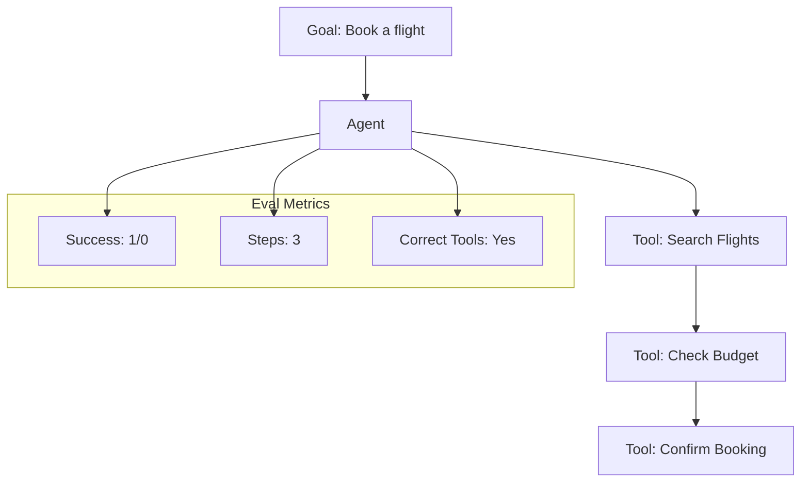

# Evaluating Agents: Testing the Loop

## 1. Beginner-friendly Hinglish Explanation 🇮🇳
Bhai, ek normal LLM ko test karna simple hai—ek sawal pucho aur answer check karo. Lekin **Agent** ko test karna mushkil hai kyunki woh ek loop mein kaam karta hai. Woh "Search" karega, "Code" likhega, phir "Sochega" aur phir shayad kuch aur karega. 

**Evaluating Agents** ka matlab hai sirf aakhri answer nahi, balki uske "Beech wale steps" (Trajectory) ko bhi judge karna. Kya usne sahi tool choose kiya? Kya usne galat query likhkar time waste kiya? Kya woh kisi loop mein toh nahi phans gaya? Is module mein hum seekhenge ki kaise ek complex "Agentic System" ki performance ko measure kiya jaye.

---

## 2. Deep Technical Explanation
Agent evaluation ko **Process** aur **Outcome** dono measure karna hota hai.
- **Success Rate**: Kya agent goal tak pahunch gaya?
- **Trajectory Accuracy**: Kya intermediate steps (Tool calls, reasoning) sahi the?
- **Efficiency**: Kitne tokens/steps lage? (Kam better hai).
- **Robustness**: Agar tool error ya koi result nahi return kare, toh kya agent recover kar sakta hai?
- **Safety**: Kya agent illegal actions perform karne ki koshish karta hai (e.g., files delete karna) jab poochha jaye?

---

## 3. Mathematical Intuition
Agent performance ko **Path Reward** ke roop mein model kiya ja sakta hai.
Total Reward $R = \mathbb{1}(\text{Success}) - \gamma \times \text{Number of Steps}$
jahaan $\gamma$ har step ke liye ek penalty hai. Yeh agent ko fast rehne ke liye encourage karta hai.
Hum **Trajectory Similarity** bhi use karte hain (agent ke steps ko "Expert" path se compare karke) using metrics like Levenshtein distance jo tool-call sequence par hota hai.

---

## 4. Architecture Diagrams

```mermaid
graph TD
    Query[Goal: Book a flight] --> Agent[Agent]
    Agent --> Step1[Tool: Search Flights]
    Step1 --> Step2[Tool: Check Budget]
    Step2 --> Step3[Tool: Confirm Booking]
    
    subgraph "Eval Metrics"
        Success[Success: 1/0]
        Efficiency[Steps: 3]
        Tool[Correct Tools: Yes]
    end
    Agent --> Success & Efficiency & Tool
```

---

## 5. Production-ready Examples
`AgentBench` ka use karte hue Evaluation (Conceptual):

```python
# Test Case
goal = "Find the revenue of Apple in 2023 and multiply it by 1.1"

# Evaluator checks:
# 1. Did it use a search tool?
# 2. Did it find the correct revenue ($383.29B)?
# 3. Is the final math correct ($421.62B)?

# If final answer is 421.62 but it didn't use search (it guessed), 
# then Trajectory Score = 0, even if Outcome = 1.
```

---

## 6. Real-world Use Cases
- **Customer Service Agents**: Testing karna ki kya bot refund issue ko < 5 steps mein solve kar sakta hai.
- **Data Analyst Agents**: Ensure karna ki agent valid SQL likhe aur column names hallucinate na kare.
- **Coding Agents (Devin style)**: Agent ke likhe code ko run karke check karna ki woh actually bug fix karta hai ya nahi (Unit Testing).

---

## 7. Failure Cases
- **Infinite Tool Loops**: Agent ek hi query ke saath `search` call karta rahta hai.
- **Hallucinated Tools**: Agent aisi function ko call karne ki koshish karta hai jo uske toolbox mein nahi hai.
- **Context Overload**: Agent ka "Thought history" itna lamba ho jata hai ki woh original goal bhool jata hai.

---

## 8. Debugging Guide
1. **Trace Visualization**: Agent ke run ka "DAG" dekhne ke liye LangSmith ya Phoenix use karein.
2. **Intermediate Unit Tests**: Har tool call ke baad ek validator run karein. Agar tool ne "Error" return kiya, toh dekhein ki agent ne notice kiya aur use fix kiya.

---

## 9. Tradeoffs
| Metric | Outcome Only | Trajectory + Outcome |
|---|---|---|
| Speed | Fast | Slow |
| Detail | Low | High |
| Cost | Low | High (evaluating every step) |

---

## 10. Security Concerns
- **Remote Code Execution (RCE)**: Agar aapka agent Python run kar sakta hai, toh evaluator ko ensure karna chahiye ki woh `rm -rf /` try na kare. Agent evals hamesha sandboxed environment (Docker) mein run karein.

---

## 11. Scaling Challenges
- **Non-determinism**: Agent runs gen non-deterministic hote hain. Aapko same test 5 baar run karke average success rate lena pad sakta hai.

---

## 12. Cost Considerations
- **Step Multiplier**: Ek single agentic request 10+ LLM calls trigger kar sakti hai, jo evaluation ko standard LLM testing se 10x zyada expensive bana deti hai.

---

## 13. Best Practices
- **Mock your tools**: Evaluation ke dauran, real APIs ko "Mocks" se replace karein jo fixed data return karein, consistency ensure karne ke liye.
- **Limit iterations**: Hamesha `max_steps` set karein, runaway costs rokne ke liye.
- **Evaluate Tool-Call Syntax**: Check karein ki tool call ka JSON actually valid hai ya nahi, tool run karne se pehle.

---

## 14. Interview Questions
1. "Outcome-only" evaluation agents ke liye dangerous kyun hai?
2. Aap agent ki "Planning" capability kaise measure karte hain?

---

## 15. Latest 2026 Patterns
- **Simulated Environment Testing**: Agent ko "Game-like" sandbox (jaise MineDojo) mein daal kar dekhna ki woh long periods mein survive karke tasks complete kar sakta hai.
- **Automatic Trajectory Labeling**: Ek super-agent (jaise GPT-5) ka use karke chhote agent ke steps ko grade karna.