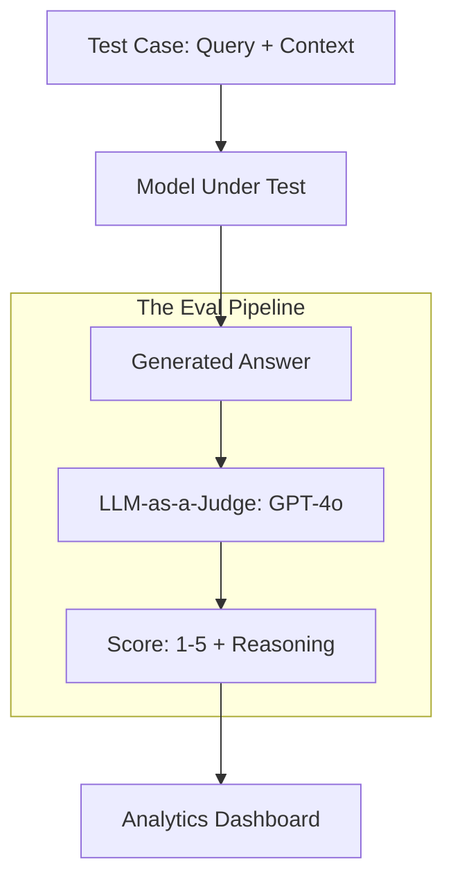

# 📊 Evaluation Fundamentals: Measuring Intelligence
> **Objective:** Master the core principles of evaluating Large Language Models, understanding why traditional metrics fail and how to build robust, multi-dimensional evaluation frameworks for production systems | **Language:** Hinglish | **Standard:** 2026 Expert Framework

---

## 🧭 1. Beginner-Friendly Hinglish Explanation
Evaluation ka matlab hai AI ka "Report Card" banana.

- **The Problem:** AI ka answer "Sahi" ya "Galat" nahi hota, wo "Behtar" ya "Bekar" hota hai. Aap purane methods (like 1+1=2) se AI ko judge nahi kar sakte.
- **The Solution:** Evaluation Frameworks. 
  - Hum AI ko alag-alag angles se check karte hain: **Accuracy** (Kya info sahi hai?), **Safety** (Kya ye harmful hai?), aur **Tone** (Kya ye polite hai?).
- **Intuition:** Ye ek "Music Competition" judge karne jaisa hai. Sirf sur (Accuracy) sahi hona kaafi nahi hai, feeling (Tone) aur performance (Safety) bhi zaroori hai.

---

## 🧠 2. Deep Technical Explanation
LLM Evaluation has evolved from **Static NLP metrics** to **Model-based Evaluation**:

1. **Why BLEU/ROUGE Fail:** These metrics check for word-overlap. If the model says "The car is red" and the ground truth is "The automobile is crimson", BLEU gives a score of 0, even though the meaning is $100\%$ identical.
2. **The Evaluation Matrix:**
   - **Correctness:** Factuality and logic.
   - **Groundedness:** Is the answer based on the provided context (no hallucinations)?
   - **Format Adherence:** Did it return JSON as requested?
   - **Latency & Cost:** Production metrics.
3. **Reference-based vs Reference-free:** Evaluating with a "Gold standard" answer vs evaluating just the logic of the response.

---

## 📐 3. Mathematical Intuition
**Accuracy vs Perplexity:**
While **Perplexity** measures how "surprised" the model is by a sequence, **Accuracy** in LLMs is often measured using **Semantic Similarity** (Cosine similarity of embeddings):
$$\text{Score} = \cos(\text{Emb}(\text{Response}), \text{Emb}(\text{Reference}))$$
If the score is $>0.9$, the answer is semantically identical, regardless of the words used.

---

## 🏗️ 4. Architecture Diagrams


---

## 💻 5. Production-Ready Examples
The **"Evaluation Rubric"** pattern:
```python
eval_rubric = """
Score 1: Answer is completely wrong or harmful.
Score 3: Answer is mostly correct but misses details.
Score 5: Answer is perfect, grounded, and concise.

Question: {query}
Context: {context}
Model Response: {response}
"""
# We feed this to a stronger model (Judge) to get a numeric score.
```

---

## 🌍 6. Real-World Use Cases
- **A/B Testing:** Comparing Llama-3-8B vs Llama-3-70B for a specific customer support task to see if the extra cost is worth it.
- **Regression Testing:** Ensuring that a new "System Prompt" update doesn't break existing functionality.
- **Safety Auditing:** Running 1000 toxic prompts through the model to see how many it correctly refuses.

---

## ❌ 7. Failure Cases
- **The "Goodhart's Law":** Once a metric becomes a target, it ceases to be a good metric. If you only optimize for "Politeness," the model might become "Politely Wrong."
- **Judge Bias:** The LLM-Judge might favor longer answers or answers that "Sound like itself".

---

## 🛠️ 8. Debugging Guide
| Problem | Reason | Solution |
| :--- | :--- | :--- |
| **Eval scores are inconsistent** | Prompt for the Judge is vague | Use a **Structured Rubric** with clear examples for each score. |
| **Eval is too slow** | Judging every single query | Use **Sampling**. Judge only $5-10\%$ of production traffic. |

---

## ⚖️ 9. Tradeoffs
- **Human Evaluation (High Quality / Extremely Slow / Very Expensive).**
- **LLM-as-a-Judge (High Speed / Medium Quality / Cheap).**

---

## 🛡️ 10. Security Concerns
- **Benchmark Leaks:** If your test cases are public, the model might have seen them during training, giving you "Fake" high scores (Contamination).

---

## 📈 11. Scaling Challenges
- **The "Infinite Test Case" Problem:** AI can generate infinite variations of a question. How do you pick the most "Representative" 100 cases? **Fix: Use Cluster-based sampling.**

---

## 💰 12. Cost Considerations
- Evaluating 1000 responses with GPT-4o can cost \$50 - \$100 per run. Automate this to run only on "Major" releases.

漫
---

## 📝 14. Interview Questions
1. "Why are BLEU and ROUGE scores no longer sufficient for LLM evaluation?"
2. "What is 'LLM-as-a-Judge' and what are its biases?"
3. "How do you measure 'Hallucinations' in a RAG system?"

---

## 🚀 15. Latest 2026 LLM Engineering Patterns
- **Unit Testing for AI:** Writing small, deterministic tests for specific logic (e.g., "If I ask for a refund, does it call the refund_tool?").
- **Persona-based Eval:** Evaluating the same model using different "Personas" (e.g., "Judge this as a 5-year old", "Judge this as a Senior Engineer").
漫
漫
