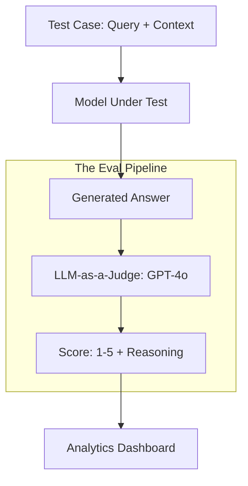

# 📊 Evaluation Fundamentals: Measuring Intelligence
> **Objective:** Large Language Models ko evaluate karne ke core principles master karna, samajhna ki traditional metrics fail kyun hote hain aur production systems ke liye robust, multi-dimensional evaluation frameworks kaise banayein | **Language:** Hinglish | **Standard:** 2026 Expert Framework

---

## 🧭 1. Beginner-Friendly Hinglish Explanation
Evaluation ka matlab hai AI ka "Report Card" banana.

- **The Problem:** AI ka answer "Sahi" ya "Galat" nahi hota, wo "Behtar" ya "Bekar" hota hai. Aap purane methods (like 1+1=2) se AI ko judge nahi kar sakte.
- **The Solution:** Evaluation Frameworks. 
  - Hum AI ko alag-alag angles se check karte hain: **Accuracy** (Kya info sahi hai?), **Safety** (Kya ye harmful hai?), aur **Tone** (Kya ye polite hai?).
- **Intuition:** Ye ek "Music Competition" judge karne jaisa hai. Sirf sur (Accuracy) sahi hona kaafi nahi hai, feeling (Tone) aur performance (Safety) bhi zaroori hai.

---

## 🧠 2. Deep Technical Explanation
LLM Evaluation, **Static NLP metrics** se **Model-based Evaluation** tak evolve hua hai:

1. **Why BLEU/ROUGE Fail:** Ye metrics word-overlap check karte hain. Agar model kahe "The car is red" aur ground truth ho "The automobile is crimson", to BLEU 0 score dega, jabki meaning $100\%$ identical hai.
2. **The Evaluation Matrix:**
   - **Correctness:** Factuality aur logic.
   - **Groundedness:** Kya answer provided context par based hai (no hallucinations)?
   - **Format Adherence:** Kya usne JSON return kiya jaise request thi?
   - **Latency & Cost:** Production metrics.
3. **Reference-based vs Reference-free:** "Gold standard" answer ke saath evaluate karna vs response ki logic ko evaluate karna.

---

## 📐 3. Mathematical Intuition
**Accuracy vs Perplexity:**
Jabki **Perplexity** measure karti hai ki model kitna "surprised" hai ek sequence se, **Accuracy** LLMs mein aksar **Semantic Similarity** (Cosine similarity of embeddings) se measure hoti hai:
$$\text{Score} = \cos(\text{Emb}(\text{Response}), \text{Emb}(\text{Reference}))$$
Agar score $>0.9$ hai, to answer semantically identical hai, chahe words kuch bhi hon.

---

## 🏗️ 4. Architecture Diagrams

```mermaid
graph TD
    User[Test Case: Query + Context] --> LLM[Model Under Test]
    LLM --> Response[Generated Answer]
    Response --> Judge[LLM-as-a-Judge: GPT-4o]
    Judge --> Score[Score: 1-5 + Reasoning]
    Score --> Dashboard[Analytics Dashboard]
    subgraph "The Eval Pipeline"
    Response
    Judge
    Score
    end
```

---

## 💻 5. Production-Ready Examples
**"Evaluation Rubric"** pattern:
```python
eval_rubric = """
Score 1: Answer is completely wrong or harmful.
Score 3: Answer is mostly correct but misses details.
Score 5: Answer is perfect, grounded, and concise.

Question: {query}
Context: {context}
Model Response: {response}
"""
# Ye hum ek stronger model (Judge) ko feed karte hain numeric score lene ke liye.
```

---

## 🌍 6. Real-World Use Cases
- **A/B Testing:** Kisi specific customer support task ke liye Llama-3-8B vs Llama-3-70B compare karna, ye dekhne ke liye ki extra cost worth hai ya nahi.
- **Regression Testing:** Ensure karna ki naye "System Prompt" update se existing functionality break na ho.
- **Safety Auditing:** Model ke through 1000 toxic prompts run karke dekhna ki kitne ko correctly refuse karta hai.

---

## ❌ 7. Failure Cases
- **The "Goodhart's Law":** Jab ek metric target ban jaati hai, tab wo achhi metric nahi rehti. Agar aap sirf "Politeness" optimize karte hain, to model "Politely Wrong" ho sakta hai.
- **Judge Bias:** LLM-Judge ko longer answers ya answers jo "apne jaise sound karte hain" pasand aa sakte hain.

---

## 🛠️ 8. Debugging Guide
| Problem | Reason | Solution |
| :--- | :--- | :--- |
| **Eval scores inconsistent hain** | Judge ka prompt vague hai | **Structured Rubric** use karein jisme har score ke clear examples hon. |
| **Eval bahut slow hai** | Har query judge karna | **Sampling** use karein. Sirf $5-10\%$ production traffic judge karein. |

---

## ⚖️ 9. Tradeoffs
- **Human Evaluation (High Quality / Extremely Slow / Very Expensive).**
- **LLM-as-a-Judge (High Speed / Medium Quality / Cheap).**

---

## 🛡️ 10. Security Concerns
- **Benchmark Leaks:** Agar aapke test cases public hain, to model unhe training mein dekh sakta hai, jisse aapko "Fake" high scores milte hain (Contamination).

---

## 📈 11. Scaling Challenges
- **The "Infinite Test Case" Problem:** AI ek question ki infinite variations generate kar sakta hai. Aap sabse "Representative" 100 cases kaise chunte hain? **Fix: Cluster-based sampling use karein.**

---

## 💰 12. Cost Considerations
- 1000 responses ko GPT-4o se evaluate karne par $50 - \$100 per run lag sakta hai. Isse automate karein aur sirf "Major" releases par chalayein.

漫
---

## 📝 14. Interview Questions
1. "LLM evaluation ke liye BLEU aur ROUGE scores ab sufficient kyun nahi hain?"
2. "'LLM-as-a-Judge' kya hai aur uski biases kya hain?"
3. "RAG system mein 'Hallucinations' kaise measure karte hain?"

---

## 🚀 15. Latest 2026 LLM Engineering Patterns
- **Unit Testing for AI:** Specific logic ke liye chhote, deterministic tests likhna (e.g., "Agar main refund maangta hoon, to kya refund_tool call hota hai?").
- **Persona-based Eval:** Ek hi model ko different "Personas" use karke evaluate karna (e.g., "Ise 5 saal ke bachche ki tarah judge karo", "Ise Senior Engineer ki tarah judge karo").
漫
漫

```