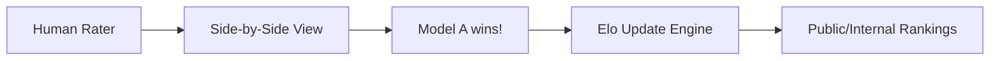

# Human Evaluation: The Ultimate Truth

## 1. Beginner-friendly Hinglish Explanation 🇮🇳
Bhai, math aur coding ke liye toh computer test kar leta hai, lekin "Creative Writing" ya "Helpful Conversation" ke liye koi computer program perfect nahi hota. 

**Human Evaluation** wahi "Gold Standard" hai jahan asli insaan (Experts ya Crowd) model ke answers ko padhte hain aur unhe rank karte hain. Woh dekhte hain ki kya answer "Tameez" (Polite) se hai, kya woh "Helpful" hai, aur kya usmein "Hawa-baazi" (Hallucination) toh nahi hai. Jab do models ka comparison hota hai aur insaan vote dete hain, use hum **A/B Testing** ya **Side-by-Side (SxS)** evaluation kehte hain. Bina insaani feedback ke, AI sirf ek machine rahegi, "Friendly" nahi ban payegi.

---

## 2. Deep Technical Explanation
Human evaluation is the process of using human raters to assess model quality across subjective dimensions.
- **Helpfulness**: Does the model follow the instruction?
- **Honesty**: Is the information factually correct?
- **Harmlessness**: Does it avoid toxic/dangerous content?
- **SxS (Side-by-Side)**: Raters are shown two anonymized responses (Model A vs Model B) and must pick the winner or a tie. This is used to calculate **Elo Ratings**.

---

## 3. Mathematical Intuition
**Elo Rating System**:
If Model A wins against Model B, its rating $R_A$ increases:
$$E_A = \frac{1}{1 + 10^{(R_B - R_A)/400}}$$
$$R'_A = R_A + K(S_A - E_A)$$
Where $E_A$ is the expected win probability, $S_A$ is the actual outcome (1 for win, 0 for loss), and $K$ is the sensitivity factor. This allows us to create a global leaderboard like **Chatbot Arena**.

---

## 4. Architecture Diagrams


---

## 5. Production-ready Examples
A typical human rating interface schema:

```json
{
  "query": "Write a funny joke about a cat.",
  "response_a": "Why was the cat so small? Because it only drank condensed milk!",
  "response_b": "A cat walks into a bar...",
  "rating_criteria": ["Humor", "Relevance", "Safety"],
  "rating_scale": 1-5,
  "winner": "response_a"
}
```

---

## 6. Real-world Use Cases
- **RLHF Training**: Collecting preference data to fine-tune a model.
- **Launch Approval**: A company won't launch a new version of their bot until the Human Eval score is 10% higher than the previous version.

---

## 7. Failure Cases
- **Human Bias**: Raters might prefer a model that "Sounds confident" even if it's wrong (The Sycophancy problem).
- **Fatigue**: After rating 100 responses, a human might start making mistakes or clicking "Tie" just to finish faster.
- **Lack of Expertise**: A regular person can't evaluate a PhD-level physics answer accurately.

---

## 8. Debugging Guide
1. **Inter-Rater Reliability**: If two humans look at the same answer and one says "Great" while the other says "Terrible", your rating instructions are unclear.
2. **Gold Standard Checks**: Sneak in some "Obviously Bad" or "Obviously Good" answers to test if your raters are paying attention.

---

## 9. Tradeoffs
| Feature | Automated Eval | Human Eval |
|---|---|---|
| Speed | Instant | Weeks |
| Cost | Low | Very High |
| Nuance | Low | Very High |

---

## 10. Security Concerns
- **Rater Bribery/Collusion**: If raters are from a specific group, they might bias the model towards their personal or political views.

---

## 11. Scaling Challenges
- **Crowdsourcing Logistics**: Managing 1,000+ raters across different time zones and languages is a massive operational challenge.

---

## 12. Cost Considerations
- **Professional Raters**: Experts (Doctors, Lawyers, Coders) can cost $50-$200 per hour for high-quality evaluation data.

---

## 13. Best Practices
- **Use Clear Rubrics**: Instead of "Rate 1-5", use "Does it have a bug? (Y/N)".
- **Blind Testing**: Raters must not know which model generated which response to avoid brand bias.
- **Diversity**: Ensure raters come from diverse backgrounds to prevent a single perspective from dominating the AI's behavior.

---

## 14. Interview Questions
1. Why is Human Evaluation still necessary when we have benchmarks like MMLU?
2. What is "Sycophancy" in the context of human ratings?

---

## 15. Latest 2026 Patterns
- **Hybrid Eval**: Using an "LLM Judge" to do the first 90% of filtering and only sending the most difficult "Ambiguous" cases to humans.
- **Multi-Modal Human Eval**: Humans rating video or audio clips generated by AI for "Smoothness" and "Naturalness".
