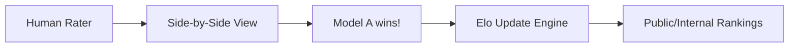

# Human Evaluation: Asli Sach

## 1. Shuruwat ke liye aasan Hinglish Explanation 🇮🇳
Bhai, math aur coding ke liye toh computer test kar leta hai, lekin "Creative Writing" ya "Helpful Conversation" ke liye koi computer program perfect nahi hota. 

**Human Evaluation** wahi "Gold Standard" hai jahan asli insaan (Experts ya Crowd) model ke answers ko padhte hain aur unhe rank karte hain. Woh dekhte hain ki kya answer "Tameez" (Polite) se hai, kya woh "Helpful" hai, aur kya usmein "Hawa-baazi" (Hallucination) toh nahi hai. Jab do models ka comparison hota hai aur insaan vote dete hain, use hum **A/B Testing** ya **Side-by-Side (SxS)** evaluation kehte hain. Bina insaani feedback ke, AI sirf ek machine rahegi, "Friendly" nahi ban payegi.

---

## 2. Gehra Technical Explanation
Human evaluation woh process hai jismein human raters model quality ko subjective dimensions par assess karte hain.
- **Helpfulness**: Kya model instruction follow karta hai?
- **Honesty**: Kya information factually sahi hai?
- **Harmlessness**: Kya yeh toxic/dangerous content se bachta hai?
- **SxS (Side-by-Side)**: Raters do anonymized responses (Model A vs Model B) dekhte hain aur winner ya tie pick karte hain. Isse **Elo Ratings** calculate hote hain.

---

## 3. Mathematical Intuition
**Elo Rating System**:
Agar Model A Model B ko harata hai, toh uski rating $R_A$ increase hoti hai:
$$E_A = \frac{1}{1 + 10^{(R_B - R_A)/400}}$$
$$R'_A = R_A + K(S_A - E_A)$$
Yahaan $E_A$ expected win probability hai, $S_A$ actual outcome hai (1 for win, 0 for loss), aur $K$ sensitivity factor hai. Isse hum **Chatbot Arena** jaisa global leaderboard bana sakte hain.

---

## 4. Architecture ke Diagrams

```mermaid
graph LR
    User[Human Rater] --> Compare[Side-by-Side View]
    Compare --> Choice[Model A wins!]
    Choice --> Calc[Elo Update Engine]
    Calc --> Leaderboard[Public/Internal Rankings]
```

---

## 5. Production-ready Udaahran
Ek typical human rating interface schema kuch aisa hota hai:

```json
{
  "query": "Write a funny joke about a cat.",
  "response_a": "Why was the cat so small? Because it only drank condensed milk!",
  "response_b": "A cat walks into a bar...",
  "rating_criteria": ["Humor", "Relevance", "Safety"],
  "rating_scale": 1-5,
  "winner": "response_a"
}
```

---

## 6. Asli Duniya ke Use Cases
- **RLHF Training**: Model ko fine-tune karne ke liye preference data collect karna.
- **Launch Approval**: Company apne bot ka naya version launch nahi karegi jab tak Human Eval score previous version se 10% zyada na ho jaye.

---

## 7. Failure Cases
- **Human Bias**: Raters us model ko prefer kar sakte hain jo "confident lagta hai" chahe woh galat ho (Sycophancy problem).
- **Thakaan (Fatigue)**: 100 responses rate karne ke baad, insaan galatiyan kar sakta hai ya jaldi finish karne ke liye "Tie" click kar sakta hai.
- **Expertise ki Kami**: Ek aam insaan PhD-level physics answer sahi tarah evaluate nahi kar sakta.

---

## 8. Debugging Guide
1. **Inter-Rater Reliability**: Agar do insaan ek hi answer dekhe aur ek kahe "Great" aur doosra kahe "Terrible", toh aapki rating instructions unclear hain.
2. **Gold Standard Checks**: Kuch "Obviously Bad" ya "Obviously Good" answers daal kar test karein ki aapke raters dhyan de rahe hain ya nahi.

---

## 9. Tradeoffs (Fayde-Nuksan)
| Feature | Automated Eval | Human Eval |
|---|---|---|
| Speed | Instant | Weeks |
| Cost | Low | Very High |
| Nuance | Low | Very High |

---

## 10. Security Concerns (Suraksha Chintayein)
- **Rater Rishwat/Saazish**: Agar raters kisi specific group se hain, toh woh model ko apni personal ya political views ki taraf bias kar sakte hain.

---

## 11. Bada Paimane par Challenges (Scaling Challenges)
- **Crowdsourcing Logistics**: 1,000+ raters ko different time zones aur languages mein manage karna ek badi operational challenge hai.

---

## 12. Cost Considerations (Kharcha)
- **Professional Raters**: Experts (Doctors, Lawyers, Coders) high-quality evaluation data ke liye $50-$200 per hour le sakte hain.

---

## 13. Best Practices (Sabse Achhe Tareeke)
- **Clear Rubrics use karein**: "Rate 1-5" ki jagah "Does it have a bug? (Y/N)" use karein.
- **Blind Testing**: Raters ko nahi pata hona chahiye ki kaunsa response kiska model hai, brand bias se bachne ke liye.
- **Vividhata (Diversity)**: Yah sure karein ki raters diverse backgrounds se aayein, taake koi ek perspective AI ke behavior par dominate na kare.

---

## 14. Interview ke Sawal
1. Jab humare paas benchmarks jaise MMLU hain, toh Human Evaluation ab bhi kyun zaroori hai?
2. Human ratings ke context mein "Sycophancy" kya hai?

---

## 15. 2026 ke Naye Patterns
- **Hybrid Eval**: Ek "LLM Judge" use karke pehle 90% filtering karna aur sirf sabse mushkil "Ambiguous" cases humans ko bhejna.
- **Multi-Modal Human Eval**: Insaan AI dwara generate kiye gaye video ya audio clips ko "Smoothness" aur "Naturalness" ke liye rate karte hain.