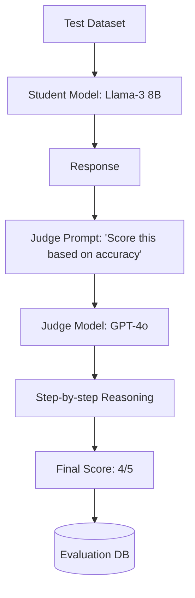

# 👩‍⚖️ LLM-as-a-Judge: The New Gold Standard
> **Objective:** Master the sophisticated technique of using high-capability models (like GPT-4o or Claude 3.5) to evaluate the outputs of smaller or specialized models, creating an automated, scalable feedback loop | **Language:** Hinglish | **Standard:** 2026 Expert Framework

---

## 🧭 1. Beginner-Friendly Hinglish Explanation
LLM-as-a-Judge ka matlab hai "Ek bade AI se chote AI ka kaam check karwana".

- **The Problem:** Insaano ke paas itna time nahi hai ki wo AI ke hazaro answers ko roz check karein.
- **The Solution:** LLM-as-a-Judge. 
  - Hum ek super-smart model (Judge) ko bulate hain.
  - Use ek "Rules ki List" (Rubric) dete hain.
  - Wo har answer ko padhta hai aur batata hai ki "Isme ye galti hai, isliye ise 5 mein se 3 milenge".
- **Intuition:** Ye ek "Board Exam" jaisa hai jahan ek senior professor (Bada AI) students (Chote AI) ki answer sheets check kar raha hai.

---

## 🧠 2. Deep Technical Explanation
The LLM-as-a-Judge pattern involves three critical components:

1. **The Evaluation Prompt:** A highly detailed prompt that defines the task, the context, and the grading criteria.
2. **The Scoring Rubric:** A 1-5 or 1-10 scale with explicit definitions for each point (e.g., "Score 2 if the answer is factual but the tone is rude").
3. **Reasoning-First Grading:** Asking the Judge to provide an explanation *before* giving the final score. This forces the Judge to pay attention to details and reduces bias.
4. **Pairwise Comparison:** Giving the Judge two answers (A and B) and asking "Which is better?". This is often more reliable than absolute scoring.

---

## 📐 3. Mathematical Intuition
**Inter-Annotator Agreement (IAA):**
We measure how often the LLM-Judge agrees with a Human-Judge using **Cohen's Kappa ($\kappa$):**
$$\kappa = \frac{p_o - p_e}{1 - p_e}$$
- $p_o$: Observed agreement.
- $p_e$: Agreement expected by chance.
If $\kappa > 0.6$, the LLM-Judge is considered "Reliable" and can replace expensive human labeling.

---

## 🏗️ 4. Architecture Diagrams


---

## 💻 5. Production-Ready Examples
A professional **Evaluation Rubric** (2026 Format):
```python
def judge_response(query, response, context):
    prompt = f"""
    You are an impartial judge. Grade the response based on the context provided.
    
    Rubric:
    - Accuracy: Does it match the context?
    - Conciseness: Is it too wordy?
    - Faithfulness: Does it hallucinate?
    
    [Context]: {context}
    [User Query]: {query}
    [Model Response]: {response}
    
    First, provide a brief reasoning for your grade.
    Then, provide the final score as 'Score: X/5'.
    """
    return judge_model.invoke(prompt)
```

---

## 🌍 6. Real-World Use Cases
- **Content Moderation:** Using a "Judge" to see if a community post violates 50 different subtle company rules.
- **Agent Tuning:** Evaluating if an agent chose the "Most efficient" tool path to reach its goal.
- **Benchmark Creation:** Using a large model to generate "Questions and Answers" for a specific company's internal wiki.

---

## ❌ 7. Failure Cases
- **Position Bias:** Judges often pick the "First" answer they see in a pairwise comparison. **Fix: Swap the order and run the test twice.**
- **Verbosity Bias:** Judges tend to give higher scores to longer, more professional-sounding answers, even if they are factually identical to short ones.
- **Self-Preference:** GPT-4 tends to prefer answers that sound like GPT-4.

---

## 🛠️ 8. Debugging Guide
| Problem | Reason | Solution |
| :--- | :--- | :--- |
| **Judge gives everyone a 5/5** | Rubric is too easy | Make the **Criteria** more strict. Add specific "Negative" examples to the prompt. |
| **Judge is inconsistent** | Temperature too high | Set **Temperature = 0** for all Judge calls. |

---

## ⚖️ 9. Tradeoffs
- **Pairwise Comparison (More accurate / $2x$ cost).**
- **Absolute Scoring (Faster / Cheaper / Noisier).**

---

## 🛡️ 10. Security Concerns
- **Eval Hijacking:** If an attacker knows your "Judge Prompt," they can craft their model's output to specifically "Trick" the judge into giving a 5/5.

---

## 📈 11. Scaling Challenges
- **The "Recursive Intelligence" Wall:** You need a smarter model to judge a smart model. What happens when our models are smarter than GPT-4? We will need "Incentivized Debate" or "Multi-Judge consensus".

---

## 💰 12. Cost Considerations
- Running 1000 evaluations per day with a top-tier judge can cost \$3k/month. Use **"Small-Judge" fine-tuning** to create a 7B model that is as good as GPT-4 at judging *your* specific task.

漫
---

## 📝 14. Interview Questions
1. "How do you handle 'Verbosity Bias' in LLM-as-a-Judge?"
2. "Why is 'Reasoning-First' grading important?"
3. "How do you validate that your LLM-Judge is actually reliable?"

---

## 🚀 15. Latest 2026 LLM Engineering Patterns
- **Prometheus Models:** Open-source models (like Prometheus-2) specifically fine-tuned to be "Judges" rather than "Chatbots".
- **Multi-Agent Consensus Eval:** Using 3 different judges (GPT-4, Claude, Llama-3) and taking the median score to eliminate single-model bias.
漫
漫
