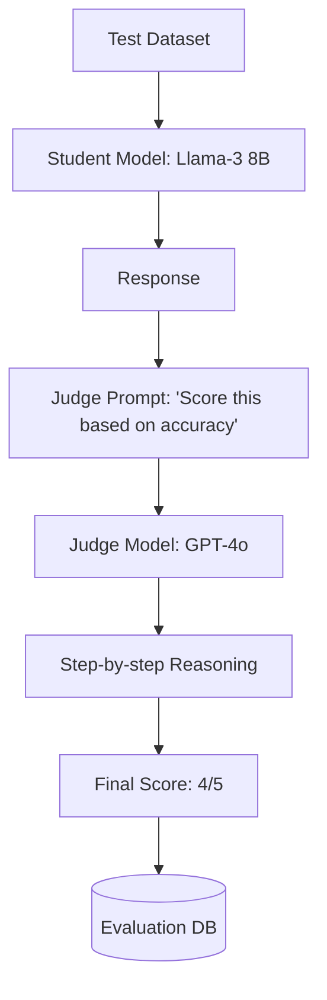

# 👩‍⚖️ LLM-as-a-Judge: Naya Gold Standard
> **Objective:** Ucch kshamata wale models (jaise GPT‑4o ya Claude 3.5) ka upyog karke chhote ya vishesh models ke outputs ka moolyankan karna, jisse ek automated, scalable feedback loop banta hai | **Language:** Hinglish | **Standard:** 2026 Expert Framework

---

## 🧭 1. Shuruaat ke Liye Hinglish Samjhaan
LLM-as-a-Judge ka matlab hai "Ek bade AI se chote AI ka kaam check karwana".

- **The Problem:** Insaano ke paas itna time nahi hai ki wo AI ke hazaro answers ko roz check karein.
- **The Solution:** LLM-as-a-Judge.
  - Hum ek super-smart model (Judge) ko bulate hain.
  - Use ek "Rules ki List" (Rubric) dete hain.
  - Wo har answer ko padhta hai aur batata hai ki "Isme ye galti hai, isliye ise 5 mein se 3 milenge".
- **Intuition:** Ye ek "Board Exam" jaisa hai jahan ek senior professor (Bada AI) students (Chote AI) ki answer sheets check kar raha hai.

---

## 🧠 2. Gehra Technical Samjhaan (Deep Technical Explanation)
LLM-as-a-Judge pattern mein teen important components shamil hain:

1. **The Evaluation Prompt:** Ek highly detailed prompt jo task, context aur grading criteria define karta hai.
2. **The Scoring Rubric:** Ek 1–5 ya 1–10 scale jisme har point ki explicit definitions hoti hain (e.g., “Score 2 agar answer factual hai lekin tone rude hai”).
3. **Reasoning‑First Grading:** Judge ko final score dene se *pehle* explanation dene ko kehna. Yeh Judge ko details par dhyan dene ke liye majboor karta hai aur bias kam karta hai.
4. **Pairwise Comparison:** Judge ko do answers (A aur B) dena aur poochna “Kaun behtar hai?”. Yeh aksar absolute scoring se zyada reliable hota hai.

---

## 📐 3. Ganitik Samajh (Mathematical Intuition)
**Inter‑Annotator Agreement (IAA):**
Hum measure karte hain ki LLM‑Judge kitni baar Human‑Judge se agree karta hai **Cohen’s Kappa ($\kappa$)** ka upyog karte hue:
$$\kappa = \frac{p_o - p_e}{1 - p_e}$$
- $p_o$: Observed agreement.
- $p_e$: Agreement expected by chance.
Agar $\kappa > 0.6$, toh LLM‑Judge ko “Reliable” mana jata hai aur yeh expensive human labeling ki jagah le sakta hai.

---

## 🏗️ 4. Architecture Diagram (Sanrachna Aarekh)

```mermaid
graph TD
    User[Test Dataset] --> LLM[Student Model: Llama-3 8B]
    LLM --> Response[Response]
    Response --> Prompt[Judge Prompt: 'Score this based on accuracy']
    Prompt --> Judge[Judge Model: GPT-4o]
    Judge --> Logic[Step-by-step Reasoning]
    Logic --> Score[Final Score: 4/5]
    Score --> DB[(Evaluation DB)]
```

---

## 💻 5. Production‑Ready Examples (Udyog ke Liye Taiyar Udaaharan)
Ek professional **Evaluation Rubric** (2026 Format):
```python
def judge_response(query, response, context):
    prompt = f"""
    You are an impartial judge. Grade the response based on the context provided.
    
    Rubric:
    - Accuracy: Does it match the context?
    - Conciseness: Is it too wordy?
    - Faithfulness: Does it hallucinate?
    
    [Context]: {context}
    [User Query]: {query}
    [Model Response]: {response}
    
    First, provide a brief reasoning for your grade.
    Then, provide the final score as 'Score: X/5'.
    """
    return judge_model.invoke(prompt)
```

---

## 🌍 6. Real‑World Use Cases (Vastavik Duniya ke Upayog)
- **Content Moderation:** Ek “Judge” ka istemal karke yeh dekhna ki kya ek community post 50 alag‑alag subtle company rules ka ullanghan karti hai.
- **Agent Tuning:** Yeh moolyankan karna ki kya agent ne apne lakshya tak pahunchne ke liye “Most efficient” tool path chuna.
- **Benchmark Creation:** Ek bade model ka upyog karke kisi specific company ke internal wiki ke liye “Questions and Answers” generate karna.

---

## ❌ 7. Failure Cases (Vifalta ke Mamale)
- **Position Bias:** Judges aksar pairwise comparison mein pehla answer choose karte hain. **Fix: Order swap karo aur test do baar chalao.**
- **Verbosity Bias:** Judges lambi aur professional‑sounding answers ko higher scores dete hain, bhale hi woh chhote answers ke factually identical hoon.
- **Self‑Preference:** GPT‑4 un answers ko prefer karta hai jo GPT‑4 jaisi sound karte hain.

---

## 🛠️ 8. Debugging Guide (Samasya Nivaran Guide)
| Problem | Reason | Solution |
| :--- | :--- | :--- |
| **Judge sabko 5/5 de raha hai** | Rubric bahut aasan hai | **Criteria** ko aur strict banao. Prompt mein specific “Negative” examples jodo. |
| **Judge inconsistent hai** | Temperature bahut zyada hai | Saare Judge calls ke liye **Temperature = 0** set karo. |

---

## ⚖️ 9. Tradeoffs (Karya Vyapar)
- **Pairwise Comparison (Zyada accurate / $2x$ cost).**
- **Absolute Scoring (Tez / Sasta / Zyada noise).**

---

## 🛡️ 10. Security Concerns (Suraksha Chintayen)
- **Eval Hijacking:** Agar koi attacker aapka “Judge Prompt” jaan leta hai, to woh apne model ke output ko is tarah craft kar sakta hai ki Judge ko “Trick” karke 5/5 score le sake.

---

## 📈 11. Scaling Challenges (Vistar ki Chunautiyan)
- **The “Recursive Intelligence” Wall:** Ek smart model ko judge karne ke liye aapko aur smarter model chahiye. Kya hoga jab humare models GPT‑4 se bhi smarter ho jayenge? Tab humein “Incentivized Debate” ya “Multi‑Judge consensus” ki zaroorat hogi.

---

## 💰 12. Cost Considerations (Lagat ke Vichar)
- Har din 1000 evaluations top‑tier judge ke saath chalane par lagbhag $3k/month kharch ho sakta hai. **“Small‑Judge” fine‑tuning** ka upyog karke ek 7B model banao jo aapke specific task par judge karne mein GPT‑4 jitna hi accha ho.

漫
---

## 📝 14. Interview Questions (Sakshaatkaar Prashna)
1. “LLM‑as‑a‑Judge mein ‘Verbosity Bias’ ko aap kaise handle karte hain?”
2. “ ‘Reasoning‑First’ grading kyun important hai?”
3. “Aap kaise validate karte hain ki aapka LLM‑Judge actually reliable hai?”

---

## 🚀 15. Latest 2026 LLM Engineering Patterns (2026 ke Naye LLM Engineering Patterns)
- **Prometheus Models:** Open‑source models (jaise Prometheus‑2) jo specially “Judges” ki tarah fine‑tune kiye gaye hain, na ki “Chatbots”.
- **Multi‑Agent Consensus Eval:** 3 different judges (GPT‑4, Claude, Llama‑3) ka upyog karke median score lena taki single‑model bias khatam ho.
漫
漫