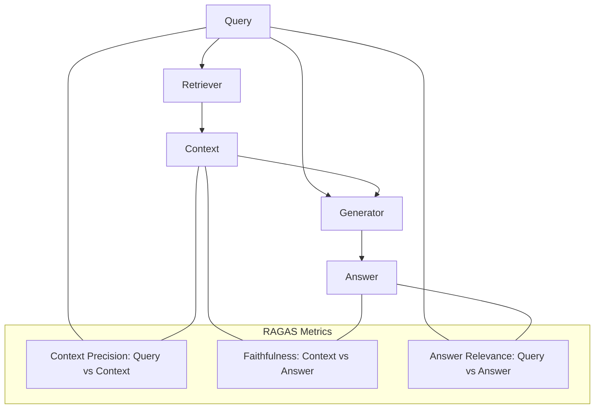

# 📏 RAG Evaluation: RAGAS, TruLens, and Arize
> **Objective:** Master the specialized "RAG Triad" metrics and frameworks like RAGAS and TruLens to evaluate the three pillars of RAG—Faithfulness, Answer Relevance, and Context Precision | **Language:** Hinglish | **Standard:** 2026 Expert Framework

---

## 🧭 1. Beginner-Friendly Hinglish Explanation
RAG Evaluation ka matlab hai "RAG system ki har kadi ko check karna".

- **The Problem:** RAG mein teen jagah galti ho sakti hai:
  1. Kya sahi document dhoonda? (Retrieval)
  2. Kya answer document par based hai? (Faithfulness)
  3. Kya answer user ke sawal ka hai? (Relevance)
- **The Solution:** RAGAS/TruLens. 
  - Ye frameworks "AI-as-a-Judge" use karte hain ye check karne ke liye ki RAG ke teeno hisse sahi kaam kar rahe hain ya nahi.
- **Intuition:** Ye ek "Reporter" ko judge karne jaisa hai. Kya usne sahi file nikali? Kya usne file mein se sach bola? Aur kya usne aapka sawal answer kiya?

---

## 🧠 2. Deep Technical Explanation
The **RAG Triad** (The Gold Standard of 2026):

1. **Context Precision:** How relevant are the retrieved chunks to the query? (Checks the Retriever).
2. **Faithfulness (Groundedness):** Is every claim in the answer supported by the retrieved context? (Checks for Hallucinations).
3. **Answer Relevance:** How well does the final answer address the original user query? (Checks the Generator).
4. **Context Recall:** Did the retriever find ALL the information needed to answer the question?

---

## 📐 3. Mathematical Intuition
**Faithfulness Score ($F$):**
$$F = \frac{|\text{Verified Claims in Answer}|}{|\text{Total Claims in Answer}|}$$
A "Claim" is a specific fact extracted by the LLM-Judge. If the answer says "The capital is Paris" but the context doesn't mention Paris, that claim is unverified, and the score drops.

---

## 🏗️ 4. Architecture Diagrams


---

## 💻 5. Production-Ready Examples
Using **RAGAS** for automated evaluation:
```python
from ragas import evaluate
from ragas.metrics import faithfulness, answer_relevance, context_precision

dataset = {
    "question": ["Who is the CEO?"],
    "contexts": [["The CEO is Sameer Malik."]],
    "answer": ["Sameer Malik is the CEO."],
}

result = evaluate(dataset, metrics=[faithfulness, answer_relevance, context_precision])
print(result)
# Returns scores from 0 to 1 for each metric.
```

---

## 🌍 6. Real-World Use Cases
- **Enterprise Search Audit:** Ensuring that the "AI HR Bot" isn't hallucinating company policies by running 500 test questions through RAGAS.
- **R&D Experimentation:** Testing if "Chunk size 500" gives better **Context Precision** than "Chunk size 1000".

---

## ❌ 7. Failure Cases
- **Reference Overlap:** If the LLM already knows the answer from its training data, it might give a "Correct" but "Unfaithful" answer (i.e., the answer is right, but it's not in the context). **Fix: Use synthetic 'Fake' data for testing.**
- **Judge Fatigue:** If the context is 50 pages long, the LLM-Judge might miss a subtle hallucination.

---

## 🛠️ 8. Debugging Guide
| Problem | Reason | Solution |
| :--- | :--- | :--- |
| **Low Context Precision** | Embedding model is weak | Switch to a **better embedding model** (e.g., OpenAI text-embedding-3-large). |
| **Low Faithfulness** | Temperature too high | Lower **Temperature to 0** to make the generator more literal. |

---

## ⚖️ 9. Tradeoffs
- **RAGAS (Easy / Fast / Needs LLM API)** vs **Manual Golden-Set (Perfect Accuracy / Very Slow).**

---

## 🛡️ 10. Security Concerns
- **Data Leakage in Evals:** Don't send PII (Personally Identifiable Information) to an external LLM-Judge (like OpenAI) during evaluation unless you have a HIPAA/GDPR agreement.

---

## 📈 11. Scaling Challenges
- **The "Context Noise" Problem:** As you retrieve more chunks (K=10+), context precision naturally drops, but faithfulness might increase. Finding the "Sweet Spot" is the goal.

---

## 💰 12. Cost Considerations
- Evaluating a single RAG turn with RAGAS can take 4-5 LLM calls. For 1000 tests, this can cost \$10 - \$20.

漫
---

## 📝 14. Interview Questions
1. "Explain the three pillars of the RAG Triad."
2. "What is 'Faithfulness' in RAG and how is it calculated?"
3. "How do you distinguish between a retrieval failure and a generation failure?"

---

## 🚀 15. Latest 2026 LLM Engineering Patterns
- **DeepEval:** A newer, faster framework that focuses on unit-testing for RAG.
- **Guardrails-during-Inference:** Running a tiny "Faithfulness" check *during* the production chat to alert the user if the model is hallucinating in real-time.
漫
漫
