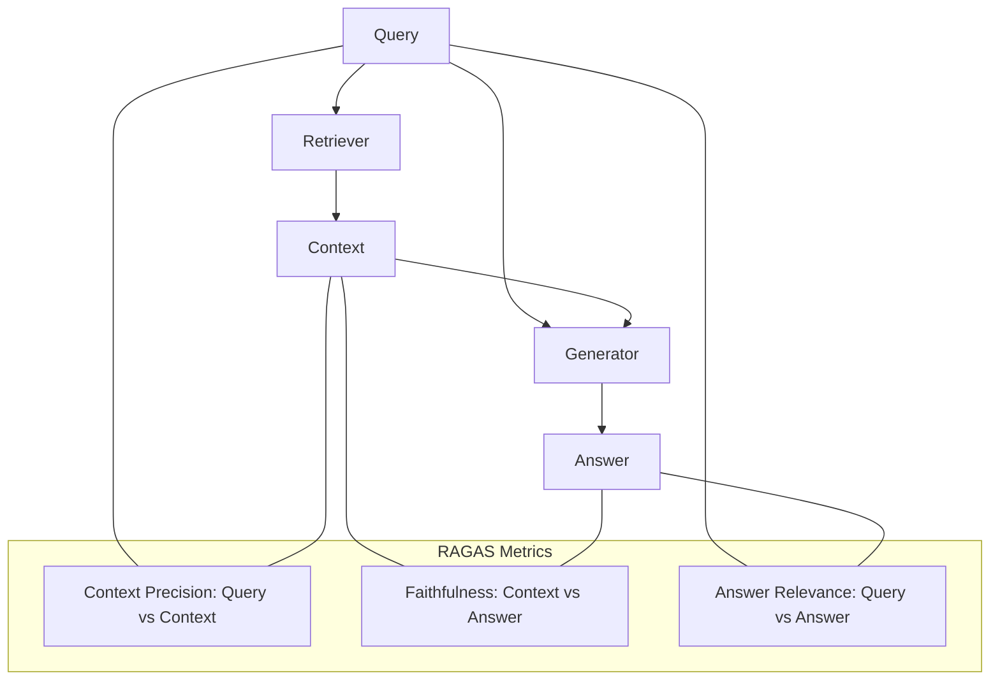

# 📏 RAG Evaluation: RAGAS, TruLens, aur Arize
> **Udeshya:** Specialized "RAG Triad" metrics aur frameworks (jaise RAGAS aur TruLens) ko master karo, taake RAG ke teen pillars—Faithfulness, Answer Relevance, aur Context Precision—ko evaluate kar sako | **Bhasha:** Hinglish | **Standard:** 2026 Expert Framework

---

## 🧭 1. Shuruat Ke Liye Hinglish Samjhai
RAG Evaluation ka matlab hai "RAG system ki har kadi ko check karna".

- **Problem:** RAG mein teen jagah galti ho sakti hai:
  1. Kya sahi document dhoonda? (Retrieval)
  2. Kya answer document par based hai? (Faithfulness)
  3. Kya answer user ke sawal ka hai? (Relevance)
- **Solution:** RAGAS/TruLens. 
  - Ye frameworks "AI-as-a-Judge" use karte hain ye check karne ke liye ki RAG ke teeno hisse sahi kaam kar rahe hain ya nahi.
- **Intuition:** Ye ek "Reporter" ko judge karne jaisa hai. Kya usne sahi file nikali? Kya usne file mein se sach bola? Aur kya usne aapka sawal answer kiya?

---

## 🧠 2. Gehrai Se Technical Samjhai
**RAG Triad** (2026 ka Gold Standard):

1. **Context Precision:** Retrieve ki gayi chunks query ke liye kitni relevant hain? (Retriever ko check karta hai).
2. **Faithfulness (Groundedness):** Kya answer ka har claim retrieve kiye gaye context se supported hai? (Hallucinations ke liye check karta hai).
3. **Answer Relevance:** Final answer original user query ko kitni achhi tarah address karta hai? (Generator ko check karta hai).
4. **Context Recall:** Kya retriever ne sawaal ka jawab dene ke liye saari zaroori information dhoond li?

---

## 📐 3. Ganitiya Samjhai
**Faithfulness Score ($F$):**
$$F = \frac{|\text{Verified Claims in Answer}|}{|\text{Total Claims in Answer}|}$$
Ek "Claim" ek specific fact hota hai jo LLM-Judge dwara extract kiya gaya. Agar answer kehta hai "The capital is Paris" lekin context mein Paris ka zikr nahi hai, to woh claim unverified ho jaata hai, aur score drop ho jaata hai.

---

## 🏗️ 4. Architecture Diagrams

```mermaid
graph TD
    Query[Query] --> Retriever[Retriever]
    Retriever --> Context[Context]
    Query --> Generator[Generator]
    Context --> Generator
    Generator --> Answer[Answer]
    
    subgraph "RAGAS Metrics"
    Metric1[Context Precision: Query vs Context]
    Metric2[Faithfulness: Context vs Answer]
    Metric3[Answer Relevance: Query vs Answer]
    end
    
    Query --- Metric1
    Context --- Metric1
    Context --- Metric2
    Answer --- Metric2
    Query --- Metric3
    Answer --- Metric3
```

---

## 💻 5. Production-Ready Udaharan
Automated evaluation ke liye **RAGAS** use karna:
```python
from ragas import evaluate
from ragas.metrics import faithfulness, answer_relevance, context_precision

dataset = {
    "question": ["Who is the CEO?"],
    "contexts": [["The CEO is Sameer Malik."]],
    "answer": ["Sameer Malik is the CEO."],
}

result = evaluate(dataset, metrics=[faithfulness, answer_relevance, context_precision])
print(result)
# Returns scores from 0 to 1 for each metric.
```

---

## 🌍 6. Vastavik Duniya Ke Upyog
- **Enterprise Search Audit:** 500 test questions ko RAGAS ke through chalaakar yeh ensure karna ki "AI HR Bot" company policies par hallucinate nahi kar raha.
- **R&D Experimentation:** Yeh test karna ki kya "Chunk size 500" "Chunk size 1000" se better **Context Precision** deta hai.

---

## ❌ 7. Viphalta Ke Mamle
- **Reference Overlap:** Agar LLM apne training data se answer pehle se jaanta hai, to woh "Correct" lekin "Unfaithful" answer de sakta hai (yani answer sahi hai, lekin context mein nahi hai). **Fix: Testing ke liye synthetic 'Fake' data use karein.**
- **Judge Fatigue:** Agar context 50 pages lamba hai, to LLM-Judge ek subtle hallucination miss kar sakta hai.

---

## 🛠️ 8. Debugging Guide
| Samasya | Karan | Samadhan |
| :--- | :--- | :--- |
| **Low Context Precision** | Embedding model weak hai | Ek **better embedding model** (jaise OpenAI text-embedding-3-large) par switch karein. |
| **Low Faithfulness** | Temperature bahut zyada hai | Generator ko aur literal banane ke liye **Temperature ko 0** karein. |

---

## ⚖️ 9. Tradeoffs
- **RAGAS (Easy / Fast / LLM API ki zaroorat)** vs **Manual Golden-Set (Perfect Accuracy / Bahut Slow).**

---

## 🛡️ 10. Suraksha Chintayein
- **Evals mein Data Leakage:** Jab tak aapke paas HIPAA/GDPR agreement nahi hai, evaluation ke dauran PII (Personally Identifiable Information) bahar ke LLM-Judge (jaise OpenAI) ko na bhejein.

---

## 📈 11. Bade Scale Par Chunautiyan
- **"Context Noise" Samasya:** Jaisi aap zyada chunks retrieve karte hain (K=10+), context precision naturally girta hai, lekin faithfulness badh sakti hai. "Sweet Spot" dhundhna goal hai.

---

## 💰 12. Cost Sambandhi Vichar
- RAGAS ke saath ek single RAG turn evaluate karne mein 4-5 LLM calls lag sakte hain. 1000 tests ke liye, iski cost \$10 - \$20 ho sakti hai.

漫
---

## 📝 14. Interview Sawaal
1. "RAG Triad ke teen pillars ko samjhao."
2. "RAG mein 'Faithfulness' kya hai aur yeh kaise calculate kiya jaata hai?"
3. "Retrieval failure aur generation failure ke beech kaise differentiate karte hain?"

---

## 🚀 15. 2026 Ke Latest LLM Engineering Patterns
- **DeepEval:** Ek naya, tez framework jo RAG ke liye unit-testing par focus karta hai.
- **Guardrails-during-Inference:** Production chat ke dauran ek chhoti "Faithfulness" check chalaakar user ko alert karna agar model real-time mein hallucinate kar raha hai.
漫
漫