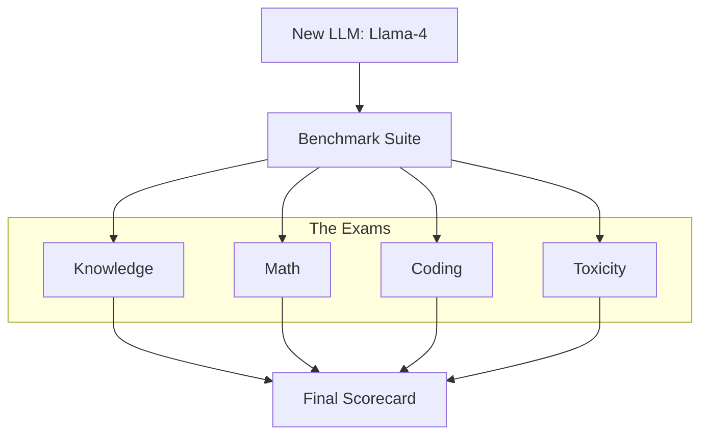

# Standard Benchmarks: How to Grade an AI

## 1. Beginner-friendly Hinglish Explanation 🇮🇳
Bhai, jab koi naya LLM launch hota hai, toh har koi kehta hai "Main GPT-4 se achha hoon". Lekin hum kaise yakeen karein? 

**Standard Benchmarks** AI ki duniya ke "Board Exams" hain. Jaise MMLU (General knowledge), GSM8K (Maths), aur HumanEval (Coding). Har model ko in exams se guzarna padta hai aur unhe ek score milta hai (e.g., 85% accuracy). In scores ko dekh kar hum decide karte hain ki kaunsa model "Top" par hai. Lekin dhyan rakhna, kabhi-kabhi models in exams ke answers "Ratta" (Memorize) maar lete hain, jise hum **Data Contamination** kehte hain.

---

## 2. Deep Technical Explanation
Benchmarks are standardized datasets used to measure different capabilities of an LLM.
- **MMLU (Massive Multitask Language Understanding)**: Covers 57 subjects across STEM, humanities, and more. Measures world knowledge and problem-solving.
- **GSM8K (Grade School Math 8K)**: 8,500 high-quality grade school math word problems. Measures multi-step reasoning.
- **HumanEval / MBPP**: Coding challenges in Python. Measures code generation and logical correctness.
- **LMSYS Chatbot Arena**: A "crowdsourced" Elo rating system where humans vote on model responses. Currently the gold standard for "Vibes" and helpfulness.

---

## 3. Mathematical Intuition
Benchmark scores are usually reported as **Zero-shot** or **Few-shot** accuracy.
Accuracy $A$:
$$A = \frac{\text{Correct Answers}}{\text{Total Questions}} \times 100$$
For multiple-choice (like MMLU), the **Random Guessing Baseline** is 25%. A model must significantly beat this to prove it has actually learned something.

---

## 4. Architecture Diagrams


---

## 5. Production-ready Examples
Using `LM Evaluation Harness` (Industry standard tool):

```bash
# Run MMLU on a local model
python main.py \
    --model hf \
    --model_args pretrained=meta-llama/Llama-3-8B \
    --tasks mmlu \
    --device cuda:0 \
    --batch_size 8
```

---

## 6. Real-world Use Cases
- **Model Selection**: Choosing Llama-3-70B for a medical project because it has the highest "MedQA" score.
- **Leaderboards**: Checking the **Open LLM Leaderboard** (HuggingFace) to find the best open-source model of the month.

---

## 7. Failure Cases
- **Goodhart's Law**: "When a measure becomes a target, it ceases to be a good measure." Models are now being trained specifically to beat MMLU, making the score less meaningful for real-world tasks.
- **Data Contamination**: The model has seen the GSM8K test questions during its pre-training on the web, giving it a 100% score that is "fake".

---

## 8. Debugging Guide
1. **Sanity Check**: If a small 1B model beats GPT-4 on a benchmark, it's almost certainly contaminated.
2. **Prompts Matter**: Benchmarks are very sensitive to the prompt format. Use the exact prompt used by the original benchmark authors.

---

## 9. Tradeoffs
| Benchmark | Focus | Pro | Con |
|---|---|---|---|
| MMLU | Knowledge | Comprehensive | Overused/Contaminated |
| GSM8K | Reasoning | Objective | Easy to "Cheat" |
| Chatbot Arena | Human Preference| Realistic | Subjective/Slow |

---

## 10. Security Concerns
- **Benchmark Poisoning**: Intentionally leaking benchmark answers into public datasets so future models "accidentally" memorize them and look smarter than they are.

---

## 11. Scaling Challenges
- **Infinite Benchmarks**: As models get smarter, we need "PhD-level" benchmarks (like GPQA) because MMLU is becoming too easy.

---

## 12. Cost Considerations
- **Evaluation Cost**: Running a full MMLU + HumanEval suite on a 70B model can cost $100s in compute time.

---

## 13. Best Practices
- **Never trust a single benchmark**. Use a suite (MMLU, GSM8K, HumanEval).
- Use **LMSYS Chatbot Arena** for general chat quality.
- Use **Needle-in-a-Haystack** for long-context evaluation.

---

## 14. Interview Questions
1. What is the difference between Zero-shot and Few-shot evaluation?
2. What is Data Contamination and how can you detect it?

---

## 15. Latest 2026 Patterns
- **Live Benchmarks**: Using daily news or fresh GitHub commits for evaluation to ensure the model couldn't have memorized the answers.
- **Self-Evolving Benchmarks**: Using an LLM to generate fresh, unseen test cases for other LLMs.
