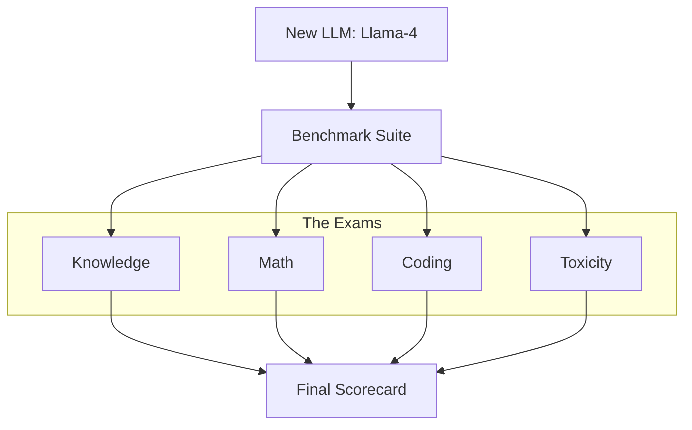

# Standard Benchmarks: AI ko Grade kaise karein

## 1. Shuruaat ke liye Hinglish Explanation 🇮🇳
Bhai, jab koi naya LLM launch hota hai, toh har koi kehta hai "Main GPT-4 se achha hoon". Lekin hum kaise yakeen karein? 

**Standard Benchmarks** AI ki duniya ke "Board Exams" hain. Jaise MMLU (General knowledge), GSM8K (Maths), aur HumanEval (Coding). Har model ko in exams se guzarna padta hai aur unhe ek score milta hai (e.g., 85% accuracy). In scores ko dekh kar hum decide karte hain ki kaunsa model "Top" par hai. Lekin dhyan rakhna, kabhi-kabhi models in exams ke answers "Ratta" (Memorize) maar lete hain, jise hum **Data Contamination** kehte hain.

---

## 2. Gehra Technical Explanation
Benchmarks standardized datasets hote hain jo LLM ki different capabilities measure karne ke liye use hote hain.
- **MMLU (Massive Multitask Language Understanding)**: Yeh 57 subjects cover karta hai STEM, humanities, aur aur bhi subjects. World knowledge aur problem-solving measure karta hai.
- **GSM8K (Grade School Math 8K)**: 8,500 high-quality grade school math word problems hain. Multi-step reasoning measure karta hai.
- **HumanEval / MBPP**: Python mein coding challenges hain. Code generation aur logical correctness measure karta hai.
- **LMSYS Chatbot Arena**: Yeh ek "crowdsourced" Elo rating system hai jahan humans model responses par vote karte hain. Currently "Vibes" aur helpfulness ke liye gold standard hai.

---

## 3. Ganit ka Intuition
Benchmark scores usually **Zero-shot** ya **Few-shot** accuracy ke roop mein report kiye jate hain.
Accuracy $A$:
$$A = \frac{\text{Correct Answers}}{\text{Total Questions}} \times 100$$
Multiple-choice (jaise MMLU) ke liye, **Random Guessing Baseline** 25% hota hai. Model ko isse significantly beat karna padta hai yeh prove karne ke liye ki usne kuch actually seekha hai.

---

## 4. Architecture Diagrams

```mermaid
graph TD
    Model[New LLM: Llama-4] --> Benchmark[Benchmark Suite]
    subgraph "The Exams"
        MMLU[Knowledge]
        GSM8K[Math]
        Code[Coding]
        Safety[Toxicity]
    end
    Benchmark --> MMLU & GSM8K & Code & Safety
    MMLU & GSM8K & Code & Safety --> Score[Final Scorecard]
```

---

## 5. Production-ready Examples
Using `LM Evaluation Harness` (Industry standard tool):

```bash
# Run MMLU on a local model
python main.py \
    --model hf \
    --model_args pretrained=meta-llama/Llama-3-8B \
    --tasks mmlu \
    --device cuda:0 \
    --batch_size 8
```

---

## 6. Real-world Use Cases
- **Model Selection**: Ek medical project ke liye Llama-3-70B choose karna kyunki uske paas sabse highest "MedQA" score hai.
- **Leaderboards**: Mahine ke best open-source model ko dhundhne ke liye **Open LLM Leaderboard** (HuggingFace) check karna.

---

## 7. Failure Cases
- **Goodhart's Law**: "Jab ek measure target ban jata hai, toh woh accha measure nahi rahta." Models ab specifically MMLU beat karne ke liye train kiye ja rahe hain, jo score ko real-world tasks ke liye kam meaningful bana raha hai.
- **Data Contamination**: Model ne GSM8K ke test questions ko web pe pre-training ke dauran dekh liya hai, jisse usse 100% score mil raha hai jo "fake" hai.

---

## 8. Debugging Guide
1. **Sanity Check**: Agar ek chhota 1B model benchmark pe GPT-4 ko beat karta hai, toh yeh almost certainly contaminated hai.
2. **Prompts Matter**: Benchmarks prompt format ke prati bahut sensitive hote hain. Original benchmark authors ne jo exact prompt use kiya hai, wohi istemal karein.

---

## 9. Tradeoffs
| Benchmark | Focus | Pro | Con |
|---|---|---|---|
| MMLU | Gyan | Vyakapak | Zyada upyog / Contaminated |
| GSM8K | Tark | Nisargatmak | "Cheat" karna aasan |
| Chatbot Arena | Manav Preference | Yatharthvadi | Vyaktigat / Dheema |

---

## 10. Security Concerns
- **Benchmark Poisoning**: Jaan-boojh kar benchmark answers ko public datasets mein leak karna taaki future models unhe "accidentally" memorize kar lein aur smart dikhein.

---

## 11. Scaling Challenges
- **Infinite Benchmarks**: Jaise-jaise models smarter hote ja rahe hain, humein "PhD-level" benchmarks (jaise GPQA) ki zaroorat hai kyunki MMLU bahut easy hota ja raha hai.

---

## 12. Cost Considerations
- **Evaluation Cost**: 70B model pe full MMLU + HumanEval suite chalane mein $100s compute time lag sakta hai.

---

## 13. Best Practices
- **Kabhi bhi ek single benchmark par bharosa mat karo**. Suite ka istemal karo (MMLU, GSM8K, HumanEval).
- General chat quality ke liye **LMSYS Chatbot Arena** use karo.
- Long-context evaluation ke liye **Needle-in-a-Haystack** use karo.

---

## 14. Interview Questions
1. Zero-shot aur Few-shot evaluation mein kya antar hai?
2. Data Contamination kya hai aur aap ise kaise detect kar sakte hain?

---

## 15. Latest 2026 Patterns
- **Live Benchmarks**: Evaluation ke liye daily news ya fresh GitHub commits ka istemal karna taaki model answers memorize na kar sake.
- **Self-Evolving Benchmarks**: Doosre LLMs ke liye fresh, unseen test cases generate karne ke liye ek LLM ka istemal karna.