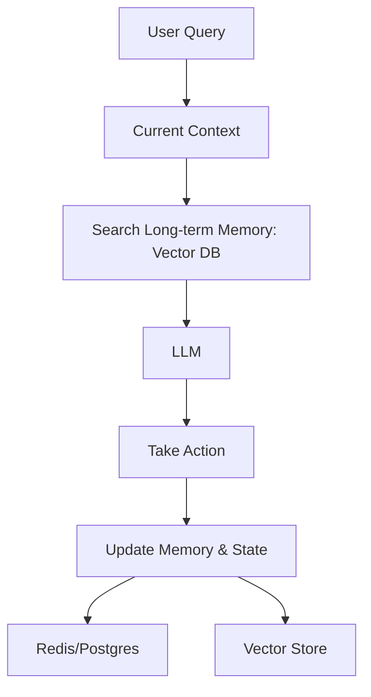

# Agent Memory & State: Mission Ko Yaad Rakhna

## 1. Shuru Ke Liye Aasan Hinglish Vyakhya 🇮🇳
Bhai, socho tum ek research kar rahe ho. Tumne 10 websites dekhi aur kuch notes banaye. Agar tum har website ke baad purana sab bhool jao, toh kya tum research poori kar paoge? Nahi na. 

**Agent Memory** wahi "Yaddasht" hai. 
1. **Short-term Memory**: Yeh "Conversation history" jaisi hai (Jo tumne abhi pucha).
2. **Long-term Memory**: Yeh tumhare "Notes" jaisi hai (Jo tumne 2 din pehle pucha tha aur agent ne vector DB mein save kiya).
3. **State**: Yeh "Process status" hai (Kaunsa step ho gaya, kaunsa bacha hai).
Bina sahi memory aur state management ke, agent sirf ek "Bhullakad" (Forgetful) robot bankar reh jayega.

---

## 2. Gehri Technical Vyakhya
Production agents banane mein sabse mushkil hissa hai state aur memory manage karna.
- **Short-term Memory (Working Memory)**: LLM context window ke zariye manage kiya jata hai. "Conversation Summary Buffer" jaisi techniques ise manageable rakhne ke liye use hoti hain.
- **Long-term Memory (Episodic/Semantic)**: Vector Databases (RAG) ke zariye manage kiya jata hai. Agent action lene se pehle relevant "past experiences" retrieve karta hai.
- **State Persistence**: Databases (Postgres/Redis) ka use agent ke current variables, task list, aur variables store karne ke liye hota hai. Isse agent "Sleep" aur "Resume" kar sakta hai baad mein.
- **Entity Memory**: Entities ke specific details track karna (e.g., "User ka dog Rex hai").

---

## 3. Mathematical Samajh
Memory ko **Weighted Context** ki tarah dekha ja sakta hai.
$C_t = [P, M_{short}, M_{long}]$
where:
- $P$: Current prompt.
- $M_{short}$: Pichhle $k$ messages.
- $M_{long}$: Memory DB se top $n$ retrieved snippets using $f_{embedding}(P)$.
"Recall Quality" embedding model ki ability par depend karta hai ki woh *current intent* ko *past context* se match kare.

---

## 4. Architecture Diagrams


---

## 5. Production-ready Udaharan
State manage karna `LangGraph` (Checkpointing) ke saath:

```python
# Agent state save karne ke liye SQLite database ka use
memory = SqliteSaver.from_conn_string(":memory:")

# Graph automatically state ko save aur load karega thread_id ke basis par.
config = {"configurable": {"thread_id": "user_123"}}

# Isse 'Human-in-the-loop' enable hota hai jahan agent pause karta hai,
# aur state safe rehti hai jab tak human respond nahi karta.
```

---

## 6. Asli Duniya Ke Use Cases
- **Customer Support**: User ne broken screen ke baare mein 2 din pehle complaint ki thi, woh yaad rakhna.
- **Learning Assistants**: Track karna ki student ne kaunse topics master kar liye aur kaunse mein problem hai.
- **Game Agents**: Player ke choices yaad rakhna taaki story baad mein change ho sake.

---

## 7. Asafalta Ke Mamle
- **Memory Overload**: Bahut zyada irrelevant "Old stuff" retrieve karna jo current prompt ko confusing bana deta hai.
- **State Corruption**: Code mein bug ki wajah se "Half-finished" task "Finished" save ho jata hai, jisse agent critical step skip kar deta hai.

---

## 8. Debugging Margdarshika
1. **Context Inspection**: Hamesha "Final Prompt" print karo jo LLM ko bheja gaya (including retrieved memories). Agar woh 20,000 words ka hai, toh tumhari memory retrieval bahut broad hai.
2. **Relevance Filtering**: Check karo ki retrieve ki gayi "Long-term memories" actually current goal ke liye useful hain ya nahi.

---

## 9. Tradeoffs
| Memory Prakar | Labh | Hani |
|---|---|---|
| In-Context (History) | Turant/Accurate | Mehanga/Token Limit |
| RAG (Vector) | Asimit Size | Aprasangik Ho Sakta Hai |
| Persistent State (SQL) | Resume Karna Sambhav | Deri (DB calls) |

---

## 10. Security Chintaein
- **Memory Hijacking**: Agar agent ne 1 hafte pehle ek malicious prompt yaad rakha hai, toh woh aaj use execute kar sakta hai.
- **PII Storage**: User passwords ya private info ka galti se "Long-term memory" vector DB mein store ho jana.

---

## 11. Scaling Chunautiyan
- **Multi-user Memory**: 1 Million users ke liye 1 Million separate vector indexes efficiently kaise manage karein? (Jawab: Metadata filtering use karo).

---

## 12. Cost Sambandhit Vichar
- **Storage Cost**: Vector DB (Pinecone/Weaviate) mein millions of conversation turns store karna $100s per month ka kharcha de sakta hai.

---

## 13. Best Practices
- **Summarize Old Conversations**: Har word store karne ke bajaye, DB mein "Summary" store karo.
- **Forgetfulness by Design**: Short-term memories ke liye "TTL" (Time to Live) use karo taaki context clutter na ho.
- **Use a Schema**: Sirf "Text" store mat karo. `{"action": "...", "result": "...", "timestamp": "..."}` store karo.

---

## 14. Interview Prashn
1. AI agents ke liye Episodic aur Semantic memory mein kya antar hai?
2. Agar agent apne context window limit tak pahuch gaya hai toh aap kaise handle karoge?

---

## 15. 2026 Ke Naye Patterns
- **MemGPT (MemoryGPT)**: Ek architecture jo apni memory ko automatically manage karta hai "swapping" info between its context (RAM) and a DB (Disk) ke through.
- **Shared Team Memory**: Multi-agent systems jahan agents apne findings ko shared memory pool mein "Publish" karte hain taaki doosre dekh sakein.