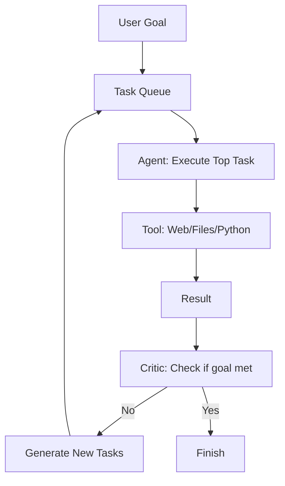

# AutoGPT aur BabyAGI: Autonomy ke Pioneers

## 1. Shuruaat ke liye Hinglish Explanation 🇮🇳
Bhai, socho tumne ek AI ko bola: "Mujhe ek naya business shuru karna hai, market research se lekar website banane tak sab tum kar lo". Normal ChatGPT yahan haar maan jayega. Lekin **AutoGPT** aur **BabyAGI** ne dikhaya ki AI "Autonomous" ho sakta hai. 

Inhone ek "Loop" banaya: 
1. **Plan**: Kya karna hai?
2. **Do**: Kaam karo.
3. **Check**: Kya hua?
4. **Task List**: Agla kaam kya hai?
Yeh 2023-2024 ke woh "Viral" projects the jinhone agents ka craze shuru kiya. Bhale hi yeh thode "Unstable" the, lekin inhone dikhaya ki AI ko sirf "Chat" nahi, balki "Execute" karne ke liye bhi use kiya ja sakta hai.

---

## 2. Gehri Technical Explanation
AutoGPT aur BabyAGI recursive task execution implement karne wale pehle frameworks the.
- **Task Management**: Ek internal queue use karke "To-do" lists manage karna.
- **Long-term Memory**: Vector DBs (jaise Pinecone) ka use karke pichle steps mein kya kiya gaya tha, yaad rakhna.
- **Continuous Loop**: Agent tasks generate karta hai, unhe execute karta hai, aur phir results ke basis par *new* tasks generate karta hai, theoretically goal meet hone tak chalta hai.
- **Self-Prompting**: LLM khud ke liye prompts likhta hai project ke next stage ko handle karne ke liye.

---

## 3. Ganitiya Intuition
Autonomous loops ko **State Space Search** ke roop mein model kiya ja sakta hai.
Goal hai ek sequence of actions $\{a_1, a_2, ..., a_n\}$ find karna jo state $G$ tak pahunchta hai.
AutoGPT har step par **Greedy Search** use karta hai:
$$a_t = \arg \max P(a | s_{t-1}, G)$$
Main limitation **Backtracking** ki kami thi; ek baar queue mein galat task add ho gaya, to agent aksar irrelevant actions ke rabbit hole mein chala jata tha.

---

## 4. Architecture Diagrams


---

## 5. Production-ready Udaharan
Simplified BabyAGI logic:

```python
def baby_agi(objective):
    task_list = ["First task"]
    while task_list:
        task = task_list.pop(0)
        result = execute_task(task, objective)
        # 1. Store result in Vector DB
        vector_db.add(task, result)
        # 2. Generate new tasks based on result
        new_tasks = generate_tasks(objective, result, task_list)
        task_list.extend(new_tasks)
        # 3. Prioritize tasks
        task_list = prioritize_tasks(task_list, objective)
```

---

## 6. Real-world Istemaal ke Mamle
- **Autonomous Coding**: AutoGPT file read karke aur tests run karke bug fix karne ki koshish karta hai.
- **Market Intelligence**: Competitors, pricing, aur features search karna aur ek report mein summarize karna.
- **Personalized News**: 100 sources monitor karna aur specific topics par daily briefing banana.

---

## 7. Asafalta ke Mamle
- **Infinite Loops**: Agent ek hi cheez ko baar-baar search karta rahta hai, bina realize kiye ki uske paas already answer hai.
- **Budget Burn**: Bina supervision ke 5 ghante GPT-4 agent chalane par tokens ka kharcha $100+ ho sakta hai.
- **Task Hallucination**: Agent "Buy a pizza" poochne par "Fly to the moon" jaise tasks create kar deta hai.

---

## 8. Debugging Margdarshan
1. **Interrupt Signal**: Agent ko manually stop karne ka tareeka ya `max_budget` limit set karna hamesha rakho.
2. **Task Audit**: Agar task list 50+ items tak pahunch jaye, to agent ne apna raasta kho diya hai. Queue clear karo aur re-prompt karo.

---

## 9. Samjhote (Tradeoffs)
| Feature (Visheshta) | Manual Chat | Autonomous Agent |
|---|---|---|
| Autonomy (Swayattata) | Zero (Shunya) | High (Uchch) |
| Reliability (Vishwasniyata) | High | Low |
| Speed (Gati) | Fast (ek pass) | Slow (multi-step) |

---

## 10. Suraksha Chintayein
- **Recursive Resource Exhaustion**: Ek agent 1000 tasks create karta hai, har ek 1000 sub-tasks trigger karta hai, jisse aapka API account aur server crash ho jata hai.

---

## 11. Scaling Chunautiyan
- **Context Management**: Jaise jaise "History" badhti hai, agent slow aur confused ho jata hai. Modern frameworks (jaise LangGraph) ise **State Management** ke saath solve karte hain.

---

## 12. Kharcha Phayda (Cost Considerations)
- **Efficiency**: AutoGPT bahut inefficient tha. 2026 agents "Plan-then-Execute" use karte hain token costs par 70% bachane ke liye.

---

## 13. Sabse Achhi Practices
- **Clear "Exit Condition" define karo**.
- **"Critic" model use karo**: Ek doosra model jo har task ko execute karne se pehle review kare.
- **Specific tools provide karo**: Sirf "Google Search" mat do; "Search for recent prices" jaise tool do.

---

## 14. Interview Sawal
1. AutoGPT real-world production settings mein aksar fail kyun hota tha?
2. BabyAGI apni task list ko prioritize kaise karta hai?

---

## 15. 2026 Ke Naye Patterns
- **Memory-Augmented Agents**: Agents jo "Memory Transformers" use karte hain 1M+ steps of history handle karne ke liye bina bhoolen.
- **Self-Healing Loops**: Agents jo detect karte hain ki woh infinite loop mein hain aur automatically apna internal state reset karte hain.